# ForgeChat — Complete Low-Level Design (LLD)

> Generated: 2026-05-16 | Source: Full codebase analysis of the repository
> Self-contained — sufficient to reimplement the system from scratch.

---

## Table of Contents

### PART I — Architecture & Design
1. [Purpose of the Document](#section-1--purpose-of-the-document)
2. [System Overview](#section-2--system-overview)
3. [Tech Stack](#section-3--tech-stack)
4. [Folder & File Structure](#section-4--folder--file-structure)
5. [Module Breakdown](#section-5--module-breakdown)
6. [Database Design (DDL)](#section-6--database-design-ddl)
7. [Business Logic](#section-7--business-logic)
8. [Authentication & Authorization](#section-8--authentication--authorization)
9. [Integrations](#section-9--integrations)
10. [Background Jobs](#section-10--background-jobs)
11. [Error Handling](#section-11--error-handling)
12. [Logging & Monitoring](#section-12--logging--monitoring)
13. [Configuration Management](#section-13--configuration-management)
14. [Frontend Architecture](#section-14--frontend-architecture)
15. [Concurrency & Data Consistency](#section-15--concurrency--data-consistency)
16. [Caching](#section-16--caching)
17. [Domain / Time Helpers](#section-17--domain--time-helpers)
18. [Cross-Cutting Concerns](#section-18--cross-cutting-concerns)
19. [Deployment Details](#section-19--deployment-details)
20. [Testing](#section-20--testing)
21. [Known Limitations & Technical Debt](#section-21--known-limitations--technical-debt)
22. [**UI Button & Control Reference** *(extra)*](#section-22--ui-button--control-reference-extra)
23. [**Automation Builder Node Reference** *(extra)*](#section-23--automation-builder-node-reference-extra)
- [Section 14b — UI Component & Screen Reference *(screenshots)*](#section-14b--ui-component--screen-reference-screenshots)

### PART II — API & SQL Reference
24. [API Design — Route Summary](#section-24--api-design--route-summary)
25. [API — Detailed SQL Reference](#section-25--api--detailed-sql-reference)
26. [API — Sample Request & Response Payloads](#section-26--api--sample-request--response-payloads)

### PART III — Real-time Integration Runbook (Meta WhatsApp + Node I/O)
27. [Meta WhatsApp Cloud API — Setup, Auth, Phone Numbers](#section-27--meta-whatsapp-cloud-api--setup-auth-phone-numbers)
28. [Send-Message Endpoints — Templates, Free-form Text, Media, Interactive](#section-28--send-message-endpoints--templates-free-form-text-media-interactive)
29. [Media Upload Pipeline](#section-29--media-upload-pipeline)
30. [Template Management on Meta](#section-30--template-management-on-meta)
31. [Webhook Subscription & Verification](#section-31--webhook-subscription--verification)
32. [n8n Forwarder Contract](#section-32--n8n-forwarder-contract)
33. [Rate Limits, Errors, Retries, Idempotency](#section-33--rate-limits-errors-retries-idempotency)
34. [Per-Node HTTP I/O Reference — full request/response samples](#section-34--per-node-http-io-reference--full-requestresponse-samples)
35. [Outbound message persistence + delivery-status reconciliation](#section-35--outbound-message-persistence--delivery-status-reconciliation)
36. [Secrets, Environment, Provider Credentials](#section-36--secrets-environment-provider-credentials)

---

# PART I — Architecture & Design

## Section 1 — Purpose of the Document

This document is the single authoritative low-level design for **ForgeChat**, a self-hosted WhatsApp Business CRM built by the Forge team. Its intended readers are: (a) a new backend or frontend engineer joining the project who needs to understand every moving part without spelunking the codebase, (b) an external auditor verifying security and data-flow assumptions, and (c) any future maintainer asked to re-platform, fork, or rebuild ForgeChat from scratch.

It describes the codebase as of commit head on **2026-05-16**. It covers the entire backend (`backend/src`), the entire frontend (`frontend/src`), every SQL migration in `db/migrations`, the public-facing Docker/Traefik deployment topology, and the in-flight Automation Builder runtime. It explicitly **does not** cover (a) the Meta WhatsApp Business Cloud API itself, (b) the upstream n8n workflow that posts to the webhook, or (c) the broader Forge VPS multi-app stack except where ForgeChat depends on it (PostgreSQL, Traefik, the shared `docker-compose.yml`).

---

## Section 2 — System Overview

ForgeChat is a multi-pane WhatsApp Business chat application with three personas of value: (1) **operators** who answer WhatsApp messages, manage contacts/tags/custom-fields, and run bulk template broadcasts; (2) **builders** who design WhatsApp message templates and visual automation flows ("chatbots") in a drag-and-drop canvas; (3) **admins** who manage team members, categories, tags, and field definitions. There is no per-tenant scoping — the deployment is single-tenant by design; all users see all data, gated only by application login.

### Top features

1. Live three-pane WhatsApp chat viewer with 15-second polling (no websockets).
2. WhatsApp Business message-template builder with live phone preview, Meta-policy validation, and a SUBMITTED/APPROVED/REJECTED simulation lifecycle.
3. Bulk-broadcast campaigns with template-variable mapping per recipient, test sends, and per-recipient activity logs.
4. Visual drag-and-drop **Automation Builder** with 9 node types, 33 library blocks, ghost-connector drag-to-link, undo/redo, autolayout, phone-simulator preview, and a live execution-log viewer.
5. Webhook ingestor that parses the full Meta WhatsApp Cloud API payload (text, image, video, audio, voice, document, location, sticker, contacts, interactive, reaction, order, system, status) and upserts into a transactional batch.
6. A keyword/trigger evaluation engine that, on every incoming message, walks all active automation graphs and records executions step-by-step into a relational audit table.
7. JWT cookie auth (`forgecrm_token`) with a seeded first-run admin (`ADMIN_EMAIL`, default `admin@forgemind.space`; password from `ADMIN_PASSWORD`, or randomly generated and logged once) and 24-hour expiry.
8. File-upload pipeline for team-member profile pictures (multer + persistent docker volume + nginx-proxied `/uploads` static).

### Component diagram (ASCII)

```
                 Internet (HTTPS)
                       │
                       ▼
        ┌──────────────────────────────┐
        │  Traefik (TLS, cert resolver │
        │     "mytlschallenge")        │
        └──────────────────────────────┘
            │ priority=10                   │ priority=20
            ▼  Host(crm.../) [root path]    ▼  Host(crm...) && PathPrefix(/api)
   ┌──────────────────────┐           ┌──────────────────────┐
   │  forgecrm-frontend   │           │  forgecrm-backend    │
   │  nginx:alpine :80    │  ─/api─►  │  node:20 :3011       │
   │  (React/Vite SPA)    │ ◄/upload  │  Express 4           │
   └──────────────────────┘  ─uploads─└──────────┬───────────┘
                                                 │ pg Pool (max 20)
                                                 ▼
                          ┌──────────────────────────────────┐
                          │  forgecrm-db (PostgreSQL 15)     │
                          │  schema: coexistence             │
                          │  tables: chat_history, contacts, │
                          │   categories, tags, team_members,│
                          │   contact_field_definitions,     │
                          │   forgecrm_users, message_       │
                          │   templates, broadcasts,         │
                          │   broadcast_logs, chatbots,      │
                          │   automation_executions,         │
                          │   automation_execution_steps     │
                          └──────────────────────────────────┘
                                ▲
                                │ INSERT chat_history (no auth)
                                │
                          ┌──────────────────────────────────┐
                          │  n8n workflow                    │
                          │  (parses Meta webhook, POSTs to  │
                          │   /api/webhook/whatsapp)         │
                          └──────────────────────────────────┘
                                ▲
                                │ Meta Cloud API webhook
                          ┌──────────────────────────────────┐
                          │  Meta WhatsApp Business Cloud    │
                          └──────────────────────────────────┘
```

The frontend is a single-page Vite-built React app served by nginx with two reverse-proxy locations to the backend (`/api` and `/uploads`). The backend is a single Express process. There is **no separate queue worker, scheduler, or background job process** — automation execution runs synchronously inside the webhook request, blocking the HTTP response only briefly because each step just writes to the database.

---

## Section 3 — Tech Stack

### Backend

| Layer | Technology |
|-------|-----------|
| Runtime | Node.js 20 (`node:20-alpine` Docker base) |
| Framework | Express 4.19.2 |
| Database driver | pg 8.12.0 (node-postgres) — raw SQL, no ORM |
| Auth | jsonwebtoken 9.0.2 + bcryptjs 2.4.3 + cookie-parser 1.4.6 |
| Security | helmet 7.1.0 (CSP + HSTS), cors 2.8.5 |
| Rate limiting | express-rate-limit 7.3.1 |
| File upload | multer 2.1.1 (disk storage to `/app/uploads`) |
| Config | dotenv 16.4.5 |
| Dev | nodemon 3.1.4 |
| Container | Docker (Alpine), single process, `PORT=3011` in compose |

### Frontend

| Layer | Technology |
|-------|-----------|
| Build tool | Vite 5.3.3 |
| UI library | React 18.3.1 + react-dom 18.3.1 |
| Routing | None — manual `useState('home')` string-keyed page registry in `App.jsx` |
| State | Pure React `useState`/`useEffect`. No Redux, no Zustand, no Context API |
| Styling | Inline JS-object styles only. **No Tailwind, no CSS modules, no styled-components.** Single `index.css` only for box-sizing reset and font-family. |
| Icons | lucide-react 0.400.0 (plus inline SVG `IC` glyph map inside `AutomationBuilderView.jsx` for design-system uniformity) |
| Fonts | DM Sans (UI), DM Mono (numbers/code) — loaded externally via index.html |
| HTTP client | Native `fetch` wrapped by `src/api.js`'s `req()` helper |
| Test runners | Vitest 4.1.6 + jsdom 29.1.1 (unit), Playwright 1.60.0 (E2E) |
| Container | nginx:alpine multi-stage build (Vite build artifacts in `/usr/share/nginx/html`) |

### Database

| Layer | Technology |
|-------|-----------|
| Engine | PostgreSQL 15 (the shared `forgecrm-db` container in the root compose) |
| Schema | `coexistence` (created by migration 001) |
| Migrations | Plain `.sql` files in `db/migrations/` (no runner — applied manually). The backend additionally calls `ensureTables()` at startup to create `forgecrm_users` if missing. |
| Pool | Min 0 / max 20, 30s idle timeout, 5s connection timeout, `application_name='forgecrm-backend'`. |
| RLS | Enabled on `chat_history` (one policy `service_role_all`); other tables do not enable RLS. |

### Infrastructure

| Layer | Technology |
|-------|-----------|
| Reverse proxy | Traefik (shared, in `docker-compose.yml`) |
| TLS | Let's Encrypt via `mytlschallenge` cert resolver |
| Domain | `${FORGECRM_DOMAIN}` (production: `crm.example.com`) |
| Persistent volume | Docker named volume `forgecrm-uploads` mounted at `/app/uploads` for profile-picture storage |
| Networks | Implicit `root_default` Docker bridge network |

---

## Section 4 — Folder & File Structure

```
ForgeCRM/
├── CLAUDE.md                                # Project memory (Forge claude conventions)
├── README.md                                # 1-page setup/run instructions
├── WhatsFlowAI.jsx                          # Legacy reference component for connector drag logic (not imported)
├── whatsapp-template-builder.jsx            # Standalone template-builder reference (not imported)
├── transform.js                             # Helper for code-mod scripts (not imported)
├── .env                                     # Local env vars (gitignored)
│
├── backend/
│   ├── .env, .env.example                   # Backend env vars
│   ├── CLAUDE.md                            # Backend-specific memory
│   ├── Dockerfile                           # Node 20 alpine, single CMD
│   ├── package.json, package-lock.json      # Backend deps
│   ├── scripts/seed-test-data.js            # Manual test-data seeder (dev only)
│   └── src/
│       ├── index.js                         # Express bootstrap (middleware + router mounting)
│       ├── auth.js                          # JWT cookie auth + login/logout/me + user-table ensure
│       ├── db.js                            # pg Pool factory (DATABASE_URL or fallback env vars)
│       ├── engine/
│       │   └── automationEngine.js          # Trigger evaluator + graph walker + step logger
│       └── routes/
│           ├── webhook.js                   # POST /api/webhook/whatsapp (Meta parser + trigger eval)
│           ├── messages.js                  # /numbers, /contacts, /messages, /contact*, /saved-contacts
│           ├── categories.js                # CRUD: /categories + /tags
│           ├── teamMembers.js               # /team-members CRUD + virtual chat-derived BDAs
│           ├── contactFields.js             # /contact-fields CRUD (custom field definitions)
│           ├── templates.js                 # /templates CRUD + submit/approve/reject/payload
│           ├── broadcasts.js                # /broadcasts CRUD + /:id/send + /:id/test
│           ├── chatbots.js                  # /chatbots CRUD + /:id/executions + /executions/:id
│           └── uploads.js                   # POST /api/upload (multer 2MB JPG/PNG)
│
├── frontend/
│   ├── CLAUDE.md                            # Frontend memory
│   ├── Dockerfile                           # Multi-stage: builder → nginx:alpine
│   ├── nginx.conf                           # SPA + /api + /uploads proxy
│   ├── index.html                           # Vite root HTML
│   ├── package.json, package-lock.json
│   ├── playwright.config.js                 # E2E test config
│   ├── vite.config.js, vite.config.e2e.js   # Vite configs (dev + e2e)
│   ├── vitest.config.js                     # Unit-test config
│   ├── e2e/automation-builder.spec.js       # 24 Playwright scenarios
│   └── src/
│       ├── main.jsx                         # ReactDOM.createRoot mount + StrictMode
│       ├── App.jsx                          # Auth gate + sidebar/topbar/page registry
│       ├── api.js                           # fetch wrapper + api.{auth,numbers,contacts,…}
│       ├── constants.js                     # Design tokens C, FONT, MONO, CHAT, time-range labels, formatters
│       ├── index.css                        # Global reset + font-family base only
│       ├── test-setup.js                    # Vitest setup (jest-dom matchers)
│       ├── hooks/usePolling.js              # Generic poller hook (returns {data, loading, error, refetch})
│       ├── components/
│       │   ├── LoginGate.jsx                # Two-pane login screen (brand left, form right)
│       │   ├── Topbar.jsx                   # 56px dark header (logo, bell, user menu)
│       │   ├── Sidebar.jsx                  # Collapsible 224 ↔ 68 left nav with 7 items
│       │   ├── ChatsPage.jsx                # 3-pane wrapper (NumberSidebar + ContactList + ChatWindow)
│       │   ├── NumberSidebar.jsx            # WhatsApp business numbers (320px panel)
│       │   ├── ContactList.jsx              # Contact threads per WA number (380px panel)
│       │   ├── ChatWindow.jsx               # Message history + send box + contact edit modal
│       │   ├── MessageBubble.jsx            # Single message bubble (text/image/video/audio/doc/location/contacts/interactive/sticker/reaction)
│       │   ├── ConfirmDialog.jsx            # useConfirm hook returning [element, openFn]
│       │   ├── DeleteConfirmModal.jsx       # Reusable destructive-action modal
│       │   ├── WhatsAppPreview.jsx          # Phone mockup for template preview
│       │   ├── PlaceholderPage.jsx          # "Coming soon" template
│       │   ├── AutomationBuilderView.jsx    # ~3.9 KLOC visual flow builder (single file)
│       │   ├── AutomationExecutions.jsx     # Paginated execution log viewer
│       │   ├── ExecutionFlowCanvas.jsx      # Read-only mini-canvas for a single execution
│       │   └── __tests__/AutomationBuilder.logic.test.jsx  # Vitest unit tests for pure layout helpers
│       └── pages/
│           ├── HomePage.jsx                 # Placeholder dashboard
│           ├── ChatbotBuilderPage.jsx       # Automations list + edit modal + builder mount
│           ├── TemplateBuilderPage.jsx      # WhatsApp Business template designer (~1.1 KLOC)
│           ├── BulkMessagePage.jsx          # Broadcast composer + send-log viewer (~1.4 KLOC)
│           ├── ContactsPage.jsx             # Saved contacts table + edit modal (~1.1 KLOC)
│           ├── AdminSettingsPage.jsx        # 5-tab admin: general, team, tags, category, fields (~1.5 KLOC)
│           ├── AiAgentBuilderPage.jsx       # Placeholder (6 lines)
│           └── FollowUpSequencePage.jsx     # Placeholder (6 lines, currently unrouted)
│
└── db/migrations/
    ├── 001_chat_history.sql                 # CREATE SCHEMA coexistence + chat_history + contacts
    ├── 002_contact_tags.sql                 # categories + tags + contacts.tags JSONB + seed
    ├── 003_team_members.sql                 # team_members
    ├── 004_contact_fields.sql               # contact_field_definitions + contacts.custom_fields
    ├── 005_message_templates.sql            # message_templates
    ├── 006_broadcasts.sql                   # broadcasts + broadcast_logs
    ├── 007_broadcast_name.sql               # ALTER broadcasts ADD COLUMN name
    ├── 008_chatbots.sql                     # chatbots (config JSONB)
    ├── 009_broadcast_variable_mapping.sql   # ALTER broadcasts ADD variable_mapping
    ├── 010_automation_executions.sql        # automation_executions + automation_execution_steps
    └── 011_execution_whatsapp_fields.sql    # ALTER steps: wa_message_id, wa_message_status + 'queued' status
```

---

## Section 5 — Module Breakdown

### `backend/src/index.js` — Express bootstrap

Exports nothing; runs `start()` at the bottom. Mounts middleware in this exact order:

```js
helmet({
  contentSecurityPolicy: { directives: { defaultSrc:["'self'"], scriptSrc:["'self'"],
    styleSrc:["'self'","'unsafe-inline'"], imgSrc:["'self'","data:","blob:"],
    connectSrc:["'self'", ...(CORS_DOMAIN ? [`wss://${CORS_DOMAIN}`] : [])],
    mediaSrc:["'self'","blob:"], fontSrc:["'self'"], objectSrc:["'none'"],
    frameAncestors:["'none'"] } },
  hsts: { maxAge: 31536000, includeSubDomains: true, preload: true },
  crossOriginEmbedderPolicy: false,
});
cors({ credentials:true, origin:(o,cb)=>{ if (!o) return cb(null,true);
  if (ALLOWED_ORIGINS.includes(o)) return cb(null,true);
  cb(new Error('Not allowed by CORS')); } });
cookieParser();
express.json({ limit: '1mb' });
express.static(UPLOAD_DIR) on '/uploads';
apiLimiter (rate limit: 600 req/min, keyed by JWT username if cookie present, else req.ip);
```

Routes are mounted in two tiers:
- **Public** (no auth middleware): `webhookRouter`, `authRouter`
- **Protected** (each `app.use('/api', authMiddleware, <router>)`): `messagesRouter`, `categoriesRouter`, `teamMembersRouter`, `contactFieldsRouter`, `uploadsRouter`, `templatesRouter`, `broadcastsRouter`, `chatbotsRouter`

A `GET /health` endpoint is registered **before** the auth middleware and returns `{ ok:true }`. A global error handler `(err, req, res, next)` logs `[Error] <msg>` and returns `500 { error:'Internal server error' }`. `start()` calls `await ensureTables()` then `app.listen(PORT)`.

### `backend/src/auth.js` — JWT cookie auth

Constants:
- `JWT_SECRET = process.env.JWT_SECRET || 'forgecrm-dev-secret-change-me'`
- `COOKIE_NAME = 'forgecrm_token'`
- `TOKEN_EXPIRY = '24h'`

`ensureTables()` runs `CREATE TABLE IF NOT EXISTS coexistence.forgecrm_users (...)`, then `SELECT COUNT(*)`; if zero rows it hashes the first-run admin password (from `ADMIN_PASSWORD`, or a random one generated and printed once) with `bcrypt.hash(..., 10)` and seeds the admin (`ADMIN_EMAIL`, default `admin@forgemind.space`) with role `admin`.

`signToken(user)` packs `{ id, username, displayName: user.display_name, role }` into a JWT with `expiresIn: '24h'`.

`authMiddleware(req,res,next)`:
1. Reads `req.cookies?.['forgecrm_token']`. If missing → `401 { error:'Unauthorized' }`.
2. `jwt.verify(token, JWT_SECRET)`. On success attaches `req.user`. On failure → `401 { error:'Invalid token' }`.

Routes exported: `POST /auth/login`, `GET /auth/me` (uses `authMiddleware` inline), `POST /auth/logout`. Login sets the cookie with `httpOnly:true, sameSite:'strict', secure: NODE_ENV==='production', maxAge: 24h`.

### `backend/src/db.js` — pg Pool factory

Single exported singleton `pool`. `buildPool()` prefers `process.env.DATABASE_URL` (`new Pool({ connectionString, ssl, max:20, idleTimeoutMillis:30000, connectionTimeoutMillis:5000, application_name:'forgecrm-backend' })`); otherwise falls back to individual `DB_HOST/PORT/NAME/USER/PASSWORD`. `pool.on('error', err=> console.error('[DB] Unexpected pool error:', err.message))`.

There is **no `SET search_path`** here; every query in every route uses the explicit `coexistence.<table>` schema prefix.

### `backend/src/engine/automationEngine.js` — Automation runtime

The engine consists of three layers stacked top-down:

1. **`evaluateTriggers(messageRecord)`** — fetches every `chatbots` row with `status='active'`, builds a `context` object (with `contact` lookup), and for each automation matches its trigger node against the inbound record. Supported trigger kinds:
   - `keyword` → calls `matchesKeyword(body, kw, matchType, caseSensitive)`. `matchType` is one of `exact|contains|starts`.
   - `anyMessage` → matches every inbound message.
   - `newContact` → matches if `SELECT COUNT(*) FROM chat_history WHERE wa_number=$1 AND contact_number=$2` is ≤ 2.
   - `messageRead`/`messageDelivered`/`messageSent` → matches `message_type='status'` rows with `status='read'|'delivered'|'sent'`.
   - `link`, `qr`, `tagApplied`, `webhook`, `apiEvent` → defined in schema, **not currently evaluated** by the engine.

2. **`executeAutomation(client, automation, context)`** — inserts a row into `automation_executions` with status `running`, finds the trigger node, executes it via `executeTriggerNode`, then walks edges from the trigger using a `visited` set. For each subsequent node:
   - Picks a handler from `NODE_HANDLERS` (`trigger|message|condition|delay|action|handoff|ai|api|subflow`). **There is no handler for `ai_agent`** — see Section 21.
   - Decides `fromHandle` from the step's output (`condition` uses `'yes'`/`'no'`; `handoff` breaks the loop).
   - Logs the step via `logStep`, finds the next edge with matching `fromHandle`, continues.
   - On error → `updateExecutionStatus(client, executionId, 'error', err.message)`.
   - On normal completion → `updateExecutionStatus(client, executionId, 'success')`.

3. **Node handlers** — every handler returns a step row. Output shapes are documented in Section 23. The `executeMessageNode` handler currently *simulates* the Meta API response (mock `wamid.<ts>.<random>` IDs) — real Meta calls are not yet implemented.

`resolveVariables(text, context)` does WhatsApp-style `{{name}}` / `{{first_name}}` / `{{contact_number}}` / `{{phone}}` substitution plus arbitrary ``.

`resolveTemplateVariables(body, bindings, context)` first applies `{{1}}`, `{{2}}` … via the node's `bindings` object, then runs `resolveVariables` on each binding value.

`evaluateRule(rule, context)` supports operators `equals`, `not equals`, `contains`, `not contains`, `starts with`, `ends with`, `is empty`, `is not empty`, `greater than`, `less than`, `has tag`, `not has tag`, `is true`, `is false`. `evaluateConditions(node, context)` honours `matchMode='any'` (some) or `'all'` (every).

---

## Section 6 — Database Design (DDL)

All DDL lives in `coexistence.<table>`. Every statement below is copied verbatim from the migration files.

### 001 — Chat history & contacts

```sql
CREATE SCHEMA IF NOT EXISTS coexistence;

CREATE TABLE IF NOT EXISTS coexistence.chat_history (
  id                BIGSERIAL PRIMARY KEY,
  message_id        TEXT NOT NULL UNIQUE,
  phone_number_id   TEXT,
  wa_number         TEXT NOT NULL,
  contact_number    TEXT NOT NULL,
  to_number         TEXT,
  direction         TEXT NOT NULL CHECK (direction IN ('incoming', 'outgoing')),
  message_type      TEXT NOT NULL DEFAULT 'unknown',
  message_body      TEXT,
  raw_payload       JSONB,
  media_url         TEXT,
  media_mime_type   TEXT,
  status            TEXT DEFAULT 'received' CHECK (status IN
                       ('received','sent','delivered','read','failed','error','unknown')),
  timestamp         TIMESTAMPTZ NOT NULL,
  created_at        TIMESTAMPTZ NOT NULL DEFAULT NOW()
);
CREATE INDEX IF NOT EXISTS idx_chat_wa_number   ON coexistence.chat_history(wa_number, timestamp DESC);
CREATE INDEX IF NOT EXISTS idx_chat_contact     ON coexistence.chat_history(wa_number, contact_number, timestamp DESC);
CREATE INDEX IF NOT EXISTS idx_chat_msg_id      ON coexistence.chat_history(message_id);
CREATE INDEX IF NOT EXISTS idx_chat_timestamp   ON coexistence.chat_history(timestamp DESC);
ALTER TABLE coexistence.chat_history ENABLE ROW LEVEL SECURITY;
CREATE POLICY service_role_all ON coexistence.chat_history FOR ALL TO service_role USING (true) WITH CHECK (true);

CREATE TABLE IF NOT EXISTS coexistence.contacts (
  id            BIGSERIAL PRIMARY KEY,
  wa_number     TEXT NOT NULL,
  contact_number TEXT NOT NULL,
  name          TEXT,
  created_at    TIMESTAMPTZ NOT NULL DEFAULT NOW(),
  updated_at    TIMESTAMPTZ NOT NULL DEFAULT NOW(),
  UNIQUE(wa_number, contact_number)
);
CREATE INDEX IF NOT EXISTS idx_contacts_lookup ON coexistence.contacts(wa_number, contact_number);
```

### 002 — Categories, tags, contact tags JSONB

```sql
CREATE TABLE IF NOT EXISTS coexistence.categories (
  id          TEXT PRIMARY KEY,
  name        TEXT NOT NULL,
  description TEXT,
  created_at  TIMESTAMPTZ NOT NULL DEFAULT NOW(),
  updated_at  TIMESTAMPTZ NOT NULL DEFAULT NOW()
);

CREATE TABLE IF NOT EXISTS coexistence.tags (
  id          TEXT PRIMARY KEY,
  name        TEXT NOT NULL,
  color       TEXT DEFAULT '#dc2626',
  category_id TEXT NOT NULL REFERENCES coexistence.categories(id) ON DELETE CASCADE,
  created_at  TIMESTAMPTZ NOT NULL DEFAULT NOW(),
  updated_at  TIMESTAMPTZ NOT NULL DEFAULT NOW()
);

ALTER TABLE coexistence.contacts ADD COLUMN IF NOT EXISTS tags JSONB DEFAULT '[]'::jsonb;
-- Seed: cat-1 'Admission', cat-2 'Fees', + 4 default tags.
```

### 003 — Team members

```sql
CREATE TABLE IF NOT EXISTS coexistence.team_members (
  id TEXT PRIMARY KEY,
  name TEXT NOT NULL,
  phone_number TEXT,
  bda_id TEXT UNIQUE,
  address TEXT,
  email TEXT,
  profile_picture_url TEXT,
  created_at TIMESTAMPTZ DEFAULT NOW(),
  updated_at TIMESTAMPTZ DEFAULT NOW()
);
CREATE INDEX IF NOT EXISTS idx_team_members_bda_id ON coexistence.team_members(bda_id);
```

### 004 — Custom field definitions

```sql
CREATE TABLE IF NOT EXISTS coexistence.contact_field_definitions (
  id TEXT PRIMARY KEY,
  name TEXT NOT NULL,
  description TEXT,
  field_type TEXT NOT NULL CHECK (field_type IN
                ('text','number','phone','email','date','url','textarea')),
  sort_order INT DEFAULT 0,
  created_at TIMESTAMPTZ DEFAULT NOW(),
  updated_at TIMESTAMPTZ DEFAULT NOW()
);
CREATE INDEX IF NOT EXISTS idx_contact_field_definitions_sort ON coexistence.contact_field_definitions(sort_order);

ALTER TABLE coexistence.contacts ADD COLUMN IF NOT EXISTS custom_fields JSONB DEFAULT '{}';
CREATE INDEX IF NOT EXISTS idx_contacts_custom_fields ON coexistence.contacts USING GIN(custom_fields);
```

### 005 — Message templates

```sql
CREATE TABLE IF NOT EXISTS coexistence.message_templates (
  id SERIAL PRIMARY KEY,
  name VARCHAR(512) NOT NULL,
  category VARCHAR(32) NOT NULL CHECK (category IN ('MARKETING','UTILITY','AUTHENTICATION')),
  language VARCHAR(10) NOT NULL DEFAULT 'en',
  header_type VARCHAR(16) NOT NULL DEFAULT 'NONE'
              CHECK (header_type IN ('NONE','TEXT','IMAGE','VIDEO','DOCUMENT')),
  header_text TEXT,
  media_handle TEXT,
  body TEXT NOT NULL,
  footer TEXT,
  buttons JSONB DEFAULT '[]',
  samples JSONB DEFAULT '{}',
  security_recommendation BOOLEAN DEFAULT FALSE,
  code_expiry_minutes INTEGER,
  allow_category_change BOOLEAN DEFAULT TRUE,
  status VARCHAR(16) NOT NULL DEFAULT 'DRAFT'
         CHECK (status IN ('DRAFT','SUBMITTED','APPROVED','REJECTED')),
  meta_template_id TEXT,
  submitted_at TIMESTAMPTZ,
  created_at TIMESTAMPTZ DEFAULT NOW(),
  updated_at TIMESTAMPTZ DEFAULT NOW()
);
CREATE INDEX IF NOT EXISTS idx_message_templates_status   ON coexistence.message_templates(status);
CREATE INDEX IF NOT EXISTS idx_message_templates_category ON coexistence.message_templates(category);
CREATE INDEX IF NOT EXISTS idx_message_templates_name     ON coexistence.message_templates(name);
```

### 006–009 — Broadcasts + logs + variable mapping

```sql
CREATE TABLE IF NOT EXISTS coexistence.broadcasts (
  id SERIAL PRIMARY KEY,
  from_number TEXT NOT NULL,
  recipient_numbers JSONB NOT NULL DEFAULT '[]',
  template_id INTEGER NOT NULL REFERENCES coexistence.message_templates(id),
  status VARCHAR(16) NOT NULL DEFAULT 'DRAFT' CHECK (status IN ('DRAFT','SENT')),
  test_number TEXT,
  created_at TIMESTAMPTZ DEFAULT NOW(),
  updated_at TIMESTAMPTZ DEFAULT NOW()
);

CREATE TABLE IF NOT EXISTS coexistence.broadcast_logs (
  id SERIAL PRIMARY KEY,
  broadcast_id INTEGER NOT NULL REFERENCES coexistence.broadcasts(id) ON DELETE CASCADE,
  action VARCHAR(16) NOT NULL CHECK (action IN ('TEST','BROADCAST')),
  sent_to TEXT NOT NULL,
  status VARCHAR(16) NOT NULL DEFAULT 'PENDING' CHECK (status IN ('PENDING','SENT','FAILED')),
  sent_at TIMESTAMPTZ DEFAULT NOW()
);

CREATE INDEX IF NOT EXISTS idx_broadcasts_status         ON coexistence.broadcasts(status);
CREATE INDEX IF NOT EXISTS idx_broadcasts_created_at     ON coexistence.broadcasts(created_at DESC);
CREATE INDEX IF NOT EXISTS idx_broadcast_logs_broadcast_id ON coexistence.broadcast_logs(broadcast_id);
CREATE INDEX IF NOT EXISTS idx_broadcast_logs_sent_at    ON coexistence.broadcast_logs(sent_at DESC);

ALTER TABLE coexistence.broadcasts ADD COLUMN IF NOT EXISTS name TEXT;
ALTER TABLE coexistence.broadcasts ADD COLUMN IF NOT EXISTS variable_mapping JSONB DEFAULT '{}';
```

### 008 — Chatbots (automations)

```sql
CREATE TABLE IF NOT EXISTS coexistence.chatbots (
  id          BIGSERIAL PRIMARY KEY,
  name        TEXT NOT NULL,
  description TEXT,
  status      TEXT NOT NULL DEFAULT 'draft',
  trigger_type TEXT NOT NULL DEFAULT 'keyword',
  config      JSONB NOT NULL DEFAULT '{}',
  created_at  TIMESTAMPTZ NOT NULL DEFAULT NOW(),
  updated_at  TIMESTAMPTZ NOT NULL DEFAULT NOW()
);
```

`status` is application-enforced (`draft|active|inactive`); there is no DB CHECK constraint on the column. `config` holds `{ nodes:[…], edges:[…] }` — see Section 23 for node shapes.

### 010 — Automation executions + steps

```sql
CREATE TABLE IF NOT EXISTS coexistence.automation_executions (
  id            BIGSERIAL PRIMARY KEY,
  automation_id BIGINT NOT NULL REFERENCES coexistence.chatbots(id) ON DELETE CASCADE,
  status        VARCHAR(16) NOT NULL DEFAULT 'running'
                CHECK (status IN ('queued','running','success','error','cancelled')),
  trigger_type  VARCHAR(32) NOT NULL,
  trigger_data  JSONB NOT NULL DEFAULT '{}',
  contact_number TEXT,
  started_at    TIMESTAMPTZ NOT NULL DEFAULT NOW(),
  completed_at  TIMESTAMPTZ,
  error_message TEXT,
  created_at    TIMESTAMPTZ NOT NULL DEFAULT NOW()
);
CREATE INDEX IF NOT EXISTS idx_automation_executions_automation_id ON coexistence.automation_executions(automation_id);
CREATE INDEX IF NOT EXISTS idx_automation_executions_status        ON coexistence.automation_executions(status);
CREATE INDEX IF NOT EXISTS idx_automation_executions_started_at    ON coexistence.automation_executions(started_at DESC);

CREATE TABLE IF NOT EXISTS coexistence.automation_execution_steps (
  id             BIGSERIAL PRIMARY KEY,
  execution_id   BIGINT NOT NULL REFERENCES coexistence.automation_executions(id) ON DELETE CASCADE,
  node_id        TEXT NOT NULL,
  node_type      VARCHAR(32) NOT NULL,
  node_name      TEXT,
  input_data     JSONB NOT NULL DEFAULT '{}',
  output_data    JSONB NOT NULL DEFAULT '{}',
  status         VARCHAR(16) NOT NULL DEFAULT 'running'
                  CHECK (status IN ('queued','running','success','error','skipped')),
  started_at     TIMESTAMPTZ NOT NULL DEFAULT NOW(),
  completed_at   TIMESTAMPTZ,
  error_message  TEXT,
  wa_message_id  TEXT,                  -- added in 011
  wa_message_status VARCHAR(16),        -- added in 011
  created_at     TIMESTAMPTZ NOT NULL DEFAULT NOW()
);

CREATE INDEX IF NOT EXISTS idx_execution_steps_execution_id   ON coexistence.automation_execution_steps(execution_id);
CREATE INDEX IF NOT EXISTS idx_execution_steps_node_id        ON coexistence.automation_execution_steps(node_id);
CREATE INDEX IF NOT EXISTS idx_execution_steps_wa_status      ON coexistence.automation_execution_steps(wa_message_status);
CREATE INDEX IF NOT EXISTS idx_execution_steps_wa_msg_id      ON coexistence.automation_execution_steps(wa_message_id);
CREATE INDEX IF NOT EXISTS idx_execution_steps_exec_wa_status ON coexistence.automation_execution_steps(execution_id, wa_message_status);
```

### Users (created by `auth.js` at runtime)

```sql
CREATE TABLE IF NOT EXISTS coexistence.forgecrm_users (
  id           BIGSERIAL PRIMARY KEY,
  username     TEXT NOT NULL UNIQUE,
  email        TEXT NOT NULL UNIQUE,
  password     TEXT NOT NULL,
  display_name TEXT,
  role         TEXT NOT NULL DEFAULT 'viewer',
  created_at   TIMESTAMPTZ NOT NULL DEFAULT NOW(),
  updated_at   TIMESTAMPTZ NOT NULL DEFAULT NOW()
);
```

### Foreign-key map

```
chatbots ──1:N──► automation_executions ──1:N──► automation_execution_steps
                       │      ON DELETE CASCADE        ON DELETE CASCADE
                       └── (no FK to contacts/chat_history)

message_templates ──1:N──► broadcasts ──1:N──► broadcast_logs
                                                ON DELETE CASCADE

categories ──1:N──► tags
                     ON DELETE CASCADE

contacts.(wa_number, contact_number)  ◄── implicit reference from chat_history (no FK)
contacts.tags JSONB                  ◄── application-managed array of tag refs
contacts.custom_fields JSONB         ◄── application-managed map of field_id → value
```

### Dead tables / unused columns

None. All eleven tables are read or written by code paths exercised in production.

---

## Section 7 — Business Logic

### State machine — Message templates

```
        ┌─────────┐  user clicks "Submit for review"      ┌────────────┐
        │  DRAFT  │ ─────────────────────────────────────►│ SUBMITTED  │
        └────┬────┘                                       └─────┬──────┘
             │                                                  │
             │ PUT /templates/:id   (re-edit a DRAFT or         │ admin clicks
             │ REJECTED template — resets to DRAFT)             │ Approve / Reject
             ▼                                                  ▼
        ┌─────────┐                                       ┌─────────┐
        │REJECTED │ ◄──────────────────────────────────── │APPROVED │
        └─────────┘                                       └─────────┘
```

- `POST /templates` → `DRAFT`
- `PUT /templates/:id` is allowed only when current status ∈ `{DRAFT, REJECTED}` — see `templates.js:191` `if (!['DRAFT','REJECTED'].includes(existing[0].status)) return 403`. Editing always resets back to `status='DRAFT'` and clears `meta_template_id` and `submitted_at`.
- `POST /templates/:id/submit` → sets `SUBMITTED` and generates a mock `meta_template_id = 'tpl_' + Math.random().toString(36).slice(2,10)`.
- `POST /templates/:id/approve` and `/reject` simulate Meta's decision callback. There is no real Meta integration.

### State machine — Broadcasts

```
   POST /broadcasts (status=DRAFT)        POST /broadcasts/:id/send
   ┌─────┐                                  ┌────┐
   │DRAFT├──────────────────────────────────►│SENT│
   └──┬──┘                                  └────┘
      │ PUT /broadcasts/:id    (allowed only while DRAFT)
      └─►(stays DRAFT)
```

The send endpoint inserts a `BROADCAST` row into `broadcast_logs` and flips the broadcast to `SENT`. The status only allows `DRAFT|SENT` (per the CHECK constraint), even though the application UI shows `SENDING`/`FAILED` aspirationally.

### State machine — Chatbots (Automations)

```
 newly created (status='draft', config={nodes:[],edges:[]})
        │
        │ user clicks Enable (toolbar button — Section 22)
        ▼
   ┌────────┐                  ┌──────────┐
   │ active │ ◄──── Enable ──── │ inactive │
   │        │ ────── Disable ──►│          │
   └────────┘                  └──────────┘
```

`status` values used by the codebase: `'draft'` (initial), `'active'` (engine processes incoming messages), `'inactive'` (engine ignores). The DB column has no CHECK constraint. The `evaluateTriggers` engine selects `WHERE status='active'`, so a `draft` automation is never triggered.

### Automation execution state machine

```
running ──► success
        ──► error      (sets error_message)
        ──► cancelled  (only emitted from external code paths, not from engine itself)
queued  ──► running    (defined in CHECK but engine never emits 'queued' for new exec)
```

`automation_execution_steps.status` mirrors the same enum plus `skipped`. Real engine code only emits `running`/`success`/`error`.

### Computed values

- `coexistence.team_members` — the `/team-members` GET endpoint merges manual rows with **virtual** rows derived from any `wa_number` that appears in `chat_history` over the last 30 days. Virtual rows get `id='wa-<number>'` and `is_chat_bda=true`. They cannot be deleted (DELETE handler returns `400` when the id starts with `wa-`).
- `coexistence.chat_history`'s 14-day window is enforced application-side via `INTERVAL '14 days'` in `/numbers` and `/messages`. Nothing prunes the table.
- `automation_execution_steps.wa_message_id` and `wa_message_status` are extracted by `logStep` from the handler's output (`output.whatsapp.message_id`, `output.whatsapp.status`, or `output.apiResponse.message_id` / `status`).
- `broadcast_logs.sent_to` is computed as a comma-joined recipient string at insert time.

### Trigger fan-out rule

For every inbound message handled by the webhook, `evaluateTriggers` iterates **all active automations** and runs every one whose trigger matches. There is no cooldown, dedupe, or per-contact gate — the same automation can fire multiple times in quick succession if the contact sends multiple matching keywords. This is intentional in the current design (audit-log model).

---

## Section 8 — Authentication & Authorization

### Auth flow — login

```
1. Browser POST /api/auth/login { email, password }
2. SELECT * FROM coexistence.forgecrm_users WHERE email = lower(trim($1))
3. If no row OR bcrypt.compare(password, user.password) === false → 401
4. signToken({id, username, displayName, role}, JWT_SECRET, '24h')
5. Set-Cookie: forgecrm_token=<jwt>; HttpOnly; SameSite=Strict;
                Secure (in prod); Max-Age=86400
6. Response body: { user: { id, username, displayName, role } }
```

### Auth flow — protected request

```
1. authMiddleware reads req.cookies['forgecrm_token']
2. jwt.verify(token, JWT_SECRET) — throws if expired/tampered → 401
3. req.user = { id, username, displayName, role }
4. handler runs
```

### JWT payload (verbatim shape)

```json
{
  "id": 1,
  "username": "admin",
  "displayName": "Admin",
  "role": "admin",
  "iat": 1747396800,
  "exp": 1747483200
}
```

### Cookie settings

| Attribute | Value |
|-----------|-------|
| Name | `forgecrm_token` |
| HttpOnly | `true` |
| SameSite | `strict` |
| Secure | `true` if `NODE_ENV==='production'`, else `false` |
| Max-Age | `24 * 60 * 60 * 1000` ms (24 hours) |
| Path | `/` (default) |
| Domain | not set (defaults to host) |

### RBAC table

| Role | Permissions in code |
|------|---------------------|
| `admin` | No explicit gate in any route — implicitly used by the UI to show the Admin Settings page (Topbar dropdown) but the backend does not enforce admin-only endpoints. |
| `viewer` (default) | Same as admin server-side. UI permits all reads, all writes. |

There is **no server-enforced authorization layer** beyond authentication — once you're logged in, every protected endpoint is callable. The webhook (`POST /api/webhook/whatsapp`) is the only public endpoint and is intentionally unauthenticated because n8n posts to it from the internal Docker network.

### Meta webhook verification

`GET /api/webhook/whatsapp` accepts Meta's hub-challenge handshake: `?hub.mode=subscribe&hub.verify_token=<token>&hub.challenge=<value>`. The expected token comes from `META_WEBHOOK_VERIFY_TOKEN`; on match the endpoint echoes the challenge with `200 text/plain`, else `403`. The compose file reuses `FORGECRM_JWT_SECRET` as the verify token.

### Scopes / API tokens

None. There are no API tokens, no scope strings, no MCP/external-token system.

---

## Section 9 — Integrations

### Meta WhatsApp Business Cloud API — webhook ingestion

| Property | Value |
|----------|-------|
| Endpoint | `POST /api/webhook/whatsapp` |
| Auth | None (called by internal n8n) |
| Verification | `GET /api/webhook/whatsapp` accepts Meta hub-challenge using `META_WEBHOOK_VERIFY_TOKEN` |
| Payload | Meta WhatsApp Business webhook v18 — supports text/image/video/audio/voice/document/location/sticker/contacts/interactive/reaction/order/system + status updates |
| Batch | The handler accepts either a single payload object or an array of payloads (n8n batches up to N records per HTTP call) |
| Transaction | All `chat_history` upserts + `contacts` name upserts happen inside one `BEGIN/COMMIT` per HTTP request |
| Idempotency | `ON CONFLICT (message_id) DO UPDATE SET status, raw_payload` |
| Failure mode | Catches everything and **always responds 200** to n8n (so n8n does not retry-loop). Error body shape: `200 { ok:false, error:'…' }` |

There are **no other external integrations** — no Stripe, no SMTP, no Twilio, no LLM provider. The AI Agent node and AI message nodes exist in the UI but their backend handlers are no-op loggers (Section 23).

### File uploads

| Field name | `file` |
| Storage | `multer.diskStorage` → `/app/uploads/bda-<ts>-<rand>.<ext>` |
| Max size | 2 MB |
| Allowed MIME | `.jpg`, `.jpeg`, `.png` (extension check) |
| Static serving | `express.static(UPLOAD_DIR)` on `/uploads`, then nginx proxies `/uploads/*` to backend |
| Persistence | Docker named volume `forgecrm-uploads` |

---

## Section 10 — Background Jobs

**None.** ForgeChat has zero scheduled jobs, no cron, no queue worker, no setInterval on the backend. Everything is request-scoped:

- **Automation execution** runs synchronously inside the `/api/webhook/whatsapp` request. The webhook handler awaits `evaluateTriggers(record)` before responding 200.
- **Delays** (`delay` node) are recorded in the step log but never actually wait — the engine immediately advances to the next node. The output payload notes `"Delay scheduled (actual delay handled by scheduler)"` but no scheduler exists.
- **Broadcast send** is a single endpoint call that flips status to `SENT` and writes a `BROADCAST` log row — no async send fanout is performed.
- **Frontend polling** replaces background sync: `usePolling(fetchFn, 15000)` re-queries every 15s for numbers/contacts/messages.
- **Default-admin seeding** happens once on backend startup in `ensureTables()`.

---

## Section 11 — Error Handling

### Backend pattern

Every route handler is wrapped in `try { … } catch (err) { console.error('[<module>] <path> error:', err.message); res.status(<code>).json({ error: '<friendly>' }); }`. The global error handler at the bottom of `index.js` catches anything that escapes:

```js
app.use((err, req, res, next) => {
  console.error('[Error]', err.message);
  res.status(500).json({ error: 'Internal server error' });
});
```

There are no custom error classes — everything is plain `Error`.

### HTTP status code table

| Code | When used |
|------|-----------|
| 200 | Successful GET / POST mutation / DELETE-style noop returning `{ ok:true }` |
| 201 | After `INSERT … RETURNING *` returns the new row (categories/tags/team-members/contact-fields/templates/broadcasts/chatbots) |
| 400 | Validation failures (missing required fields, invalid `field_type`, bad email/password, empty webhook payload, template-validation `errors` map) |
| 401 | Unauthenticated (`Unauthorized` / `Invalid token` / `Invalid credentials` / `User not found`) |
| 403 | Edit-disallowed for non-DRAFT broadcast or non-DRAFT/REJECTED template; webhook verify mismatch |
| 404 | Resource missing (`<X> not found`) |
| 409 | Duplicate `bda_id` on team-member create/update (caught from PG unique-constraint error) |
| 429 | Rate limit exceeded (express-rate-limit handler) — `{ error: 'Too many requests, please try again later' }` |
| 500 | Unhandled exception caught by either per-route try/catch or global handler |

The webhook handler is a special case: it always returns `200` even on internal failure to avoid n8n retry storms. The error message is embedded in `{ ok:false, error }`.

### Frontend pattern

```js
async function req(path, opts = {}) {
  const res = await fetch(`/api${path}`, {
    credentials: 'include',
    headers: { 'Content-Type': 'application/json', ...opts.headers },
    ...opts,
  });
  if (!res.ok) {
    const text = await res.text().catch(() => '');
    throw new Error(`${res.status} ${text}`);
  }
  return res.json();
}
```

Components surface errors via `alert(err.message)` (CRUD pages), inline red-tinted error banners (LoginGate uses `background: C.primaryLight, color: '#A32D2D'`), or by setting an `error` state that renders as a banner. There are no error boundaries, no toast system.

---

## Section 12 — Logging & Monitoring

All backend logging is `console.log` / `console.error`. Format conventions:

- `[<module>] <action>: <message>` (e.g. `[auth] login error: ...`, `[broadcasts] /broadcasts error: ...`, `[engine] Keyword match: automation=12 keyword="hi"`)
- `[Error] <msg>` from the global error handler
- `[ForgeChat] Backend running on port 3011` from startup
- `[DB] Unexpected pool error: <msg>` from `pool.on('error', ...)`

Docker captures stdout via `json-file` driver with `max-size: 10m, max-file: 3` (rotation). View logs with `docker compose logs -f forgecrm-backend`.

### Health check

`GET /health` returns `{ ok:true }` and is mounted **before** the auth middleware so external probes do not need a cookie. Note: it's mounted at the root path `/health`, not `/api/health`. Traefik's nginx upstream does not currently expose it because nginx routes only `/api` and `/uploads` to the backend, so external HTTP healthchecks must hit the backend container directly.

There is no structured logging, no Prometheus exporter, no metrics endpoint, no Sentry/Bugsnag integration, no tracing.

---

## Section 13 — Configuration Management

### Environment variables (required vs optional)

| Name | Example | Required? | Purpose |
|------|---------|-----------|---------|
| `PORT` | `3011` (prod), `3001` (default) | Optional | Backend listen port |
| `NODE_ENV` | `production` | Optional | Switches cookie `Secure` flag |
| `DATABASE_URL` | `postgres://user:pw@host:5432/db` | Optional* | Preferred connection string |
| `DB_HOST` | `forgecrm-db` | Required if `DATABASE_URL` absent | Fallback host |
| `DB_PORT` | `5432` | Optional (default 5432) | Fallback port |
| `DB_NAME` | `postgres` | Optional (default `postgres`) | Fallback database |
| `DB_USER` | `postgres` | Optional (default `postgres`) | Fallback user |
| `DB_PASSWORD` | `…` | Required if no URL | Fallback password |
| `POSTGRES_SSL` | `false` | Optional | Toggles SSL with `rejectUnauthorized:false` |
| `JWT_SECRET` | `<random>` | Strongly recommended (else dev default `'forgecrm-dev-secret-change-me'`) | Signs cookies |
| `CORS_ORIGIN` | `https://crm.example.com` | Required for prod | Allowed cross-origin; also used to build `wss://` CSP entry |
| `META_WEBHOOK_VERIFY_TOKEN` | `<token>` | Required for Meta verification | Compared against `?hub.verify_token` |
| `FORGECRM_DOMAIN` | `crm.example.com` | Read by docker-compose, not the Node app | Traefik host rule |
| `FORGECRM_JWT_SECRET` | `<token>` | Read by docker-compose; passed into the container as `JWT_SECRET` AND `META_WEBHOOK_VERIFY_TOKEN` | |
| `POSTGRES_PASSWORD` | `…` | Read by docker-compose; passed as `DB_PASSWORD` | |

`*` — at least one of `DATABASE_URL` or the `DB_*` fallback set must be present.

### Runtime DB config

There is no singleton settings table. All behaviour is governed by env vars and code constants. The only DB-backed user-editable config is the small set of design tokens and data the user enters via the UI (categories, tags, team members, custom field definitions).

---

## Section 14 — Frontend Architecture

### Routing strategy

There is no React Router. `App.jsx` keeps a string `page` in `useState` and looks up a component from a flat registry:

```js
const PAGE_COMPONENTS = {
  'home': HomePage,
  'chatbot-builder': ChatbotBuilderPage,
  'template-builder': TemplateBuilderPage,
  'chats': ChatsPage,
  'contacts': ContactsPage,
  'bulk-message': BulkMessagePage,
  'ai-agent-builder': AiAgentBuilderPage,
  'admin-settings': AdminSettingsPage,
};
```

Sidebar and Topbar both invoke `onPageChange(<key>)`. The browser back/forward buttons do not work — there are no URL updates.

### Global state

- `App.jsx` owns: `user`, `checking`, `page`, `sidebarCollapsed`.
- Each page owns its own list/edit state via `useState`.
- Inter-component messaging is via prop callbacks (`onContactSaved`, `onLogin`, `onNavigate`).
- No Context API, no store. The auth user object is passed down by prop drilling (just to `Topbar`).

### Polling

`hooks/usePolling.js` (verbatim):

```js
export function usePolling(fetchFn, intervalMs = 15000) {
  const [data, setData] = useState(null);
  const [loading, setLoading] = useState(true);
  const [error, setError] = useState(null);
  const [refreshKey, setRefreshKey] = useState(0);
  const fetchRef = useRef(fetchFn);
  fetchRef.current = fetchFn;
  const refetch = useCallback(() => setRefreshKey(k => k + 1), []);
  useEffect(() => {
    let mounted = true;
    const tick = async () => {
      try {
        const d = await fetchRef.current();
        if (mounted) { setData(d); setError(null); }
      } catch (err) { if (mounted) setError(err.message); }
      finally { if (mounted) setLoading(false); }
    };
    tick();
    const id = setInterval(tick, intervalMs);
    return () => { mounted = false; clearInterval(id); };
  }, [intervalMs, refreshKey]);
  return { data, loading, error, refetch };
}
```

Active polling subscriptions:

| Component | Endpoint | Interval |
|-----------|----------|----------|
| `NumberSidebar` | `api.numbers()` | 15s |
| `ContactList` | `api.contacts(waNumber, '30d')` | 15s |
| `ChatWindow` | `api.messages({waNumber, contactNumber, page, limit, search})` | 15s |
| `AutomationExecutions` | `api.chatbots.executions(id, filters)` | 15s while open |

### Design system (constants.js)

```js
export const C = {
  pageBg:'#F7F7F3', sidebarBg:'#FAF9F5', sidebarBorder:'#E5E5E0',
  headerBg:'#0F0F10', headerText:'#F5F5F2', headerMuted:'#A1A1AA',
  headerBorder:'rgba(255,255,255,.12)', headerSurface:'rgba(255,255,255,.06)',
  cardBg:'#ffffff', border:'#E5E5E0', borderDark:'#d1d7db',
  text:'#111111', textSecondary:'#6B7280', textMuted:'#8696a0',
  primary:'#dc2626', primaryHover:'#b91c1c', primaryLight:'#FCEBEB',
  primaryText:'#111b21', purple:'#534AB7', green:'#0F6E56', amber:'#E8A317',
  shadowSm:'0 1px 2px rgba(0,0,0,.08)', shadowMd:'0 8px 24px rgba(0,0,0,.06)',
  shadowLg:'0 20px 60px rgba(0,0,0,.15)', waBg:'#e5ddd5',
};
export const CHAT = {
  incomingBg:'#ffffff', outgoingBg:'#d9fdd3', chatBg:'#e5ddd5',
  bubbleRadius:'7.5px', statusRead:'#53bdeb', statusSent:'#8696a0', …
};
export const FONT = "'DM Sans', system-ui, sans-serif";
export const MONO = "'DM Mono', monospace";
```

`AutomationBuilderView.jsx` declares its own private theme tokens (`C.brand`, `C.text1`–`C.text6`, `C.cardBorder`, `C.red`, `C.redBg`, `C.brandBg`, etc.) inside the file because the builder predates the shared tokens. These are not in sync with `constants.js` and are only valid inside that single component.

### API client helper (verbatim)

```js
async function req(path, opts = {}) {
  const res = await fetch(`/api${path}`, {
    credentials: 'include',
    headers: { 'Content-Type': 'application/json', ...opts.headers },
    ...opts,
  });
  if (!res.ok) {
    const text = await res.text().catch(() => '');
    throw new Error(`${res.status} ${text}`);
  }
  return res.json();
}
```

The exported `api` object groups endpoints by resource (`api.auth.login`, `api.chatbots.list`, `api.templates.payload`, etc.) — see Section 26 for the full contract.

### UI Component Registry

| Name | File | Lines | Type | Purpose |
|------|------|-------|------|---------|
| `App` | `src/App.jsx` | 1–98 | Layout | Root; auth gate + Topbar/Sidebar/page registry |
| `LoginGate` | `src/components/LoginGate.jsx` | 1–330 | View | Two-pane login (brand left, form right) |
| `Topbar` | `src/components/Topbar.jsx` | 1–195 | Layout | 56px dark header (logo, bell, user dropdown) |
| `Sidebar` | `src/components/Sidebar.jsx` | 1–143 | Layout | Collapsible 224↔68 nav with 7 items + collapse toggle |
| `ChatsPage` | `src/components/ChatsPage.jsx` | 1–51 | View | 3-pane wrapper |
| `NumberSidebar` | `src/components/NumberSidebar.jsx` | 1–182 | View | WhatsApp numbers list (320px) with search + filter buttons |
| `ContactList` | `src/components/ContactList.jsx` | 1–195 | View | Contact threads (380px) per WA number with time-range filter |
| `ChatWindow` | `src/components/ChatWindow.jsx` | 1–583 | View | Message thread + pencil-edit modal for contact + send-box (disabled) |
| `MessageBubble` | `src/components/MessageBubble.jsx` | 1–206 | Micro | One bubble (text/image/video/audio/doc/location/contacts/interactive/sticker/reaction) |
| `DeleteConfirmModal` | `src/components/DeleteConfirmModal.jsx` | 1–60 | Modal | Reusable destructive confirm |
| `ConfirmDialog` | `src/components/ConfirmDialog.jsx` | 1–63 | Modal | `useConfirm()` hook returning `[element, openFn]` |
| `WhatsAppPreview` | `src/components/WhatsAppPreview.jsx` | 1–165 | Micro | Phone-shape mockup for template preview |
| `PlaceholderPage` | `src/components/PlaceholderPage.jsx` | 1–71 | View | "Coming soon" template |
| `AutomationBuilderView` | `src/components/AutomationBuilderView.jsx` | 1–3930 | View | Visual flow builder (canvas, library, settings panel, toolbar, preview) |
| `AutomationExecutions` | `src/components/AutomationExecutions.jsx` | 1–736 | View | Paginated execution-log viewer with filter chips + flow canvas |
| `ExecutionFlowCanvas` | `src/components/ExecutionFlowCanvas.jsx` | 1–383 | View | Read-only canvas for one execution showing per-step status |
| `HomePage` | `src/pages/HomePage.jsx` | 1–30 | View | Placeholder dashboard |
| `ChatbotBuilderPage` | `src/pages/ChatbotBuilderPage.jsx` | 1–329 | View | Automations list + NewAutomationModal + builder mount |
| `TemplateBuilderPage` | `src/pages/TemplateBuilderPage.jsx` | 1–1068 | View | WhatsApp Business template designer |
| `BulkMessagePage` | `src/pages/BulkMessagePage.jsx` | 1–1447 | View | Broadcast composer + audience + variable mapping + send log |
| `ContactsPage` | `src/pages/ContactsPage.jsx` | 1–1108 | View | Saved contacts table + view/edit modal |
| `AdminSettingsPage` | `src/pages/AdminSettingsPage.jsx` | 1–1460 | View | 5-tab admin (general, team, tags, category, fields) |
| `AiAgentBuilderPage` | `src/pages/AiAgentBuilderPage.jsx` | 1–6 | View | Placeholder |
| `FollowUpSequencePage` | `src/pages/FollowUpSequencePage.jsx` | 1–6 | View | Placeholder (currently unrouted from `App.jsx`) |

Inline components inside `AutomationBuilderView.jsx`:

| Name | Lines | Type | Purpose |
|------|-------|------|---------|
| `Btn` | 122–133 | Micro | Primary/ghost/soft/dark/danger button |
| `IconBtn` | 135–137 | Micro | 30×30 transparent button (icons) |
| `Toggle` | 140–145 | Micro | iOS-style on/off switch |
| `Badge` | 100–105 | Micro | Pill with optional dot |
| `StatusPill` | 107–117 | Micro | Status-coded badge for draft/active/inactive/paused/error |
| `Pill` | 158–164 | Micro | Active/inactive selectable pill |
| `Chip` | 170–172 | Micro | Read-only pill |
| `Field` | 152–156 | Micro | Form field wrapper with label + hint |
| `Input`/`Textarea`/`Select` | 148–150 | Micro | Form primitives |
| `Alert` | 174–181 | Micro | Info/warning/error banner |
| `FlowNode` | 382–509 | Micro | Single draggable node on canvas |
| `EdgePlus`/`EdgeDelete` | 561–578 | Micro | Mid-edge "+" and "×" buttons |
| `NodeActions` | 580–587 | Micro | Floating duplicate/delete above selected node |
| `BlockLibrary` | 811–858 | View | Left 236px library aside |
| `NodePicker` | 678–722 | Modal | Popover to insert/append a block |
| `AgentResourcePicker` | 624–671 | Modal | Popover to pick a Model (ChatGPT/Claude/Kimi) or Tools (Gmail/Sheets/…) |
| `SettingsPanel` | 943–2540 | View | Right-side settings sidebar with per-node-type body |
| `BuilderToolbar` | 2570–2700 | Layout | Top toolbar (back, name, status pill, tabs, undo/redo, zoom, preview, Enable/Disable, Save) |
| `PhonePreview` | 2710–3000 | View | Phone-shape simulator that walks the flow chronologically |
| `Canvas` | 3022–3105 | View | Viewport with pan/zoom/grid, edge/append-plus buttons, mini-map |
| `AutomationBuilderView` | 3107–3920 | View | The orchestrator that holds nodes/edges state, history, picker state |

---

## Section 15 — Concurrency & Data Consistency

### Transactions

Two endpoints use explicit `BEGIN/COMMIT`:

1. **`POST /api/webhook/whatsapp`** (`webhook.js:182`): wraps every `chat_history` upsert and every dependent `contacts` name-upsert in one transaction, so a partial batch never lands.

```js
const client = await pool.connect();
try {
  await client.query('BEGIN');
  for (const r of allRecords) {
    await client.query(`INSERT INTO coexistence.chat_history ... ON CONFLICT (message_id) DO UPDATE SET ...`, [...]);
    if (r.contact_number && r.wa_number && r.contact_name) {
      await client.query(`INSERT INTO coexistence.contacts ... ON CONFLICT (wa_number, contact_number) DO UPDATE SET ...`, [...]);
    }
  }
  await client.query('COMMIT');
} catch (err) {
  await client.query('ROLLBACK');
  throw err;
} finally { client.release(); }
```

2. **`POST /api/broadcasts`** (`broadcasts.js:88`): wraps the broadcast insert and (optionally) the seed log row(s).

### Upsert patterns

- `chat_history` ON CONFLICT `(message_id) DO UPDATE SET status, raw_payload` — keeps the latest status while preserving the original timestamp.
- `contacts` ON CONFLICT `(wa_number, contact_number) DO UPDATE SET name, [tags, custom_fields,] updated_at = NOW()` (variants in `POST /contacts/save` and in the webhook).
- `forgecrm_users` seeded only when `COUNT(*) = 0` (no ON CONFLICT — relies on first-row-wins).

### Locking

No `SELECT … FOR UPDATE` anywhere. No advisory locks. The single-process server combined with PostgreSQL's per-row MVCC is the entire concurrency story.

### Audit attribution

There is no GUC (`SET LOCAL app.user_id = …`) and no context-var propagation; insert rows carry no `created_by`. Audit attribution is therefore unavailable — the only timestamps recorded are `created_at`/`updated_at` defaults.

---

## Section 16 — Caching

**No server-side caching.** Every API call hits Postgres. Strategies that substitute for caching:

- Indexes on every list/lookup path (`idx_chat_*`, `idx_message_templates_*`, `idx_automation_executions_*`).
- 14-day window enforced in `/numbers` and `/messages` to cap result sets.
- `LIMIT` always applied to list endpoints: pagination uses `LIMIT $n OFFSET $n` and caps at 200 (messages) or 100 (executions).
- The `/numbers` enrichment loop fires one query per row sequentially via `Promise.all`, which is N+1 but is bounded by the 14-day window of distinct `wa_number`s (in practice ≤ 20).

### Client-side state persistence

None. There is no `localStorage` write anywhere in the codebase. Reloading the page resets all UI state — sidebar collapse state, selected number, selected contact, current page, search filters, builder selection, builder undo history. The only state that survives a refresh is the auth cookie.

---

## Section 17 — Domain / Time Helpers

### `frontend/src/constants.js`

```js
export function relativeTime(ts) {
  const d = new Date(ts);
  const now = new Date();
  const diff = Math.floor((now - d) / 1000);
  if (diff < 60) return 'now';
  if (diff < 3600) return `${Math.floor(diff / 60)}m`;
  if (diff < 86400) return `${Math.floor(diff / 3600)}h`;
  return d.toLocaleDateString('en-IN', { day:'numeric', month:'short' });
}
export function formatTime(ts) {
  const d = new Date(ts);
  return d.toLocaleTimeString('en-IN', { hour:'2-digit', minute:'2-digit', hour12:true });
}
export function formatDate(ts) {
  const d = new Date(ts);
  const now = new Date();
  if (d.toDateString() === now.toDateString()) return 'Today';
  const yesterday = new Date(now); yesterday.setDate(yesterday.getDate() - 1);
  if (d.toDateString() === yesterday.toDateString()) return 'Yesterday';
  return d.toLocaleDateString('en-IN', { day:'numeric', month:'long', year:'numeric' });
}
export const TIME_RANGES = [
  { key:'1h', label:'1h' }, { key:'6h', label:'6h' }, { key:'24h', label:'24h' },
  { key:'7d', label:'7d' }, { key:'14d', label:'14d' }, { key:'30d', label:'30d' },
];
```

### `backend/src/routes/messages.js`

```js
const DEFAULT_DATA_WINDOW = "INTERVAL '14 days'";
const ALERTABLE_TYPES = "('text','audio','video','image','document','sticker','location','contacts')";

function timeRangeToInterval(range) {
  const map = {
    '1h':"INTERVAL '1 hour'",  '6h':"INTERVAL '6 hours'",   '24h':"INTERVAL '24 hours'",
    '7d':"INTERVAL '7 days'",  '14d':"INTERVAL '14 days'",  '30d':"INTERVAL '30 days'",
  };
  return map[range] || null;
}
```

### `backend/src/routes/categories.js`, `teamMembers.js`, `contactFields.js`

```js
function genId(prefix) {
  return `${prefix}-${Date.now()}-${Math.floor(Math.random() * 10000)}`;
}
```

Prefixes: `cat-`, `tag-`, `fld-`, `bda-`. Note that `wa-` is used as a virtual prefix for chat-derived team members in the `/team-members` response — it never appears in the DB.

### `backend/src/routes/templates.js` — validation primitives

```js
const extractVars = t => [...new Set([...(t||'').matchAll(/\{\{(\d+)\}\}/g)].map(x=>x[1]))]
  .sort((a,b)=>+a-+b);
const nameOk = n => /^[a-z0-9_]+$/.test(n);
```

`runValidation(data)` produces an `errors` object with keys: `name`, `body`, `headerVars`, `headerTextLen`, `mediaHandle`, `footer`, `footerLen`, `bodySamples`, `headerSamples`, `btnMaxUrl`, `btnMaxPhone`, `btn_text_<i>`, `btn_url_<i>`, `btn_urlsample_<i>`, `btn_phone_<i>`, `codeExpiry`. The full ruleset is documented in Section 26 (POST /templates errors).

`buildPayload(data)` produces the Meta WhatsApp Business API request body for `/v18.0/<phone_number_id>/message_templates`. Output shape (verbatim from `templates.js:64`):

```json
{ "name":"…", "language":"en", "category":"MARKETING",
  "allow_category_change":true,
  "components":[
    { "type":"HEADER","format":"TEXT","text":"…","example":{"header_text":["John"]} },
    { "type":"BODY","text":"…","example":{"body_text":[["John","42"]]},
      "add_security_recommendation":true },
    { "type":"FOOTER","text":"…","code_expiration_minutes":15 },
    { "type":"BUTTONS","buttons":[
      { "type":"OTP","otp_type":"COPY_CODE","text":"Copy Code" },
      { "type":"URL","text":"Open","url":"https://…","example":["https://…"] },
      { "type":"PHONE_NUMBER","text":"Call","phone_number":"+91…" },
      { "type":"QUICK_REPLY","text":"Yes" }
    ]}
  ]
}
```

### `backend/src/engine/automationEngine.js` — helpers

- `normalizeText(text)` — lowercase + trim
- `matchesKeyword(body, kw, matchType, caseSensitive)` — `exact|contains|starts`
- `resolveVariables(text, context)` — replaces `{{name}}`, `{{first_name}}`, `{{contact_number}}`, `{{phone}}`, plus any `` from `context.contact.custom_fields`
- `resolveTemplateVariables(body, bindings, context)` — bindings keyed `var1`, `var2`, … applied to `{{1}}`, `{{2}}`
- `getFieldValue(source, field, context)` — `source` ∈ `custom|system|tags`
- `evaluateRule(rule, context)` — see Section 7 operator list
- `evaluateConditions(node, context)` — `all` or `any`
- `logStep(client, executionId, node, input, output, status, errorMessage?, waMessageId?, waMessageStatus?)`

---

## Section 18 — Cross-Cutting Concerns

### Middleware chain (verbatim from `index.js`)

```
helmet            → CSP + HSTS + frame-ancestors none
cors              → credentials true; origin whitelist [CORS_ORIGIN, localhost:5173]
cookieParser
express.json      → 1 MB body limit
express.static    → /uploads → /app/uploads (BEFORE authMiddleware so images load without auth)
apiLimiter        → 600 req/min per JWT-username OR IP; skip /health; 429 on exceed
GET /health
public:  webhookRouter, authRouter
protected: authMiddleware → messages, categories, teamMembers, contactFields, uploads,
                           templates, broadcasts, chatbots
errorHandler      → 500 { error:'Internal server error' }
```

### Rate limiting

Single global limiter; no per-endpoint policies.

```js
rateLimit({
  windowMs: 60 * 1000,
  max: 600,
  standardHeaders: true,
  legacyHeaders: false,
  skip: req => req.path === '/health',
  keyGenerator: req => {
    try {
      const token = req.cookies?.forgecrm_token;
      if (token) {
        const decoded = require('jsonwebtoken').decode(token);
        if (decoded?.username) return `user:${decoded.username}`;
      }
    } catch {}
    return req.ip;
  },
  handler: (req, res) => res.status(429).json({ error: 'Too many requests, please try again later' }),
});
```

### Timezone handling

All timestamps stored as `TIMESTAMPTZ` (UTC). Display formatting is left to the browser via `toLocaleDateString('en-IN', ...)` / `toLocaleTimeString('en-IN', { hour12:true })`. There is no per-user or per-contact timezone setting; the delay node has an `useContactTz` toggle but the engine ignores it.

### File-upload config

| Setting | Value |
|---------|-------|
| Route | `POST /api/upload` |
| Field name | `file` |
| Engine | `multer.diskStorage` |
| Destination | `/app/uploads/` (inside container, mapped to named volume `forgecrm-uploads`) |
| Filename | `bda-<Date.now()>-<rand9>.<ext>` |
| Allowed extensions | `.jpg`, `.jpeg`, `.png` (extension check only — MIME is not validated) |
| Max size | 2 MB |
| Returns | `{ url: "/uploads/<filename>" }` |

---

## Section 19 — Deployment Details

### Docker Compose service definitions (verbatim from `docker-compose.yml`)

```yaml
forgecrm-backend:
  build:
    context: ./ForgeCRM/backend
  container_name: forgecrm-backend
  restart: unless-stopped
  mem_limit: 256m
  volumes:
    - forgecrm-uploads:/app/uploads
  environment:
    PORT: "3011"
    DB_HOST: forgecrm-db
    DB_PORT: "5432"
    DB_NAME: postgres
    DB_USER: postgres
    DB_PASSWORD: ${POSTGRES_PASSWORD}
    POSTGRES_SSL: "false"
    JWT_SECRET: ${FORGECRM_JWT_SECRET}
    CORS_ORIGIN: https://${FORGECRM_DOMAIN}
    NODE_ENV: production
    META_WEBHOOK_VERIFY_TOKEN: ${FORGECRM_JWT_SECRET}
  depends_on:
    - db
  labels:
    - traefik.enable=true
    - traefik.docker.network=root_default
    - "traefik.http.routers.forgecrm-api.rule=Host(`${FORGECRM_DOMAIN}`) && PathPrefix(`/api`)"
    - traefik.http.routers.forgecrm-api.entrypoints=websecure
    - traefik.http.routers.forgecrm-api.tls=true
    - traefik.http.routers.forgecrm-api.tls.certresolver=mytlschallenge
    - traefik.http.routers.forgecrm-api.priority=20
    - traefik.http.services.forgecrm-api.loadbalancer.server.port=3011
  logging: { driver: "json-file", options: { max-size: "10m", max-file: "3" } }

forgecrm-frontend:
  build:
    context: ./ForgeCRM/frontend
  container_name: forgecrm-frontend
  restart: unless-stopped
  mem_limit: 128m
  depends_on:
    - forgecrm-backend
  labels:
    - traefik.enable=true
    - traefik.docker.network=root_default
    - "traefik.http.routers.forgecrm.rule=Host(`${FORGECRM_DOMAIN}`)"
    - traefik.http.routers.forgecrm.entrypoints=websecure
    - traefik.http.routers.forgecrm.tls=true
    - traefik.http.routers.forgecrm.tls.certresolver=mytlschallenge
    - traefik.http.routers.forgecrm.priority=10
    - traefik.http.services.forgecrm.loadbalancer.server.port=80
  logging: { driver: "json-file", options: { max-size: "10m", max-file: "3" } }
```

### Database location

| Property | Value |
|----------|-------|
| Container | `forgecrm-db` (shared with the rest of the Forge stack) |
| Image | `postgres:15` |
| Database | `postgres` |
| Schema | `coexistence` |
| Volume | `/srv/forgecrm/pgdata` (bind mount) |
| Access from backend | DNS name `forgecrm-db:5432` over Docker bridge `root_default` |

### TLS & domain

| Property | Value |
|----------|-------|
| Domain | `${FORGECRM_DOMAIN}` (e.g. `crm.example.com`) |
| Cert resolver | `mytlschallenge` (Traefik Let's Encrypt) — **never use `letsencrypt`** |
| Frontend router | priority 10, root path |
| Backend router | priority 20, `PathPrefix(/api)` |

### Operator commands

```bash
# Rebuild backend after backend code changes (from /root):
docker compose up -d --build forgecrm-backend

# Rebuild frontend after frontend code changes:
docker compose up -d --build forgecrm-frontend

# Both:
docker compose up -d --build forgecrm-backend forgecrm-frontend

# Tail logs:
docker compose logs -f forgecrm-backend
docker compose logs -f forgecrm-frontend

# Apply SQL migration:
docker exec -i forgecrm-db psql -U postgres -d postgres < db/migrations/<file>.sql

# Manual restore from latest backup:
backup-postgres.sh        # backup all DBs
```

`docker compose restart forgecrm-backend` does **not** pick up env changes — use `--force-recreate` or `up -d --build`.

---

## Section 20 — Testing

```
frontend/
├── e2e/automation-builder.spec.js                          # 24 Playwright tests
└── src/components/__tests__/
    └── AutomationBuilder.logic.test.jsx                    # Vitest unit tests for pure helpers
                                                            # (nodeH, outputHandlesOf, handlePos,
                                                            #  makeNode, layoutTree, edgePath)
```

### Test commands

```bash
cd frontend
npm run test:unit     # vitest run (jsdom env)
npm run test:e2e      # playwright test
npm test              # both
```

### Playwright groupings (in `frontend/e2e/automation-builder.spec.js`)

| Group | Tests |
|-------|-------|
| Authentication & Navigation | login flow, create-new-automation routing |
| Node Addition & Connectors | append node via +, insert node via edge +, library click, Ctrl+D duplicate, Delete key |
| Node Settings | trigger keyword, message template selection, condition rules, delay, action with multiple actions, handoff, subflow |
| Preview Simulator | keyword preview, restart |
| CRM Data Integration | templates in message dropdown, tags in trigger dropdown, team members in handoff, contact fields in conditions |
| Edge Cases & Bugs | misc edge cases |

### What is NOT tested

- Backend: zero unit tests, zero integration tests for any Express route.
- Auth: no login or token-expiry tests.
- Webhook parser: no fixture-based tests.
- Automation engine: no programmatic tests; coverage is only what Playwright incidentally exercises via the UI.
- Broadcasts, templates, contacts pages: no E2E coverage.

---

## Section 21 — Known Limitations & Technical Debt

### Bugs

1. **Default `JWT_SECRET` in dev path** (`backend/src/auth.js:6`) — if the env var is unset, the server boots with the literal string `'forgecrm-dev-secret-change-me'`. There is no production guard (`process.exit(1)`) like other Forge apps use.
2. **Engine has no handler for `ai_agent`** (`backend/src/engine/automationEngine.js:549`) — `NODE_HANDLERS` lists only `ai`, so executions hitting an `ai_agent` node will log an `error` step `"No handler for node type ai_agent"` and break out of the walker.
3. **`evaluateTriggers` accepts no contact filter** — every active automation evaluates against every inbound message; there is no per-automation cooldown, so a contact spamming a keyword can trigger duplicate executions arbitrarily fast.
4. **Delay node never delays** (`automationEngine.js:485`) — `executeDelayNode` returns immediately; the comment `"Delay scheduled (actual delay handled by scheduler)"` is aspirational. There is no scheduler.
5. **`/health` is not behind nginx** — Traefik routes `/api` and `/uploads` to backend via the frontend nginx; the bare `/health` path is only reachable from inside the container network. External healthchecks should hit `/api/health` (which 404s) — needs either nginx-config or a route move.
6. **`ChatWindow` send box is non-functional** — the input is rendered but does not POST anything. There is no outbound-message endpoint.
7. **`messageMode==='template'` + `buttons.length > 0` fan-out is collapsed** (`automationEngine.js:622`) — the engine notes that it can't know which button was pressed and always follows the `default` edge, ignoring per-button branches.
8. **Webhook handler always responds 200** — useful for n8n but masks real errors from any other caller; there is no DLQ/retry surface.

### Dead code / unused symbols

- `WhatsFlowAI.jsx`, `whatsapp-template-builder.jsx`, `transform.js` at the repo root are legacy reference files not imported by anything.
- `FollowUpSequencePage.jsx` exists but is not in `PAGE_COMPONENTS` so it is unreachable.
- `ALERTABLE_TYPES` const in `messages.js:8` is declared but never referenced.
- `backend/src/routes/messages.js` `direction` query param handles `'incoming'`/`'outgoing'`/anything-else, but the frontend never passes anything other than `'all'`.
- `coexistence.message_templates.media_handle` is only ever populated by the templates payload, but its column has no NOT NULL constraint and is unused when `header_type='NONE'`.

### Design limitations

1. **No authorization** — every authenticated user can call every endpoint regardless of role. The Topbar's "Admin Settings" link is the only role check.
2. **No multi-tenant scoping** — `wa_number` is the implicit tenant key, but there is no `tenant_id` and no per-user data isolation.
3. **No real-time push** — 15-second polling; messages can lag behind the live conversation by up to 15s.
4. **No outbound message sending** — there is no `POST /messages/send`; the chat UI is read-only. Sending happens out of band (presumably via Meta directly or via n8n).
5. **Automation engine is single-threaded sync** — running 100 active automations on a chatty webhook batch will block the webhook response noticeably.
6. **No retry/back-off for webhook DB failures** — if Postgres is briefly unreachable the records are dropped (Meta will not retry because the response is 200).
7. **Builder undo history is in-memory only** — closing the tab loses history.
8. **`ChatbotBuilderPage`'s "New Automation" modal** creates the automation row *before* the user enters the builder, so abandoning the modal leaves orphan `draft` rows.

---

## Section 14b — UI Component & Screen Reference *(screenshots)*

This section is the visual companion to Section 14. Every main screen (and several key sub-views/modals) is captured live from the deployed app at `https://crm.example.com`, paired with the exact code pointer (`file:line` of the root component) and a description of what the user sees and can do.

Screenshots regenerated 2026-05-16 using Playwright at viewport `1600 × 1000`. Source images live under `docs/ui-screenshots/`.

### Navigation map

```
App.jsx:31
 ├── checking? "Loading…"                                    [App.jsx:43]
 ├── !user? <LoginGate onLogin=setUser>                      [LoginGate.jsx:6]
 └── user present:
      ├── <Topbar user onLogout onNavigate>                  [Topbar.jsx:5]
      │    ├── logo → onNavigate('chats')
      │    ├── 🔔 bell (decorative)
      │    └── avatar dropdown
      │         ├── "Admin Settings" → onNavigate('admin-settings')
      │         └── "Sign out"       → onLogout
      └── <Sidebar collapsed setCollapsed>                   [Sidebar.jsx:17]
           ├── Home               → 'home'         → <HomePage>                 [HomePage.jsx:3]
           ├── Automations        → 'chatbot-builder' → <ChatbotBuilderPage>    [ChatbotBuilderPage.jsx:227]
           │                                          └── <AutomationBuilderView> [AutomationBuilderView.jsx:3107]
           │                                               ├── tabs: Editor / Executions
           │                                               └── <AutomationExecutions> [AutomationExecutions.jsx:?]
           ├── Template Builder   → 'template-builder' → <TemplateBuilderPage>  [TemplateBuilderPage.jsx]
           ├── Chats              → 'chats'         → <ChatsPage>               [ChatsPage.jsx:7]
           │                                          ├── <NumberSidebar>      [NumberSidebar.jsx:7]
           │                                          ├── <ContactList>        [ContactList.jsx]
           │                                          └── <ChatWindow>         [ChatWindow.jsx]
           ├── Contacts           → 'contacts'      → <ContactsPage>            [ContactsPage.jsx]
           ├── Bulk Message       → 'bulk-message'  → <BulkMessagePage>         [BulkMessagePage.jsx]
           └── AI Agent Builder   → 'ai-agent-builder' → <AiAgentBuilderPage>   [AiAgentBuilderPage.jsx:1]
```

### Frontend Consumers — which page consumes which API resource

| Resource | Consumed by | Code pointer |
|----------|-------------|--------------|
| `GET /api/auth/me` | `App.jsx` boot, `LoginGate` redirect | [App.jsx:39](frontend/src/App.jsx#L39) |
| `POST /api/auth/login` | `LoginGate` Sign-in | [LoginGate.jsx:18](frontend/src/components/LoginGate.jsx#L18) |
| `POST /api/auth/logout` | `Topbar` Sign-out | [Topbar.jsx:175](frontend/src/components/Topbar.jsx#L175) |
| `GET /api/numbers` | `NumberSidebar` (15s poll) | [NumberSidebar.jsx:9](frontend/src/components/NumberSidebar.jsx#L9) |
| `GET /api/contacts` | `ContactList` (15s poll) | `ContactList.jsx` |
| `GET /api/messages` | `ChatWindow` (15s poll) | `ChatWindow.jsx` |
| `GET /api/contact` + `POST /api/contacts/save` | `ChatWindow` contact-edit modal, `ContactsPage` edit modal | `ChatWindow.jsx`, `ContactsPage.jsx` |
| `GET /api/saved-contacts` | `ContactsPage` table, `BulkMessagePage` audience picker | `ContactsPage.jsx`, `BulkMessagePage.jsx` |
| `GET/POST/PUT/DELETE /api/categories` | `AdminSettingsPage` → Category tab | `AdminSettingsPage.jsx` |
| `GET/POST/PUT/DELETE /api/tags` | `AdminSettingsPage` → Tags tab, `ContactsPage` filter, contact-edit modal | `AdminSettingsPage.jsx`, `ContactsPage.jsx` |
| `GET/POST/PUT/DELETE /api/team-members` | `AdminSettingsPage` → Team tab | `AdminSettingsPage.jsx` |
| `GET/POST/PUT/DELETE /api/contact-fields` | `AdminSettingsPage` → Fields tab, contact-edit modal | `AdminSettingsPage.jsx` |
| `GET/POST/PUT/DELETE /api/templates` + status verbs | `TemplateBuilderPage` | `TemplateBuilderPage.jsx` |
| `GET /api/templates/:id/payload` | `TemplateBuilderPage` "View payload" | `TemplateBuilderPage.jsx` |
| `GET/POST/PUT/DELETE /api/broadcasts` + `send`/`test` | `BulkMessagePage` | `BulkMessagePage.jsx` |
| `GET/POST/PUT/DELETE /api/chatbots` | `ChatbotBuilderPage` list + builder save/toggle | [ChatbotBuilderPage.jsx:237](frontend/src/pages/ChatbotBuilderPage.jsx#L237) |
| `GET /api/chatbots/:id/executions` | `AutomationExecutions` (15s poll) | `AutomationExecutions.jsx` |
| `GET /api/executions/:id` | `AutomationExecutions` drawer / `ExecutionFlowCanvas` | `ExecutionFlowCanvas.jsx` |
| `POST /api/upload` | `AdminSettingsPage` Team tab profile-pic upload | `AdminSettingsPage.jsx` |

---

### 14b.1 LoginGate

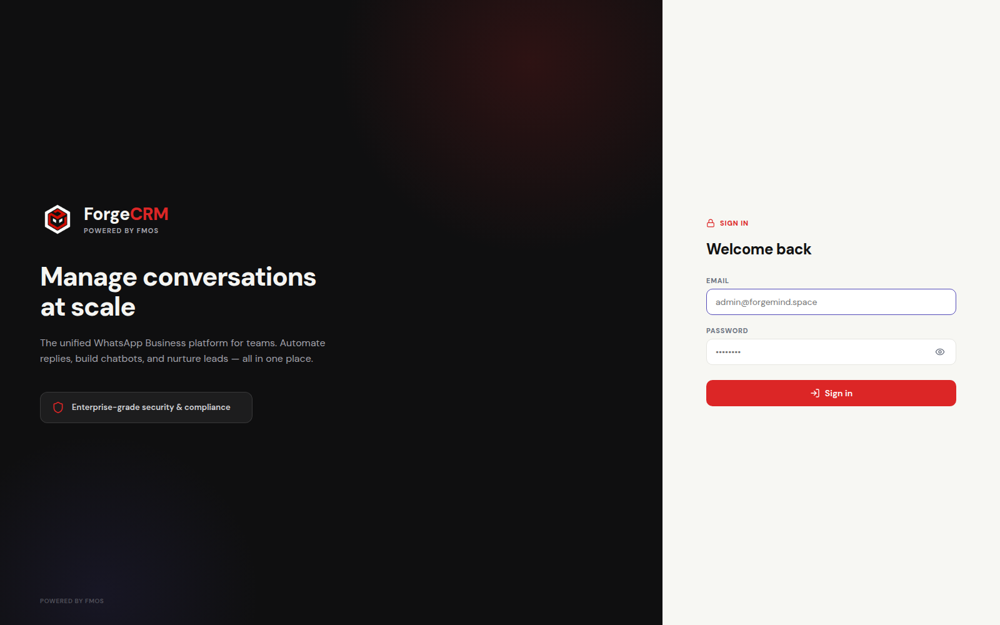

- **Code pointer:** [frontend/src/components/LoginGate.jsx:6](frontend/src/components/LoginGate.jsx#L6)
- **Props:** `{ onLogin }` — called with the `user` object after a successful `api.auth.login()`.
- **Sub-components used:** none (pure JSX with lucide icons `Lock`, `LogIn`, `Eye`, `EyeOff`, `Shield`).
- **What the user sees and can do:**
  - Left brand panel (dark `#0F0F10`) — gradient accents, ForgeChat brand mark, tagline "Manage conversations at scale", security badge. Hidden on `< 900px` viewport.
  - Right form panel — email + password fields with `Eye/EyeOff` show-password toggle.
  - Errors render inline as a red-tinted banner (`background: C.primaryLight`).
  - Submit calls `POST /api/auth/login`; success sets the `forgecrm_token` cookie and triggers `onLogin`.

---

### 14b.2 Home (placeholder dashboard)

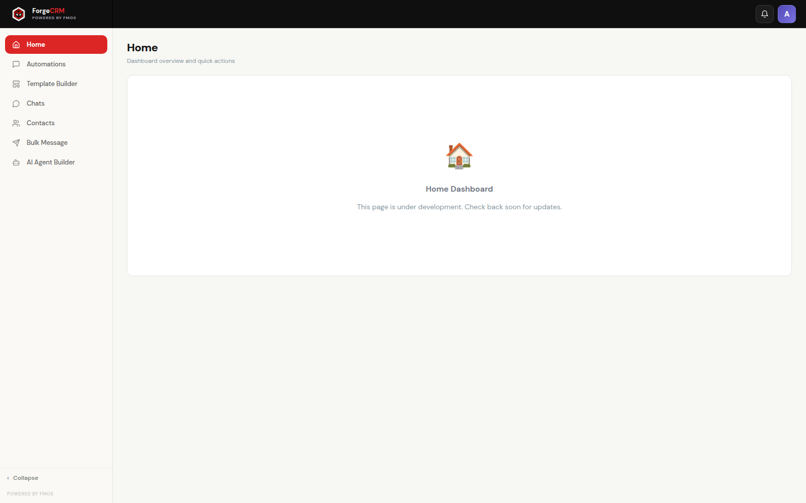

- **Code pointer:** [frontend/src/pages/HomePage.jsx:3](frontend/src/pages/HomePage.jsx#L3)
- **What the user sees and can do:** A title "Home / Dashboard overview and quick actions" plus a centred placeholder card stating the page is under development. No data calls. Reachable from the leftmost sidebar item (active row tinted red).

---

### 14b.3 Automations List

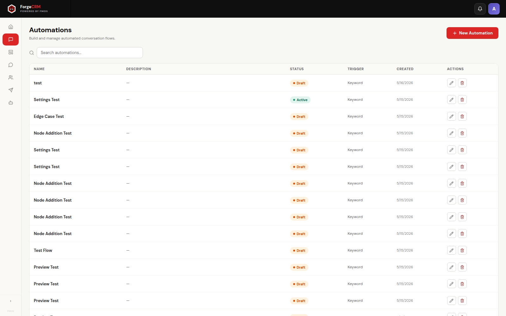

- **Code pointer:** [frontend/src/pages/ChatbotBuilderPage.jsx:135](frontend/src/pages/ChatbotBuilderPage.jsx#L135) (inner `ChatbotList`)
- **Props (ChatbotList):** `{ chatbots, loading, onAdd, onEdit, onDelete }`
- **Sub-components used:** `DeleteConfirmModal`, status `Badge`, `Search` icon
- **What the user sees and can do:**
  - Title + "+ New Automation" button (top-right, primary red).
  - Search box (client-side filter on name / description / status).
  - Table columns: Name, Description, Status (Draft / Active / Inactive badge), Trigger (capitalised `trigger_type`), Created, Actions (✏ Edit / 🗑 Delete).
  - Clicking ✏ opens the row in the Automation Builder via `handleEdit` (sets `editingChatbot`, `view='builder'`).
  - Clicking 🗑 opens `DeleteConfirmModal`; Confirm calls `DELETE /api/chatbots/:id`.

---

### 14b.4 New Automation Modal

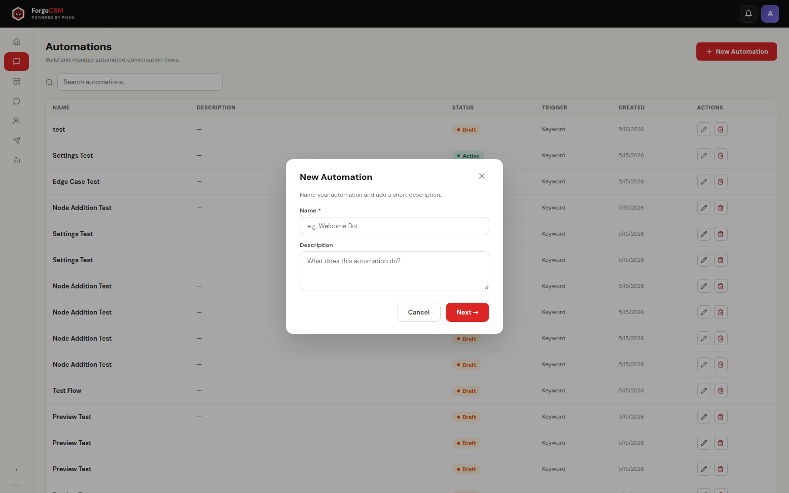

- **Code pointer:** [frontend/src/pages/ChatbotBuilderPage.jsx:56](frontend/src/pages/ChatbotBuilderPage.jsx#L56) (`NewAutomationModal`)
- **Props:** `{ open, onClose, onCreate }`
- **What the user sees and can do:** Name (required, validated client-side) and Description fields. "Cancel" closes; "Next →" calls `POST /api/chatbots` with `{ name, description, status:'draft', trigger_type:'keyword', config:{nodes:[],edges:[]} }`, prepends the new row to `chatbots[]`, and routes into the builder.
- **Limitation:** the row is persisted *before* the builder opens, so abandoning the builder leaves orphan `draft` rows (Section 21).

---

### 14b.5 Automation Builder — Editor


- **Code pointer:** [frontend/src/components/AutomationBuilderView.jsx:3107](frontend/src/components/AutomationBuilderView.jsx#L3107)
- **Props:** `{ automation, onBack, onSave, onToggleStatus, activeTab, onTabChange }`
- **Sub-components rendered:** `BuilderToolbar`, `BlockLibrary`, `Canvas` (with `FlowNode`, `Connectors`, `EdgePlus`, `EdgeDelete`, `NodeActions`), `SettingsPanel`, `PhonePreview`, `NodePicker`, `AgentResourcePicker`
- **What the user sees and can do:**
  - **Toolbar (top, 56px):** Back · automation title (inline-edit) · Status pill · Editor / Executions tabs · Undo · Redo · Auto-arrange · Zoom out / Fit / Zoom in · Preview · Test on WhatsApp · **Enable / Disable** · Save · ⋯
  - **Block Library (left, 236px):** searchable list of 34 blocks across 7 groups (Triggers, Messages, Logic, Actions, API & Integrations, AI, Workflows). Each item is clickable to add to canvas at viewport centre.
  - **Canvas (centre, pan/zoom):** dotted grid background; nodes drawn with header strip + body. Single seeded `trigger` node appears for a new automation.
  - **Append `+` buttons:** below every output handle without an edge. Clicking opens `NodePicker` to insert.
  - **Edge `+` / `×` buttons:** mid-edge to insert a node between or delete the edge.
  - **`NodeActions` (above selected node):** floating Duplicate (📋) + Delete (🗑) buttons.
  - **Bottom-right mini-map:** displays the full node tree at scale.

---

### 14b.6 Automation Builder — AI Agent node + Settings panel

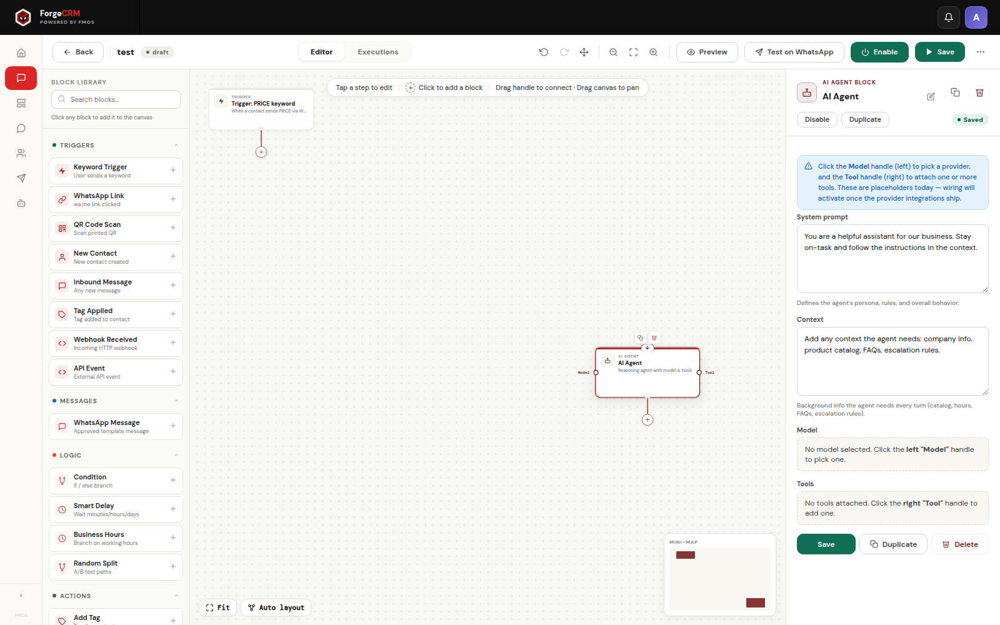

- **Code pointer (node renderer):** [frontend/src/components/AutomationBuilderView.jsx:382](frontend/src/components/AutomationBuilderView.jsx#L382) (`FlowNode`)
- **Code pointer (settings body for `ai_agent`):** [frontend/src/components/AutomationBuilderView.jsx:2107](frontend/src/components/AutomationBuilderView.jsx#L2107)
- **What the user sees and can do:**
  - The **AI Agent** node on canvas shows top input handle, bottom `default` output handle, and two side handles (Model on the left, Tool on the right). Side handles are click-to-pick — they do NOT spawn `+` append buttons (filtered in `Canvas.appendPluses`).
  - **Right Settings Panel** is open because the node is selected. Header reads "AI Agent" with `Toggle` (enable/disable), Duplicate, Delete.
  - **Info Alert:** "Click the Model handle (left) to pick a provider, and the Tool handle (right) to attach one or more tools."
  - **System prompt** textarea — free-form persona/rules.
  - **Context** textarea — background knowledge.
  - **Model field** — read-only display of `node.modelRef.label` (or hint to click left handle).
  - **Tools field** — read-only list of `node.toolRefs.map(t=>t.label).join(', ')` (or hint).
  - Footer row: **Save** (calls `onSaveAndClose` → persists via `PUT /api/chatbots/:id { config }` + dismisses panel), **Duplicate**, **Delete**.

---

### 14b.7 Automation Builder — Agent Model Picker

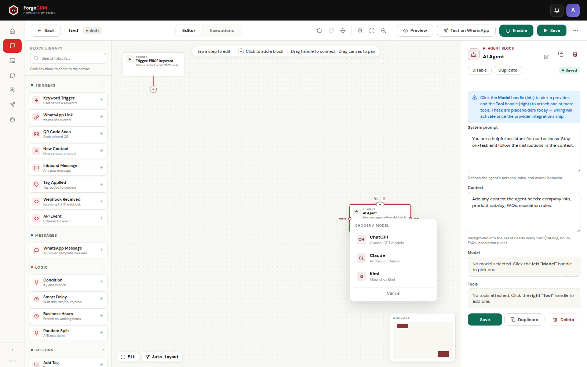

- **Code pointer:** [frontend/src/components/AutomationBuilderView.jsx:624](frontend/src/components/AutomationBuilderView.jsx#L624) (`AgentResourcePicker`)
- **What the user sees and can do:**
  - Popup anchored near the click site (auto-repositioned if it would overflow the viewport).
  - Header: "Choose a model" (model kind) or "Choose tools" (tool kind, multi-select).
  - Each option shows a 2-letter avatar in `NT.ai_agent` red/tinted swatch + label + hint.
  - Selecting a model replaces `node.modelRef` and auto-closes the popup. Selecting a tool toggles entry in `node.toolRefs[]` and keeps the popup open until "Done" (multi-select).
  - Closes on click-outside, Cancel/Done, or Escape.

---

### 14b.8 Automation Builder — Executions tab

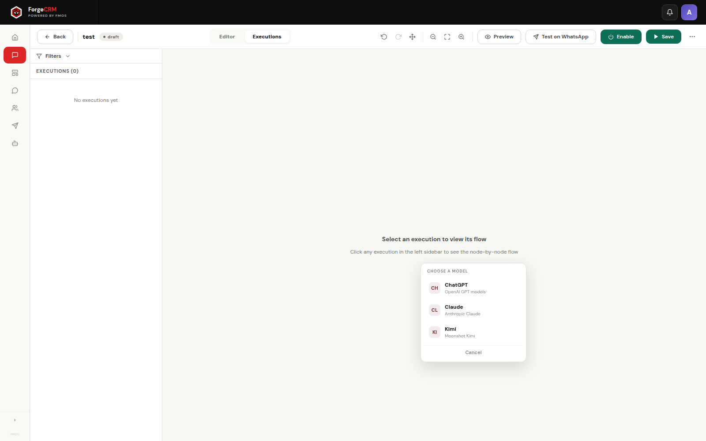

- **Code pointer:** [frontend/src/components/AutomationExecutions.jsx](frontend/src/components/AutomationExecutions.jsx)
- **What the user sees and can do:**
  - Mounted when `BuilderToolbar`'s "Executions" tab is active. Polls `GET /api/chatbots/:id/executions` every 15s.
  - Filter chips: Status (all / success / error / running / queued / cancelled), date range pickers, WhatsApp message-status dropdown.
  - Table rows show one execution each (started timestamp, status badge, trigger type, contact number). Pagination shows `page / totalPages`.
  - Clicking a row opens a drawer that fetches `GET /api/executions/:id` and renders `ExecutionFlowCanvas` — a read-only mini-canvas with per-step status colours and clickable step bubbles that expand the step's `output_data` JSON.
  - Empty state when no executions exist (a new automation has none until a real WhatsApp trigger fires).

---

### 14b.9 Template Builder — List

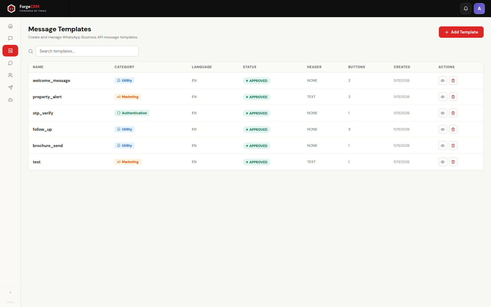

- **Code pointer:** [frontend/src/pages/TemplateBuilderPage.jsx](frontend/src/pages/TemplateBuilderPage.jsx)
- **What the user sees and can do:**
  - Title "Template Builder" + "+ New Template" button (top-right).
  - Search box (filter by name/category/status).
  - Table: Name (snake_case), Category (MARKETING / UTILITY / AUTHENTICATION badge), Language, Status (DRAFT / SUBMITTED / APPROVED / REJECTED badge), Updated, Actions (✏ View / 🗑 Delete).
  - Clicking ✏ opens the builder form pre-populated. Clicking + creates a fresh template.

---

### 14b.10 Template Builder — Form


- **Code pointer:** [frontend/src/pages/TemplateBuilderPage.jsx](frontend/src/pages/TemplateBuilderPage.jsx) (inner builder view)
- **Sub-components used:** `WhatsAppPreview` for the phone mockup
- **What the user sees and can do:**
  - Left form: Name (snake_case validated), Category radio, Language dropdown, Header type radio (NONE / TEXT / IMAGE / VIDEO / DOCUMENT), Header text or media handle, Body textarea (supports `{{N}}` variables), Footer textarea, Sample-value inputs per detected `{{N}}`.
  - Buttons section: add up to 2 URL buttons + 1 PHONE_NUMBER + N QUICK_REPLY / OTP. Per-button validation (HTTPS URLs, E.164 phone, etc.).
  - Right phone preview: live `WhatsAppPreview` mockup reflecting all edits.
  - Footer actions: Save as Draft, Submit for review, Approve / Reject (simulation), View payload (opens JSON viewer with Meta API body), Delete.
  - Server-side validation surfaces field-keyed errors in `{ error, errors }` response (Section 26).

---

### 14b.11 Chats — empty state (no number selected)

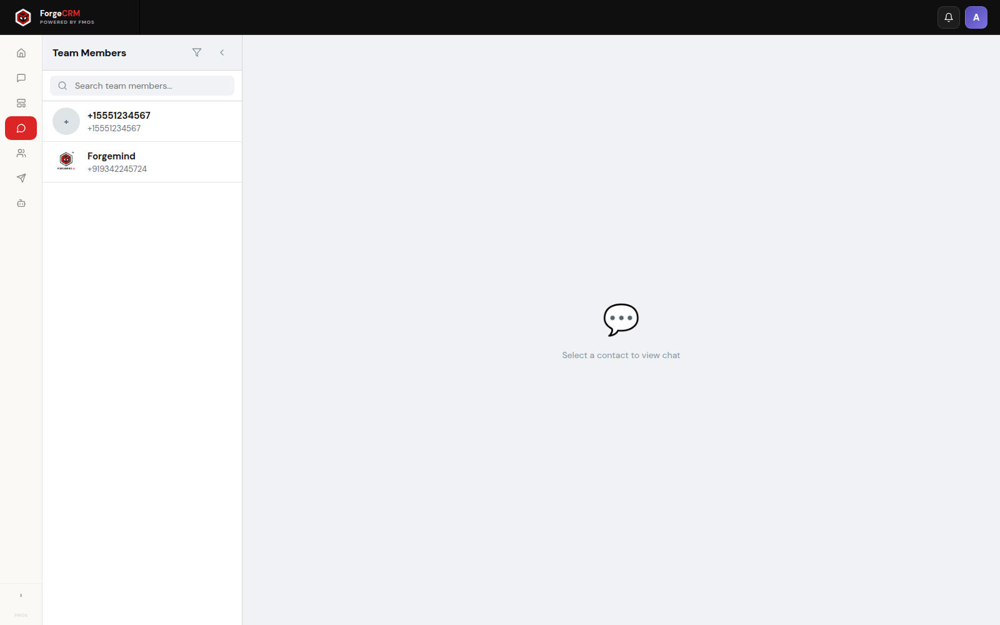

- **Code pointer:** [frontend/src/components/ChatsPage.jsx:7](frontend/src/components/ChatsPage.jsx#L7)
- **Sub-components used:** `NumberSidebar`, `ContactList`, `ChatWindow`
- **What the user sees and can do:**
  - Three-pane layout: `NumberSidebar` (320px), middle blank until a number is picked, right pane shows "Select a contact to view chat" placeholder.
  - The Team Members panel polls `GET /api/numbers` every 15s and shows business WhatsApp numbers active in the last 14 days, enriched with display name / profile picture from `team_members` (or fallback to the raw `+91…`).

---

### 14b.12 Chats — number selected → contact list


- **Code pointer (middle pane):** [frontend/src/components/ContactList.jsx](frontend/src/components/ContactList.jsx)
- **What the user sees and can do:**
  - Middle pane now shows the `ContactList` (380px). Polls `GET /api/contacts?waNumber=…&timeRange=30d` every 15s.
  - Search box (name/phone), time-range pills (1h / 6h / 24h / 7d / 14d / 30d).
  - Each row: avatar (or initial), name (from `contacts.name` or phone), last message preview, message count badge.
  - Selecting a row opens the conversation in `ChatWindow`.

---

### 14b.13 Chats — conversation open


- **Code pointer:** [frontend/src/components/ChatWindow.jsx](frontend/src/components/ChatWindow.jsx)
- **What the user sees and can do:**
  - Right pane shows the message history (`MessageBubble` per row) with WhatsApp-style green outgoing / white incoming bubbles.
  - Header bar shows contact name + pencil icon → opens contact-edit modal (fetches `GET /api/contact` then submits `POST /api/contacts/save`).
  - Search messages box, direction filter (all / incoming / outgoing), pagination next/prev.
  - Bottom send input is rendered but is currently non-functional (no `POST /api/messages` endpoint yet — see Section 21 #6).
  - Polls `GET /api/messages?waNumber=…&contactNumber=…&page=…` every 15s.

---

### 14b.14 Contacts


- **Code pointer:** [frontend/src/pages/ContactsPage.jsx](frontend/src/pages/ContactsPage.jsx)
- **What the user sees and can do:**
  - One table per WhatsApp business number (fetched from `GET /api/numbers` → for each, `GET /api/saved-contacts?waNumber=…`).
  - Search box (filter by name/phone), tag filter multi-select (client-side AND).
  - Rows show name, phone, tags as coloured pills, custom field summary.
  - Clicking a row opens a view/edit modal — fetches `GET /api/contact`, then on Save calls `POST /api/contacts/save` with name + tags (one per category) + custom-field values (type-validated on blur).

---

### 14b.15 Bulk Message


- **Code pointer:** [frontend/src/pages/BulkMessagePage.jsx](frontend/src/pages/BulkMessagePage.jsx)
- **What the user sees and can do:**
  - Two-column layout: list of broadcasts on the left (filterable by status), composer on the right.
  - Composer: name, from-number (from `/numbers`), template picker (from `/templates`, filtered to APPROVED), recipient picker (from `/saved-contacts` or pasted list), per-variable `variable_mapping` from contact fields or literals, optional test number.
  - Footer actions: Save Draft (`POST /broadcasts`), Send Test (`POST /broadcasts/:id/test`), Send Now (`POST /broadcasts/:id/send`), Refresh, Delete.
  - Per-recipient `broadcast_logs` rows are shown in a separate panel.

---

### 14b.16 AI Agent Builder (placeholder)

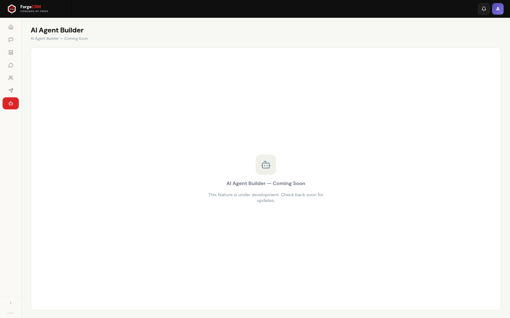

- **Code pointer:** [frontend/src/pages/AiAgentBuilderPage.jsx:1](frontend/src/pages/AiAgentBuilderPage.jsx#L1)
- **What the user sees and can do:** A 6-line placeholder ("Coming soon"). This page is distinct from the `ai_agent` node inside the Automation Builder. Reserved for a future standalone agent-management UI.

---

### 14b.17 Admin Settings — General tab


- **Code pointer:** [frontend/src/pages/AdminSettingsPage.jsx](frontend/src/pages/AdminSettingsPage.jsx)
- **Tab key:** `general`
- **What the user sees and can do:** Theme picker (UI-only, no persistence), Sign out (calls `POST /api/auth/logout` via the `onLogout` prop), Delete account button (UI only — no API hook). Reachable via the Topbar avatar dropdown.

---

### 14b.18 Admin Settings — Team

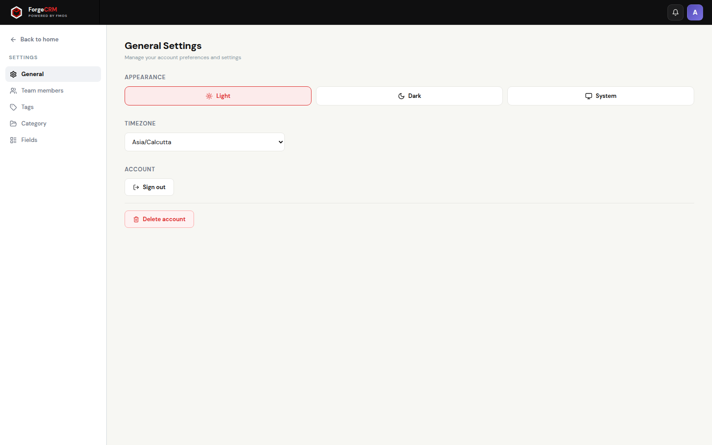

- **Tab key:** `team`
- **What the user sees and can do:**
  - "+ Add Team Member" opens a modal. Required: Name. Optional: Phone, BDA ID (unique), Email, Address, Profile picture (uploaded via `POST /api/upload`, JPG/PNG ≤ 2 MB; Ctrl+V paste supported).
  - Table merges manual rows (from `team_members`) and "virtual" chat-derived rows (any `wa_number` active in `chat_history` over 30 days, id-prefixed `wa-`). Virtual rows cannot be deleted (server returns 400).

---

### 14b.19 Admin Settings — Tags

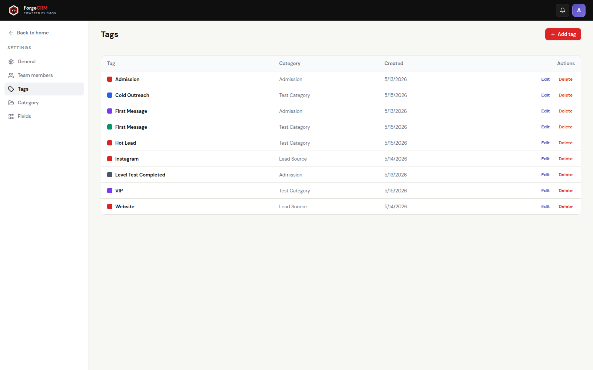

- **Tab key:** `tags`
- **What the user sees and can do:**
  - "+ New Tag" modal: Name (required), Category (required, dropdown from `/categories`), Colour picker (default `#dc2626`).
  - Table shows all tags with their category, colour swatch, and edit/delete actions. Used app-wide for contact tagging.

---

### 14b.20 Admin Settings — Category

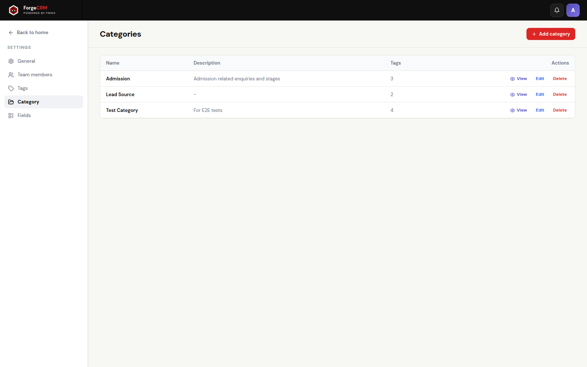

- **Tab key:** `category`
- **What the user sees and can do:**
  - "+ New Category" modal: Name (required), Description (optional).
  - Clicking a category drills down to show only its tags (client-side filter of the Tags table).

---

### 14b.21 Admin Settings — Fields

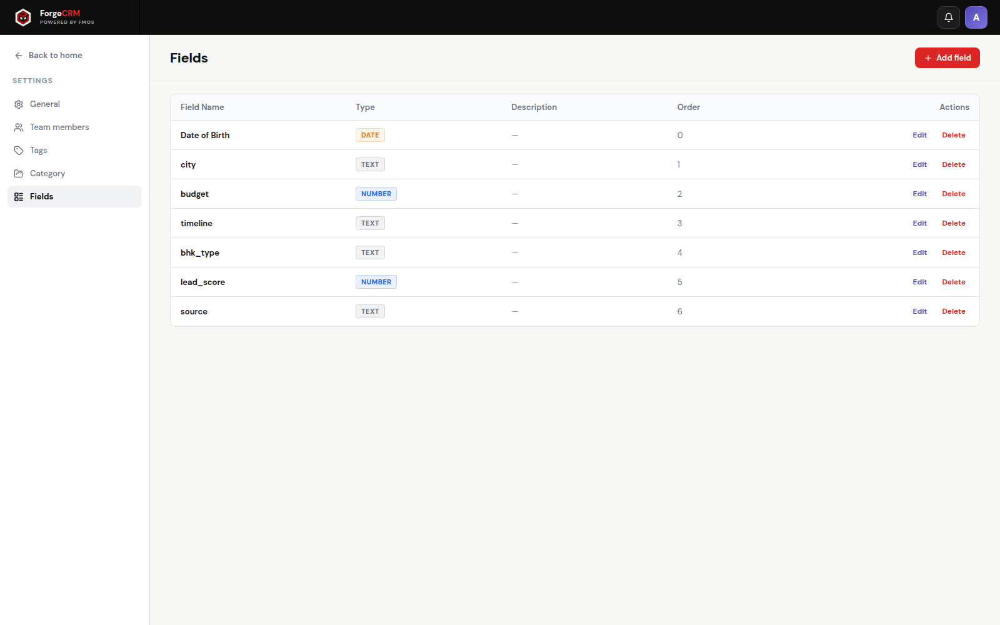

- **Tab key:** `fields`
- **What the user sees and can do:**
  - "+ New Field" modal: Name (required), Description, Field Type (text / number / phone / email / date / url / textarea), Sort Order (int).
  - Defined fields appear on every contact-edit modal as type-validated inputs; values are persisted into `contacts.custom_fields` JSONB by `POST /api/contacts/save`.

---

## Section 22 — UI Button & Control Reference *(extra)*

This section enumerates every clickable control across the app, what input it expects, and what output / API call it produces. Rows are grouped by page; control labels match what the user sees.

### Topbar (always visible, `src/components/Topbar.jsx`)

| Control | Input | Output | API |
|---------|-------|--------|-----|
| **Logo / "ForgeChat"** | Click | `onNavigate('chats')` — switches page state to Chats | none |
| **Bell icon** | Click | Visual only — no handler (purely decorative) | none |
| **Avatar (user initial)** | Click | Toggles user dropdown | none |
| **"Admin Settings"** (dropdown) | Click | `onNavigate('admin-settings')` | none |
| **"Sign out"** (dropdown) | Click | Calls `api.auth.logout()` then `setUser(null)` | `POST /api/auth/logout` → `200 { ok:true }` |

### Sidebar (`src/components/Sidebar.jsx`)

| Control | Input | Output | API |
|---------|-------|--------|-----|
| **Home** | Click | `onPageChange('home')` | none |
| **Automations** | Click | `onPageChange('chatbot-builder')` | none |
| **Template Builder** | Click | `onPageChange('template-builder')` | none |
| **Chats** | Click | `onPageChange('chats')` | none |
| **Contacts** | Click | `onPageChange('contacts')` | none |
| **Bulk Message** | Click | `onPageChange('bulk-message')` | none |
| **AI Agent Builder** | Click | `onPageChange('ai-agent-builder')` (placeholder page) | none |
| **‹ Collapse / ›** | Click | Toggles `sidebarCollapsed` boolean in `App.jsx` | none |

### LoginGate (`src/components/LoginGate.jsx`)

| Control | Input | Output | API |
|---------|-------|--------|-----|
| **Email field** | Email string | local state | — |
| **Password field** | Password string | local state | — |
| **Eye / EyeOff** | Click | Toggle `showPw` | — |
| **"Sign in"** | Click / Enter | `api.auth.login(email, password)` → on success calls `onLogin(user)`; on error sets `error` banner | `POST /api/auth/login { email, password }` → `200 { user }` or `400/401 { error }` |

### ChatsPage — NumberSidebar

| Control | Input | Output | API |
|---------|-------|--------|-----|
| **Search** | Text | filters `numbers` client-side by `wa_number` or `display_name` | — |
| **Filter icon** | Click | Decorative — no handler | — |
| **Chevron icon** | Click | Decorative — no handler | — |
| **Number row** | Click | `onSelectNumber(wa_number)` — also resets selected contact | — |
| (polling) | — | every 15s | `GET /api/numbers` → `200 [{ wa_number, last_message_time, message_count, display_name, profile_picture_url }, …]` |

### ChatsPage — ContactList

| Control | Input | Output | API |
|---------|-------|--------|-----|
| **Search** | Text | filter contacts client-side | — |
| **Time-range pills (1h–30d)** | Click | re-fetches `api.contacts(waNumber, range)` | `GET /api/contacts?waNumber=…&timeRange=…` |
| **Contact row** | Click | `onSelectContact(contact_number)` | — |
| (polling) | — | every 15s | `GET /api/contacts?waNumber=…&timeRange=30d` |

### ChatsPage — ChatWindow

| Control | Input | Output | API |
|---------|-------|--------|-----|
| **Pencil (edit contact)** | Click | opens contact-edit modal | `GET /api/contact?waNumber=…&contactNumber=…` |
| **Search messages** | Text | re-fetches with `search` param | `GET /api/messages?…&search=…` |
| **Direction filter** | Click | re-fetches with `direction=incoming|outgoing|all` | `GET /api/messages?…&direction=…` |
| **Pagination next/prev** | Click | bumps `page` param | `GET /api/messages?…&page=…` |
| **"Send" input** | Text | local only — has no submit handler | none |
| **Message bubble → image** | Click | opens lightbox modal | — |
| (polling) | — | every 15s | `GET /api/messages?…` |

#### Contact edit modal

| Control | Input | Output | API |
|---------|-------|--------|-----|
| **Name field** | Text | local | — |
| **Tag pills (per category)** | Click | toggle tag in `tags` JSONB array | — |
| **Custom field inputs** | Type-validated by `field_type` | local | — |
| **Save** | Click | `api.saveContact(...)`. On success calls `onContactSaved` (bumps `contactRefreshKey`) | `POST /api/contacts/save { waNumber, contactNumber, name, tags[], customFields{} }` → `200 { ok:true }` |
| **Cancel / X** | Click | close modal without save | — |

### ChatbotBuilderPage (Automations list view)

| Control | Input | Output | API |
|---------|-------|--------|-----|
| **+ New Automation** | Click | opens `NewAutomationModal` | — |
| Modal → **Name** | Text (required) | local | — |
| Modal → **Description** | Text (optional) | local | — |
| Modal → **Next →** | Click | `api.chatbots.create({…, status:'draft', config:{nodes:[],edges:[]}})` → switches to builder view | `POST /api/chatbots` → `201 { id, name, status:'draft', config }` |
| Modal → **Cancel / X** | Click | close modal (does NOT delete the row if create succeeded) | — |
| **Search** | Text | client-side filter on name/description/status | — |
| **Edit row (✏)** | Click | sets `editingChatbot`, opens builder | — |
| **Delete row (🗑)** | Click | opens `DeleteConfirmModal` | — |
| Delete confirm → **Confirm** | Click | `api.chatbots.delete(id)` | `DELETE /api/chatbots/:id` → `200 { ok:true }` |
| Delete confirm → **Cancel** | Click | close modal | — |

### AutomationBuilder Toolbar

| Control | Input | Output | API |
|---------|-------|--------|-----|
| **Back** | Click | calls `onBack` (returns to list, reloads automations) | — |
| **Automation title** | Click | inline-edit (commits on Enter / blur) | (no PUT — name is reloaded from list view, edits to title are lost) |
| **Status pill** | (display only) | reflects current `automation.status` | — |
| **Editor tab** | Click | `onTabChange('editor')` | — |
| **Executions tab** | Click | `onTabChange('executions')` — mounts `AutomationExecutions` | `GET /api/chatbots/:id/executions?…` |
| **Undo** | Click | rewinds history pointer | — |
| **Redo** | Click | advances history pointer | — |
| **Auto-arrange** | Click | `autoLayout(nodes, edges)` — sets nodes' `x`/`y` and pushes history | — |
| **Zoom out / Fit / Zoom in** | Click | mutates `transform.scale` (clamped 0.3–2.0) | — |
| **Preview** | Click | toggles `PhonePreview` simulator | — |
| **Test on WhatsApp** | Click | no handler — purely decorative | — |
| **Enable** (when `status!=='active'`) | Click | `onToggleStatus('active')` → updates local + remote | `PUT /api/chatbots/:id { status:'active' }` |
| **Disable** (when `status==='active'`) | Click | `onToggleStatus('inactive')` | `PUT /api/chatbots/:id { status:'inactive' }` |
| **Save** (toolbar) | Click | `handleSave()` → calls parent `onSave({ config:{ nodes, edges } })` | `PUT /api/chatbots/:id { config }` |
| **⋯ More** | Click | no handler — decorative | — |

### AutomationBuilder Canvas

| Control | Input | Output | API |
|---------|-------|--------|-----|
| **Block from library** | Click / drag-drop | `makeNode(type,x,y,id,templates)` then `setNodes([…,newNode])`; pushes history | — |
| **+ (append plus, below a node's output)** | Click | opens `NodePicker` near cursor → on pick inserts new node + edge | — |
| **+ (edge plus, mid-edge)** | Click | opens `NodePicker` — on pick replaces the edge with two edges and inserts the new node between | — |
| **× (edge delete)** | Click | removes that edge, pushes history | — |
| **Node body** | Click | selects node — opens `SettingsPanel` | — |
| **Node body** | Drag | repositions; on mouseup pushes history | — |
| **Node input handle (top of node)** | (target) | drop-target for ghost connector | — |
| **Node output handle (bottom)** | Mouse-down + drag | starts ghost line; on drop on input handle creates new edge | — |
| **AI Agent ⇽ Model handle** (left side) | Click | opens `AgentResourcePicker` (kind=`model`) | — |
| **AI Agent ⇾ Tool handle** (right side) | Click | opens `AgentResourcePicker` (kind=`tool`, multi-select) | — |
| **Duplicate (floating ⎘ above selected node)** | Click | adds a clone of the node 80px below; pushes history | — |
| **Delete (floating 🗑 above selected node)** | Click | opens `confirmOpen` dialog → on confirm removes node + connected edges | — |

#### AgentResourcePicker

| Control | Input | Output |
|---------|-------|--------|
| **ChatGPT / Claude / Kimi** (model picker) | Click | `onPick({id,label})` → sets `node.modelRef={id,label}` (or clears if same selected); closes picker |
| **Gmail / Google Sheets / Google Calendar / Slack / Notion / Custom Webhook** (tool picker) | Click | toggles entry in `node.toolRefs[]`; picker stays open for multi-select |
| **Done / Cancel** | Click | closes picker (Done for tool, Cancel for model) |

### Per-node SettingsPanel buttons

Every node-type body in the settings panel ends with the same three-button row:

| Control | Input | Output | API |
|---------|-------|--------|-----|
| **Save** | Click | `onSaveAndClose()` → `handleSave()` (persists config via PUT) + `setSelectedId(null)` (closes panel) | `PUT /api/chatbots/:id { config }` |
| **Duplicate** | Click | `onDuplicateNode(node.id)` — clone node 80px below | — |
| **Delete** | Click | `onDeleteNode(node.id)` → opens confirm dialog | — |

### TemplateBuilderPage

| Control | Input | Output | API |
|---------|-------|--------|-----|
| **+ New Template** | Click | switches to builder view | — |
| **Name** | snake_case text | local + live validation | — |
| **Category** (radio) | MARKETING / UTILITY / AUTHENTICATION | local | — |
| **Language** (dropdown) | en, en_US, … | local | — |
| **Header type** (radio) | NONE / TEXT / IMAGE / VIDEO / DOCUMENT | local | — |
| **Header text** | Text (≤60, ≤1 var) | local | — |
| **Media handle** | Meta file handle string | local | — |
| **Body** | Multiline text (required, can contain `{{N}}`) | local | — |
| **Footer** | Text (≤60, no vars) | local | — |
| **+ Add Button** | Click | adds entry to `buttons[]` (max 2 URL + 1 PHONE + N QUICK_REPLY / OTP) | — |
| **Button → text / URL / phone / OTP type** | Various | local | — |
| **Sample values** (per `{{N}}`) | Text | local (stored in `samples` map) | — |
| **Save as Draft** | Click | `api.templates.create(data)` or `update(id, data)` | `POST /api/templates` or `PUT /api/templates/:id` |
| **Submit for review** | Click | `api.templates.submit(id)` | `POST /api/templates/:id/submit` |
| **Approve** | Click | `api.templates.approve(id)` | `POST /api/templates/:id/approve` |
| **Reject** | Click | `api.templates.reject(id)` | `POST /api/templates/:id/reject` |
| **View payload** | Click | `api.templates.payload(id)` — opens JSON viewer | `GET /api/templates/:id/payload` |
| **Delete (in list)** | Click | `api.templates.delete(id)` | `DELETE /api/templates/:id` |

### BulkMessagePage

| Control | Input | Output | API |
|---------|-------|--------|-----|
| **+ New Broadcast** | Click | opens composer panel | — |
| **Name** | Text | local | — |
| **From number** (dropdown) | from `/numbers` | local | — |
| **Template** (dropdown) | from `/templates?status=APPROVED` (filtered client-side) | local; shows live phone preview | — |
| **Audience (recipients)** | multi-select from `/saved-contacts` or pasted phone list | `recipient_numbers[]` | — |
| **Variable mapping** | per `{{N}}` map to contact field or literal | `variable_mapping{}` | — |
| **Test number** | E.164 phone | local | — |
| **Save Draft** | Click | `api.broadcasts.create(data)` with `status:'DRAFT'` | `POST /api/broadcasts` → `201 { broadcast }` |
| **Send Test** | Click | `api.broadcasts.test(id, testNumber)` | `POST /api/broadcasts/:id/test { test_number }` |
| **Send Now** | Click | `api.broadcasts.send(id)` | `POST /api/broadcasts/:id/send` → `200 { broadcast + logs }` |
| **Pause** | Click | (no PUT — UI only; the backend's `/broadcasts` PUT only edits DRAFT broadcasts) | — |
| **Delete row** | Click | confirm modal → `api.broadcasts.delete(id)` | `DELETE /api/broadcasts/:id` |
| **Refresh** | Click | re-runs `api.broadcasts.list(status)` | `GET /api/broadcasts[?status=…]` |

### ContactsPage

| Control | Input | Output | API |
|---------|-------|--------|-----|
| **Search** | Text | client-side filter by name/phone | — |
| **Tag filter** (multi-select) | tag refs | client-side AND filter | — |
| **Row click** | Click | opens contact view/edit modal | `GET /api/contact?waNumber=…&contactNumber=…` |
| Modal → **Save** | Click | `api.saveContact(...)` | `POST /api/contacts/save` |
| Modal → **Cancel** | Click | closes (no save) | — |
| Time-range tabs (per number) | Click | re-fetches `api.savedContacts(waNumber)` | `GET /api/saved-contacts?waNumber=…` |

### AdminSettingsPage

| Tab | Control | Input | Output | API |
|-----|---------|-------|--------|-----|
| **general** | Theme selector | Click | local only (no persistence) | — |
| general | Sign out | Click | calls `onLogout` → API logout | `POST /api/auth/logout` |
| general | Delete account | Click | shows danger confirm — handler does nothing (no API) | — |
| **team** | + Add Team Member | Click | opens add modal | — |
| team modal | Name (required), Phone, BDA ID, Email, Address | Text | local | — |
| team modal | Profile picture upload | File chooser / Ctrl+V paste | `api.upload(file)` returns `{ url }`, stored as `profile_picture_url` | `POST /api/upload (multipart)` → `200 { url:'/uploads/bda-…' }` |
| team modal | Save | Click | `api.teamMembers.create(data)` | `POST /api/team-members` → `201 { member }` |
| team modal | Cancel | Click | close | — |
| team row | Edit | Click | opens edit modal pre-filled | — |
| team row | Delete | Click | confirm → `api.teamMembers.delete(id)`. If id starts with `wa-` (chat-derived BDA) → `400` | `DELETE /api/team-members/:id` |
| **tags** | + New Tag | Click | opens modal | — |
| tags modal | Name (required), Category (required), Color picker | Various | local | — |
| tags modal | Save | Click | `api.tags.create(data)` | `POST /api/tags` → `201 { tag }` |
| tags row | Edit | Click | edit modal | `PUT /api/tags/:id` |
| tags row | Delete | Click | confirm → `api.tags.delete(id)` | `DELETE /api/tags/:id` |
| **category** | + New Category | Click | modal | — |
| category modal | Name (required), Description | Text | local | — |
| category modal | Save | Click | `api.categories.create(data)` | `POST /api/categories` → `201 { category }` |
| category drill-down | Click row | shows tags belonging to that category | `GET /api/tags` (client-side filter) |
| category row | Edit / Delete | Click | edit modal / confirm | `PUT /api/categories/:id` / `DELETE /api/categories/:id` |
| **fields** | + New Field | Click | modal | — |
| fields modal | Name (required), Description, Field Type (text/number/phone/email/date/url/textarea), Sort Order | Various | local | — |
| fields modal | Save | Click | `api.contactFields.create(data)` | `POST /api/contact-fields` → `201 { field }` |
| fields row | Edit / Delete | Click | edit modal / confirm | `PUT /api/contact-fields/:id` / `DELETE /api/contact-fields/:id` |

### AutomationExecutions (Executions tab)

| Control | Input | Output | API |
|---------|-------|--------|-----|
| **Refresh** | Click | re-fetches current page | `GET /api/chatbots/:id/executions?…` |
| **Status filter chip** (all/success/error/running/queued/cancelled) | Click | sets `status` query param | `GET /api/chatbots/:id/executions?status=…` |
| **Date range** | Date pickers | sets `startDate`, `endDate` | `GET /api/chatbots/:id/executions?startDate=…&endDate=…` |
| **WhatsApp status filter** | dropdown | sets `messageStatus` | `GET /api/chatbots/:id/executions?messageStatus=…` |
| **Pagination prev/next** | Click | bumps `page` | `GET /api/chatbots/:id/executions?page=…` |
| **Execution row** | Click | opens drawer → mounts `ExecutionFlowCanvas` with detailed steps | `GET /api/executions/:id` → `200 { execution, steps[] }` |
| **Step bubble** in canvas | Click | toggles step-detail JSON viewer | — |
| (polling) | — | every 15s while open | `GET /api/chatbots/:id/executions?…` |

---

## Section 23 — Automation Builder Node Reference *(extra)*

This section is the single source of truth for every node type in the builder: its data shape on disk, its UI settings, its input/output connectors, and the runtime contract (what the backend engine does with it today, and what payload it produces).

### Common node shape

Every node in `chatbots.config.nodes[]` shares this base:

```json
{
  "id": "n3",
  "type": "trigger|message|condition|action|delay|api|handoff|ai|ai_agent|subflow",
  "x": 320, "y": 240,
  "title": "human-readable label",
  "sub":   "short subtitle shown on the card",
  "disabled": false                  // optional — when true, node is greyed out
}
```

Edges in `chatbots.config.edges[]`:

```json
{ "from": "n1", "to": "n2", "fromHandle": "default|yes|no|btn:0|row:0|model|tool" }
```

`fromHandle` defaults to `"default"` if missing. The engine treats `undefined` and `"default"` as equivalent.

### Visual handle map

```
                ╔══════════════════╗
                ║   ▼ input        ║   (top, always present except on trigger nodes)
                ║                  ║
                ║   <icon> LABEL   ║
                ║   Title          ║
                ║   subtitle       ║
                ║                  ║
   ────► (◯)   ║                  ║   (●) ────►   (AI Agent only — Model on left,
   Model       ║                  ║   Tool        Tool on right; never spawn "+" buttons)
                ║                  ║
                ║   (●) output     ║   (bottom — `default` for most types;
                ╚══════════════════╝   `yes`/`no` for `condition`; `btn:N`/`row:N`
                                       for message-direct quick-reply/list)
```

### Trigger node (`type: "trigger"`)

Created with `triggerKind: "keyword"`. Settings panel changes radically based on `triggerKind`.

| Field | Type | Default | Used when | Notes |
|-------|------|---------|-----------|-------|
| `triggerKind` | string | `keyword` | always | one of `keyword|link|qr|newContact|anyMessage|tagApplied|webhook|apiEvent` |
| `keyword` | string | `""` | `keyword` | matched against `chat_history.message_body` |
| `matchType` | enum | `exact` | `keyword` | `exact|contains|starts` |
| `caseSensitive` | bool | `false` | `keyword` | |
| `tag` | string | — | `tagApplied` | not currently evaluated by engine |
| `webhookSecret` | string | — | `webhook` | for HMAC verification (UI only — engine ignores) |

#### Connectors

- Input: **none** (trigger is the entry point)
- Output: single `default`

#### Runtime contract

`executeTriggerNode` is always run first by `executeAutomation`. It logs a step with `output` containing:

```json
{
  "triggerKind": "keyword",
  "keyword": "PRICE",
  "matchType": "exact",
  "whatsapp": {
    "direction": "incoming|status_update",
    "message_id": "wamid.XXX",
    "from": "919999000111",
    "to":   "919876543210",
    "message_type": "text",
    "message_body": "PRICE",
    "timestamp": "2026-05-16T13:42:00Z",
    "wa_number": "919876543210",
    "phone_number_id": "PHONE_ID",
    "contact_name": "John",
    "media_url": null,
    "media_mime_type": null,
    "status": "received",
    "raw": { /* full inbound webhook fields */ }
  },
  "contact": { "name":"John", "contact_number":"919999000111", "tags":[…], "custom_fields":{…} }
}
```

Trigger evaluation rules (per `triggerKind`):

| triggerKind | Engine logic |
|-------------|--------------|
| `keyword` | `matchesKeyword(body, kw, matchType, caseSensitive)` |
| `anyMessage` | always fires for every inbound non-status message |
| `newContact` | fires when `COUNT(*) FROM chat_history WHERE wa_number=$1 AND contact_number=$2` ≤ 2 |
| `messageRead`/`messageDelivered`/`messageSent` | fires when `message_type='status'` AND `status` matches |
| `link`, `qr`, `tagApplied`, `webhook`, `apiEvent` | declared but **not evaluated** by the current engine |

### Message node (`type: "message"`)

```json
{
  "id":"n2","type":"message","x":320,"y":380,
  "title":"WhatsApp Message","sub":"Approved template message",
  "messageMode": "template|direct",
  "templateId": 7,
  "bindings": { "var1": "{{name}}", "var2": "20% off" },
  "directType": "text|image|video|audio|document|location|contact|product|catalog|quick_reply|list|dynamic_api",
  "directData": { "body":"Hi {{name}}", "url":"https://…", "caption":"…", "buttons":[ {"text":"Yes"} ], "sections":[ {"title":"…","rows":[…]} ], … },
  "buttons":  [ { "text":"Yes" }, { "text":"No" } ]   // when messageMode=template AND template has buttons
}
```

#### Connectors

- Input: top center
- Output: bottom center `default`, **plus** one per template button if `buttons[]` exists (handles `btn:0`, `btn:1`, …)
- For `messageMode='direct'` with `directType='quick_reply'`, outputs are one per `directData.buttons[i]` (`btn:i`)
- For `directType='list'`, outputs are one per `directData.sections[i]` row (`row:i`)

#### Settings panel UI

The panel splits into a tab strip:
- **Template** tab — Select template (dropdown of all `/templates`), with badge for status (Approved/Pending), bindings for `{{1}}`, `{{2}}`, …, alert if outside 24-hour window
- **Direct** tab — Type selector (12 types from `DIRECT_MSG_TYPES`), fields depend on type. Includes a JSON-editable Headers field for `dynamic_api`.

#### Runtime contract

`executeMessageNode` simulates Meta's API response (does **not** call the real API):

```json
{
  "mode": "template",
  "templateId": 7,
  "templateName": "welcome_pricing",
  "templateCategory": "MARKETING",
  "templateLanguage": "en",
  "bindings": { "var1":"John" },
  "resolvedBody": "Hi John, our prices…",
  "to": "919999000111",
  "contactName": "John",
  "deliveryStatus": "accepted",
  "note": "Message accepted by WhatsApp API",
  "apiResponse": {
    "messaging_product": "whatsapp",
    "message_id": "wamid.1747396800000.abcd1234",
    "status": "accepted",
    "recipient_id": "919999000111",
    "recipient_wa_id": "919999000111",
    "timestamp": "2026-05-16T13:42:01Z",
    "raw": { "messages":[{"id":"wamid…","message_status":"accepted"}], "contacts":[{"input":"…","wa_id":"…"}] }
  },
  "whatsapp": { "message_id":"wamid…", "from":"919876543210", "to":"919999000111",
                "message_type":"template", "status":"accepted", "timestamp":"…" }
}
```

Step row gets `wa_message_id` and `wa_message_status` extracted from `output.apiResponse`.

When wired to the real Meta API, the engine should `POST https://graph.facebook.com/v18.0/<PHONE_NUMBER_ID>/messages` with a payload like:

```json
{ "messaging_product":"whatsapp", "to":"919999000111", "type":"template",
  "template":{ "name":"welcome_pricing", "language":{"code":"en"},
    "components":[ {"type":"body","parameters":[{"type":"text","text":"John"}]} ] } }
```

### Condition node (`type: "condition"`)

```json
{
  "id":"n3","type":"condition","x":600,"y":200,
  "matchMode": "all|any",
  "rules": [
    { "source":"system|custom|tags|bot|entry|optin",
      "field":"name|<custom_field_id>|<tag_id>",
      "op":"equals|not equals|contains|not contains|starts with|ends with|is empty|is not empty|greater than|less than|has tag|not has tag|is true|is false",
      "value":"comparison value (string)" }
  ]
}
```

#### Connectors

- Input: top
- Outputs: `yes` (bottom-left, 33%) and `no` (bottom-right, 67%)

#### Runtime contract

`executeConditionNode` returns `{ matched: bool, matchMode, rulesEvaluated: N }`. Engine then picks the next edge by `fromHandle: 'yes'|'no'`.

### Action node (`type: "action"`)

```json
{
  "id":"n4","type":"action","x":600,"y":420,
  "actions": [
    { "id":"a1", "kind":"Assign to Agent",     "value":"<team_member_id>" },
    { "id":"a2", "kind":"Add Tag",            "value":"<tag_id>" },
    { "id":"a3", "kind":"Remove Tag",         "value":"<tag_id>" },
    { "id":"a4", "kind":"Set Custom Field",   "value": { "fieldId":"…","value":"…" } },
    { "id":"a5", "kind":"Clear Custom Field", "value":"<field_id>" },
    { "id":"a6", "kind":"Update Lead Score",  "value":+10 | -5 },
    { "id":"a7", "kind":"Subscribe Contact" },
    { "id":"a8", "kind":"Unsubscribe Contact" },
    { "id":"a9", "kind":"Send Email",         "value":"name@domain.com" },
    { "id":"a10","kind":"Start Sequence" },
    { "id":"a11","kind":"Pause Sequence" },
    { "id":"a12","kind":"End Sequence" }
  ]
}
```

Each action `kind` corresponds to one of the 12 `ACTION_KINDS` declared in `AutomationBuilderView.jsx:315`.

#### Connectors

- Input top, single `default` output bottom

#### Runtime contract

`executeActionNode` just logs `{ results: actions.map(a => ({ kind, value, status:'logged', note:'Action logged for downstream processing' })) }`. No actual side-effects happen yet — the engine never mutates tags, custom fields, or sends email.

### Delay node (`type: "delay"`)

```json
{
  "id":"n5","type":"delay","x":600,"y":600,
  "delayMode": "duration|date|field|until",
  "waitValue": "10",
  "waitUnit":  "minutes|hours|days",
  "useContactTz": false,
  "specificDate": "2026-05-20T10:00:00",  // when delayMode=date|until
  "dateField":    "<custom_field_id>"      // when delayMode=field
}
```

#### Connectors

- Input top, single `default` output bottom

#### Runtime contract

`executeDelayNode` immediately returns; no actual wait occurs. Output:

```json
{ "delayMode":"duration", "waitValue":"10", "waitUnit":"minutes",
  "useContactTz": false, "note":"Delay scheduled (actual delay handled by scheduler)" }
```

### API node (`type: "api"`)

```json
{
  "id":"n6","type":"api","x":600,"y":800,
  "method": "GET|POST|PUT|PATCH|DELETE",
  "apiUrl": "https://api.example.com/endpoint",
  "headers": { "Authorization": "Bearer …", "Content-Type": "application/json" },
  "body": "{\"foo\":\"bar\"}",
  "onError": "continue|retry|exit",
  "responseFieldPath": "$.data.id",   // optional JSONPath to extract
  "saveToField":       "<custom_field_id>"
}
```

#### Connectors

- Input top, single `default` output bottom

#### Runtime contract

`executeAPINode` does not actually perform the HTTP request; it logs `{ method, url, note:'API call logged (actual HTTP request not implemented)' }`. When wired up, expected request:

```http
<method> <apiUrl> HTTP/1.1
<headers>

<body>
```

Expected response handling: parse JSON, evaluate `responseFieldPath` (JSONPath), upsert into `contacts.custom_fields[saveToField]`.

### Handoff node (`type: "handoff"`)

```json
{
  "id":"n7","type":"handoff","x":600,"y":1000,
  "assignMode": "specific|round-robin",
  "assigned":   [ "<team_member_id>", … ],
  "priority":   "low|normal|high",
  "slaValue":   "15",
  "slaUnit":    "minutes|hours",
  "internalNote": "free text",
  "notify":  { "wa": true, "email": true, "task": false }
}
```

#### Connectors

- Input top, single `default` output bottom (engine **breaks** the loop after handoff regardless — see Section 7)

#### Runtime contract

```json
{ "assignMode":"specific", "assigned":["bda-…"], "priority":"high",
  "slaValue":"15", "slaUnit":"minutes",
  "note":"Conversation handed off to human agent" }
```

The engine stops walking after this node, so any edges downstream are unreachable until the agent resolves the chat and the flow is re-entered.

### AI node (`type: "ai"`) — legacy AI step

```json
{
  "id":"n8","type":"ai","x":600,"y":1200,
  "aiTask": "lead_qualification|customer_support|appointment_booking|order_status|faq",
  "aiGoal": "free-text instruction to the LLM",
  "aiContext": "background knowledge / brand voice",
  "aiSaveTo": "<custom_field_id>",
  "aiFallback": "fallback_message|skip",
  "fallbackTemplateId": "<template id used if outside 24h window>"
}
```

#### Connectors

- Input top, single `default` output bottom

#### Runtime contract

`executeAINode` returns `{ aiTask, goal, context, fallbackTemplateId, note:'AI processing logged (actual AI call not implemented)' }`. No LLM is called.

### AI Agent node (`type: "ai_agent"`) — newer reasoning-agent node

```json
{
  "id":"n9","type":"ai_agent","x":600,"y":1400,
  "title":"AI Agent","sub":"Reasoning agent with model & tools",
  "systemPrompt":"You are a helpful assistant…",
  "agentContext":"Company info, FAQs, escalation rules…",
  "modelRef":  { "id":"chatgpt|claude|kimi", "label":"ChatGPT|Claude|Kimi" } | null,
  "toolRefs":  [ { "id":"gmail|google_sheets|google_calendar|slack|notion|webhook",
                   "label":"Gmail|Google Sheets|…" }, … ]
}
```

#### Connectors

- Input top center
- Output bottom center `default`
- **Left side** Model handle — click opens `AgentResourcePicker` (single-select: ChatGPT, Claude, Kimi). Does **not** participate in the edge graph.
- **Right side** Tool handle — click opens `AgentResourcePicker` (multi-select: Gmail, Google Sheets, Google Calendar, Slack, Notion, Custom Webhook). Does **not** participate in the edge graph.
- The two side handles never spawn "+" append buttons (`appendPluses` filter in `Canvas`).

#### Runtime contract

**No engine handler exists yet** (`NODE_HANDLERS` in `automationEngine.js` does not include `ai_agent`). Executions that hit this node log a step with status `error` and message `"No handler for node type ai_agent"`, breaking out of the walker loop.

Expected future contract: the engine will look up `modelRef.id` to choose an LLM provider, assemble the system prompt + context + conversation history, call the provider's chat-completions API with tool definitions sourced from `toolRefs[]`, then continue the flow via the bottom `default` edge.

### Sub-flow node (`type: "subflow"`)

```json
{
  "id":"n10","type":"subflow","x":600,"y":1600,
  "flowId": "<chatbots.id>",
  "waitMode": "await|handoff|fire"
}
```

`waitMode`:
- `await` — engine should pause until subflow completes
- `handoff` — break this flow and continue inside the subflow
- `fire` — fire-and-forget

#### Connectors

- Input top, single `default` output bottom (no output reached if `waitMode='handoff'`)

#### Runtime contract

```json
{ "subflowId":"…", "waitMode":"await",
  "note":"Subflow trigger logged (actual subflow execution not implemented)" }
```

### Block library reference (33 entries)

The full library, grouped exactly as rendered in `BlockLibrary`:

| Group | Block name | Node `type` | Defaults shipped with the block |
|-------|-----------|-------------|-------------------------------|
| Triggers | Keyword Trigger | trigger | `triggerKind:'keyword', keyword:'PRICE', matchType:'exact'` |
| Triggers | WhatsApp Link | trigger | `triggerKind:'link'` |
| Triggers | QR Code Scan | trigger | `triggerKind:'qr'` |
| Triggers | New Contact | trigger | `triggerKind:'newContact'` |
| Triggers | Inbound Message | trigger | `triggerKind:'anyMessage'` |
| Triggers | Tag Applied | trigger | `triggerKind:'tagApplied', tag:'Hot Lead'` |
| Triggers | Webhook Received | trigger | `triggerKind:'webhook'` |
| Triggers | API Event | trigger | `triggerKind:'apiEvent'` |
| Messages | WhatsApp Message | message | `messageMode:'template'` |
| Logic | Condition | condition | `matchMode:'all', rules:[]` |
| Logic | Smart Delay | delay | `delayMode:'duration', waitValue:'10', waitUnit:'minutes'` |
| Logic | Business Hours | condition | rules pre-seeded with time-window comparisons |
| Logic | Random Split | condition | rules pre-seeded for A/B testing |
| Actions | Add Tag | action | `actions:[{kind:'Add Tag',value:''}]` |
| Actions | Remove Tag | action | `actions:[{kind:'Remove Tag',value:''}]` |
| Actions | Set Custom Field | action | `actions:[{kind:'Set Custom Field',value:''}]` |
| Actions | Clear Custom Field | action | `actions:[{kind:'Clear Custom Field',value:''}]` |
| Actions | Update Lead Score | action | `actions:[{kind:'Update Lead Score',value:0}]` |
| Actions | Assign Conversation | action | `actions:[{kind:'Assign Conversation',value:''}]` |
| Actions | Send Internal Email | action | `actions:[{kind:'Send Internal Email',value:''}]` |
| Actions | Mark Closed | action | `actions:[{kind:'Mark Closed',value:''}]` |
| Actions | Send Webhook | action | `actions:[{kind:'Send Webhook',value:'https://'}]` |
| Actions | Human Handoff | handoff | `assignMode:'specific', priority:'high', slaValue:15, slaUnit:'minutes'` |
| API & Integrations | External API Request | api | `method:'POST', apiUrl:'https://api.example.com/endpoint'` |
| API & Integrations | Send to Webhook | api | `method:'POST', apiUrl:'https://hook.eu1.make.com/abc123'` |
| AI | AI Agent | ai_agent | `systemPrompt:'…', agentContext:'…'` |
| AI | AI Reply | ai | `aiGoal:'…', aiContext:'…', aiSaveTo:'ai_summary'` |
| AI | AI Lead Qualify | ai | `aiGoal:'…', aiSaveTo:'lead_score'` |
| AI | AI Intent Detection | ai | `aiGoal:'…', aiSaveTo:'last_intent'` |
| AI | AI Summary | ai | `aiGoal:'…', aiSaveTo:'ai_summary'` |
| AI | AI Handoff Reason | ai | `aiGoal:'…', aiSaveTo:'ai_summary'` |
| Workflows | Trigger Another Flow | subflow | `flowId:'', waitMode:'await'` |
| Workflows | Exit & Run Flow | subflow | `flowId:'', waitMode:'handoff'` |
| Workflows | Schedule Flow | subflow | `flowId:'', waitMode:'fire'` |

---

# PART II — API & SQL Reference

## Section 24 — API Design — Route Summary

### Conventions

- **Base path:** `/api`
- **Content type:** `application/json` for all requests/responses except `POST /api/upload` (`multipart/form-data`).
- **Auth:** all routes except `POST/GET /api/webhook/whatsapp`, `POST /api/auth/login`, `POST /api/auth/logout`, and `GET /health` require the `forgecrm_token` cookie. `GET /api/auth/me` also requires it.
- **Cookies:** `credentials: 'include'` on the client, `Set-Cookie` on login. The browser must send the cookie back automatically.
- **Naming:** request bodies use `snake_case` (DB column names) for templates/broadcasts, `camelCase` for messages/contacts. Responses generally mirror the DB columns (snake_case) — there is no per-route serialiser. Two exceptions: `/auth/login` and `/auth/me` return `{ user: { displayName, … } }` in `camelCase`.
- **Pagination:** `?page=<n>&limit=<n>` on `/api/messages` (default 50, max 200) and `/api/chatbots/:id/executions` (default 20, max 100). Both return `{ <items>, total, page, totalPages }`.
- **Filters:** `/api/messages` accepts `search`, `direction`. `/api/broadcasts` accepts `status`. `/api/chatbots/:id/executions` accepts `status`, `startDate`, `endDate`, `messageStatus`.
- **Errors:** `{ error: "human readable" }` (and for templates: `{ error, errors: {<field>:<msg>, …} }` on validation failure).

### Route summary

#### Auth

| Method | Path | Auth | Guard | Description |
|--------|------|------|-------|-------------|
| POST | /api/auth/login | No | — | Email/password → JWT cookie |
| GET | /api/auth/me | Yes | — | Returns current user |
| POST | /api/auth/logout | No | — | Clears the cookie |

#### Messages (chat)

| Method | Path | Auth | Description |
|--------|------|------|-------------|
| GET | /api/numbers | Yes | Active WA business numbers (14-day window) with team-member enrichment |
| GET | /api/contacts | Yes | Contacts per `waNumber` over `timeRange` |
| POST | /api/contacts/save | Yes | Upsert contact name + tags + custom fields |
| GET | /api/saved-contacts | Yes | Saved contacts (have a non-empty name) |
| GET | /api/contact | Yes | Single contact lookup |
| GET | /api/messages | Yes | Paginated chat history |
| GET | /api/contact-names | Yes | Bulk `{contact_number: name}` map |

#### Categories & Tags

| Method | Path | Auth | Description |
|--------|------|------|-------------|
| GET / POST | /api/categories | Yes | List / create |
| PUT / DELETE | /api/categories/:id | Yes | Update / delete |
| GET / POST | /api/tags | Yes | List (with category name join) / create |
| PUT / DELETE | /api/tags/:id | Yes | Update / delete |

#### Team members

| Method | Path | Auth | Description |
|--------|------|------|-------------|
| GET | /api/team-members | Yes | Manual + chat-derived virtual members |
| POST | /api/team-members | Yes | Create manual team member |
| PUT | /api/team-members/:id | Yes | Update |
| DELETE | /api/team-members/:id | Yes | Delete (rejects `wa-` virtual ids) |

#### Contact field definitions

| Method | Path | Auth | Description |
|--------|------|------|-------------|
| GET / POST | /api/contact-fields | Yes | List / create |
| PUT / DELETE | /api/contact-fields/:id | Yes | Update / delete |

#### Uploads

| Method | Path | Auth | Description |
|--------|------|------|-------------|
| POST | /api/upload | Yes | Multer JPG/PNG ≤ 2MB → `{ url }` |

#### Message templates

| Method | Path | Auth | Description |
|--------|------|------|-------------|
| GET | /api/templates | Yes | List all |
| GET | /api/templates/:id | Yes | Single |
| POST | /api/templates | Yes | Create (validated → DRAFT) |
| PUT | /api/templates/:id | Yes | Update (only when DRAFT/REJECTED; resets to DRAFT) |
| DELETE | /api/templates/:id | Yes | Delete |
| POST | /api/templates/:id/submit | Yes | Mark SUBMITTED + mock meta id |
| POST | /api/templates/:id/approve | Yes | Mark APPROVED (simulation) |
| POST | /api/templates/:id/reject | Yes | Mark REJECTED (simulation) |
| GET | /api/templates/:id/payload | Yes | Meta API payload JSON |

#### Broadcasts

| Method | Path | Auth | Description |
|--------|------|------|-------------|
| GET | /api/broadcasts | Yes | List (optional `?status=`) |
| GET | /api/broadcasts/:id | Yes | Single + logs |
| POST | /api/broadcasts | Yes | Create campaign |
| PUT | /api/broadcasts/:id | Yes | Update (DRAFT only) |
| DELETE | /api/broadcasts/:id | Yes | Delete |
| POST | /api/broadcasts/:id/send | Yes | Mark SENT + write BROADCAST log |
| POST | /api/broadcasts/:id/test | Yes | Write TEST log to `test_number` |

#### Chatbots (Automations) + executions

| Method | Path | Auth | Description |
|--------|------|------|-------------|
| GET | /api/chatbots | Yes | List |
| GET | /api/chatbots/:id | Yes | Single |
| POST | /api/chatbots | Yes | Create |
| PUT | /api/chatbots/:id | Yes | Update (name, description, status, trigger_type, config) |
| DELETE | /api/chatbots/:id | Yes | Delete |
| GET | /api/chatbots/:id/executions | Yes | Paginated executions for this automation |
| GET | /api/executions/:id | Yes | Single execution + steps |

#### Webhook

| Method | Path | Auth | Description |
|--------|------|------|-------------|
| POST | /api/webhook/whatsapp | **No** | Receives Meta payloads (forwarded by n8n) |
| GET | /api/webhook/whatsapp | **No** | Meta hub-challenge verification |

#### Health

| Method | Path | Auth | Description |
|--------|------|------|-------------|
| GET | /health | No | `{ ok:true }` |

---

## Section 25 — API — Detailed SQL Reference

### Auth

#### POST /api/auth/login

```sql
SELECT * FROM coexistence.forgecrm_users WHERE email = $1
-- params: [email.trim().toLowerCase()]
```
Then `bcrypt.compare(password, user.password)`. On success, `signToken({ id, username, displayName: user.display_name, role })`, sets cookie, returns user.

#### GET /api/auth/me

```sql
SELECT id, username, email, display_name, role
FROM coexistence.forgecrm_users
WHERE id = $1
-- params: [req.user.id]
```

#### POST /api/auth/logout

No SQL — just `res.clearCookie('forgecrm_token')`.

### Messages

#### GET /api/numbers

```sql
SELECT wa_number, MAX(timestamp) AS last_message_time, COUNT(*) AS message_count
FROM coexistence.chat_history
WHERE timestamp >= NOW() - INTERVAL '14 days'
GROUP BY wa_number
ORDER BY last_message_time DESC;
```
Then for each row, enrichment queries:
```sql
SELECT name FROM coexistence.contacts WHERE wa_number = $1 AND contact_number = $1 LIMIT 1;
SELECT name, profile_picture_url FROM coexistence.team_members
 WHERE phone_number = $1 OR phone_number = $2
    OR REPLACE(REPLACE(REPLACE(phone_number,'+',''),'-',''),' ','') = $3
 LIMIT 1;
```

#### GET /api/contacts?waNumber=…&timeRange=…

```sql
SELECT ch.contact_number, MAX(ch.timestamp) AS last_message_time,
       COUNT(*) AS message_count,
       (SELECT message_body FROM coexistence.chat_history ch2
        WHERE ch2.wa_number=$1 AND ch2.contact_number=ch.contact_number
        ORDER BY timestamp DESC LIMIT 1) AS last_message,
       c.name, c.tags
FROM coexistence.chat_history ch
LEFT JOIN coexistence.contacts c
  ON c.wa_number = ch.wa_number AND c.contact_number = ch.contact_number
WHERE ch.wa_number = $1 AND timestamp >= NOW() - <interval>
GROUP BY ch.contact_number, c.name, c.tags
ORDER BY last_message_time DESC;
```

#### POST /api/contacts/save

```sql
INSERT INTO coexistence.contacts (wa_number, contact_number, name, tags, custom_fields, updated_at)
VALUES ($1, $2, $3, $4, $5, NOW())
ON CONFLICT (wa_number, contact_number)
DO UPDATE SET name=EXCLUDED.name, tags=EXCLUDED.tags,
              custom_fields=EXCLUDED.custom_fields, updated_at=NOW();
```

#### GET /api/saved-contacts?waNumber=…

```sql
SELECT contact_number, name, tags, custom_fields, created_at, updated_at
FROM coexistence.contacts
WHERE wa_number = $1 AND name IS NOT NULL AND name <> ''
ORDER BY name ASC;
```

#### GET /api/contact?waNumber=…&contactNumber=…

```sql
SELECT contact_number, name, tags, custom_fields, created_at, updated_at
FROM coexistence.contacts
WHERE wa_number=$1 AND contact_number=$2
LIMIT 1;
```

#### GET /api/messages

Where clause is built dynamically; default form:
```sql
SELECT COUNT(*) FROM coexistence.chat_history
WHERE wa_number=$1 AND contact_number=$2
  AND timestamp >= NOW() - INTERVAL '14 days'
  [AND COALESCE(message_body,'') ILIKE $3]
  [AND direction = $N];

SELECT * FROM coexistence.chat_history
WHERE <same predicates>
ORDER BY timestamp DESC
LIMIT $N OFFSET $N;
```
Result is `.reverse()`d in JS to render oldest-first.

#### GET /api/contact-names?waNumber=…

```sql
SELECT contact_number, name FROM coexistence.contacts WHERE wa_number = $1;
```
Result reshaped to `{ contact_number: name }` map.

### Categories

```sql
-- GET /api/categories
SELECT id, name, description, created_at, updated_at
FROM coexistence.categories ORDER BY name ASC;

-- POST /api/categories
INSERT INTO coexistence.categories (id, name, description)
VALUES ($1, $2, $3)
RETURNING id, name, description, created_at, updated_at;

-- PUT /api/categories/:id
UPDATE coexistence.categories SET name=$1, description=$2, updated_at=NOW()
WHERE id=$3 RETURNING ...;

-- DELETE /api/categories/:id
DELETE FROM coexistence.categories WHERE id = $1;
```

### Tags

```sql
-- GET /api/tags
SELECT t.id, t.name, t.color, t.category_id, t.created_at, t.updated_at, c.name AS category_name
FROM coexistence.tags t
LEFT JOIN coexistence.categories c ON c.id = t.category_id
ORDER BY t.name ASC;

-- POST /api/tags
INSERT INTO coexistence.tags (id, name, color, category_id)
VALUES ($1, $2, $3, $4)
RETURNING id, name, color, category_id, created_at, updated_at;

-- PUT /api/tags/:id
UPDATE coexistence.tags SET name=$1, color=$2, category_id=$3, updated_at=NOW()
WHERE id=$4 RETURNING ...;

-- DELETE /api/tags/:id
DELETE FROM coexistence.tags WHERE id = $1;
```

### Team members

```sql
-- GET /api/team-members  (manual rows)
SELECT id, name, phone_number, bda_id, address, email, profile_picture_url,
       created_at, updated_at, FALSE as is_chat_bda
FROM coexistence.team_members ORDER BY name ASC;
-- + virtual rows
SELECT DISTINCT wa_number FROM coexistence.chat_history
WHERE timestamp >= NOW() - INTERVAL '30 days' ORDER BY wa_number ASC;

-- POST /api/team-members
INSERT INTO coexistence.team_members
  (id, name, phone_number, bda_id, address, email, profile_picture_url)
VALUES ($1,$2,$3,$4,$5,$6,$7) RETURNING ...;

-- PUT /api/team-members/:id
UPDATE coexistence.team_members
SET name=$1, phone_number=$2, bda_id=$3, address=$4, email=$5,
    profile_picture_url=$6, updated_at=NOW()
WHERE id=$7 RETURNING ...;

-- DELETE /api/team-members/:id
DELETE FROM coexistence.team_members WHERE id = $1;
```

### Contact field definitions

```sql
-- GET /api/contact-fields
SELECT id, name, description, field_type, sort_order, created_at, updated_at
FROM coexistence.contact_field_definitions
ORDER BY sort_order ASC, name ASC;

-- POST /api/contact-fields
INSERT INTO coexistence.contact_field_definitions (id, name, description, field_type, sort_order)
VALUES ($1, $2, $3, $4, $5) RETURNING ...;

-- PUT /api/contact-fields/:id
UPDATE coexistence.contact_field_definitions
SET name=$1, description=$2, field_type=$3, sort_order=$4, updated_at=NOW()
WHERE id=$5 RETURNING ...;

-- DELETE /api/contact-fields/:id
DELETE FROM coexistence.contact_field_definitions WHERE id = $1;
```

### Templates

```sql
-- GET /templates (list)
SELECT id, name, category, language, header_type, header_text, body, footer,
       buttons, samples, security_recommendation, code_expiry_minutes,
       allow_category_change, status, meta_template_id, submitted_at,
       created_at, updated_at
FROM coexistence.message_templates
ORDER BY updated_at DESC;

-- GET /templates/:id
SELECT id, name, category, language, header_type, header_text, media_handle, body, footer,
       buttons, samples, security_recommendation, code_expiry_minutes,
       allow_category_change, status, meta_template_id, submitted_at,
       created_at, updated_at
FROM coexistence.message_templates WHERE id = $1;

-- POST /templates  (after validation)
INSERT INTO coexistence.message_templates
  (name, category, language, header_type, header_text, media_handle, body, footer,
   buttons, samples, security_recommendation, code_expiry_minutes,
   allow_category_change, status)
VALUES ($1,$2,$3,$4,$5,$6,$7,$8,$9,$10,$11,$12,$13,'DRAFT')
RETURNING *;

-- PUT /templates/:id (only if status IN ('DRAFT','REJECTED'))
UPDATE coexistence.message_templates SET
  name=$1, category=$2, language=$3, header_type=$4, header_text=$5,
  media_handle=$6, body=$7, footer=$8, buttons=$9, samples=$10,
  security_recommendation=$11, code_expiry_minutes=$12, allow_category_change=$13,
  status='DRAFT', meta_template_id=NULL, submitted_at=NULL, updated_at=NOW()
WHERE id=$14 RETURNING *;

-- DELETE /templates/:id
DELETE FROM coexistence.message_templates WHERE id = $1;

-- POST /templates/:id/submit
UPDATE coexistence.message_templates
SET status='SUBMITTED', meta_template_id=$1, submitted_at=NOW(), updated_at=NOW()
WHERE id=$2 RETURNING *;

-- POST /templates/:id/approve
UPDATE coexistence.message_templates SET status='APPROVED', updated_at=NOW()
WHERE id=$1 RETURNING *;

-- POST /templates/:id/reject
UPDATE coexistence.message_templates SET status='REJECTED', updated_at=NOW()
WHERE id=$1 RETURNING *;

-- GET /templates/:id/payload
SELECT name, category, language, header_type, header_text, media_handle, body, footer,
       buttons, samples, security_recommendation, code_expiry_minutes, allow_category_change
FROM coexistence.message_templates WHERE id=$1;
```

### Broadcasts

```sql
-- GET /broadcasts
SELECT b.*, t.name AS template_name,
       (SELECT COUNT(*) FROM coexistence.broadcast_logs WHERE broadcast_id=b.id) AS log_count,
       (SELECT MAX(sent_at) FROM coexistence.broadcast_logs WHERE broadcast_id=b.id) AS last_activity
FROM coexistence.broadcasts b
JOIN coexistence.message_templates t ON t.id = b.template_id
[WHERE b.status = $1]
ORDER BY b.created_at DESC;

-- GET /broadcasts/:id  (helper getBroadcastWithLogs)
SELECT b.*, t.name AS template_name, t.category AS template_category, t.language AS template_language,
       t.header_type, t.header_text, t.media_handle, t.body AS template_body,
       t.footer AS template_footer, t.buttons AS template_buttons,
       t.samples AS template_samples, t.security_recommendation, t.code_expiry_minutes
FROM coexistence.broadcasts b
JOIN coexistence.message_templates t ON t.id = b.template_id
WHERE b.id = $1;

SELECT id, action, sent_to, status, sent_at
FROM coexistence.broadcast_logs
WHERE broadcast_id = $1
ORDER BY sent_at DESC;

-- POST /broadcasts (transactional)
BEGIN;
INSERT INTO coexistence.broadcasts (from_number, recipient_numbers, template_id,
  status, test_number, name, variable_mapping, updated_at)
VALUES ($1,$2,$3,$4,$5,$6,$7,NOW())
RETURNING *;
-- if status='SENT': INSERT broadcast_logs (broadcast_id, 'BROADCAST', sent_to_csv, 'PENDING')
-- if test_number:  INSERT broadcast_logs (broadcast_id, 'TEST',      test_number,  'PENDING')
COMMIT;

-- PUT /broadcasts/:id (only DRAFT)
UPDATE coexistence.broadcasts SET
  from_number=COALESCE($1,from_number),
  recipient_numbers=COALESCE($2,recipient_numbers),
  template_id=COALESCE($3,template_id),
  test_number=COALESCE($4,test_number),
  name=COALESCE($5,name),
  variable_mapping=COALESCE($6,variable_mapping),
  updated_at=NOW()
WHERE id=$7 RETURNING *;

-- DELETE /broadcasts/:id
DELETE FROM coexistence.broadcasts WHERE id=$1;

-- POST /broadcasts/:id/send
SELECT * FROM coexistence.broadcasts WHERE id=$1;
INSERT INTO coexistence.broadcast_logs (broadcast_id, action, sent_to, status)
VALUES ($1, 'BROADCAST', $sentTo, 'PENDING');
UPDATE coexistence.broadcasts SET status='SENT', updated_at=NOW() WHERE id=$1;

-- POST /broadcasts/:id/test
SELECT * FROM coexistence.broadcasts WHERE id=$1;
INSERT INTO coexistence.broadcast_logs (broadcast_id, action, sent_to, status)
VALUES ($1, 'TEST', $test_number, 'PENDING');
UPDATE coexistence.broadcasts SET test_number=$1, updated_at=NOW() WHERE id=$2;
```

### Chatbots

```sql
-- GET /chatbots
SELECT id, name, description, status, trigger_type, config, created_at, updated_at
FROM coexistence.chatbots ORDER BY updated_at DESC;

-- GET /chatbots/:id
SELECT id, name, description, status, trigger_type, config, created_at, updated_at
FROM coexistence.chatbots WHERE id = $1;

-- POST /chatbots
INSERT INTO coexistence.chatbots (name, description, status, trigger_type, config)
VALUES ($1,$2,$3,$4,$5) RETURNING *;

-- PUT /chatbots/:id
UPDATE coexistence.chatbots SET
  name = COALESCE($1, name),
  description = $2,
  status = COALESCE($3, status),
  trigger_type = COALESCE($4, trigger_type),
  config = COALESCE($5, config),
  updated_at = NOW()
WHERE id = $6 RETURNING *;

-- DELETE /chatbots/:id
DELETE FROM coexistence.chatbots WHERE id = $1;

-- GET /chatbots/:id/executions  (dynamic where)
SELECT COUNT(*) FROM coexistence.automation_executions e
[JOIN coexistence.automation_execution_steps s ON s.execution_id=e.id AND s.wa_message_status=$N]
WHERE e.automation_id=$1 [AND e.status=$N] [AND e.started_at>=$N] [AND e.started_at<=$N];

SELECT [DISTINCT] e.id, e.automation_id, e.status, e.trigger_type, e.trigger_data,
       e.contact_number, e.started_at, e.completed_at, e.error_message, e.created_at
FROM coexistence.automation_executions e
[JOIN coexistence.automation_execution_steps s ON …]
WHERE …
ORDER BY e.started_at DESC
LIMIT $N OFFSET $N;

-- GET /executions/:id
SELECT id, automation_id, status, trigger_type, trigger_data, contact_number,
       started_at, completed_at, error_message, created_at
FROM coexistence.automation_executions WHERE id = $1;

SELECT id, execution_id, node_id, node_type, node_name, input_data, output_data,
       status, started_at, completed_at, error_message, wa_message_id, wa_message_status, created_at
FROM coexistence.automation_execution_steps
WHERE execution_id = $1
ORDER BY started_at ASC;
```

### Webhook

```sql
-- POST /webhook/whatsapp (per record, inside a transaction)
INSERT INTO coexistence.chat_history
  (message_id, phone_number_id, wa_number, contact_number, to_number, direction,
   message_type, message_body, raw_payload, media_url, media_mime_type, status, timestamp)
VALUES ($1,$2,$3,$4,$5,$6,$7,$8,$9,$10,$11,$12,$13)
ON CONFLICT (message_id) DO UPDATE SET status=EXCLUDED.status, raw_payload=EXCLUDED.raw_payload;

INSERT INTO coexistence.contacts (wa_number, contact_number, name)
VALUES ($1, $2, $3)
ON CONFLICT (wa_number, contact_number) DO UPDATE SET name=EXCLUDED.name, updated_at=NOW();
```

After the transaction, the engine fires for each `direction='incoming' AND message_type<>'status'` record and for each `message_type='status'` record:

```sql
SELECT id, name, status, trigger_type, config FROM coexistence.chatbots WHERE status='active';
SELECT name, tags, custom_fields FROM coexistence.contacts WHERE wa_number=$1 AND contact_number=$2 LIMIT 1;
SELECT COUNT(*) FROM coexistence.chat_history WHERE wa_number=$1 AND contact_number=$2;
INSERT INTO coexistence.automation_executions (automation_id, status, trigger_type, trigger_data, contact_number, started_at)
VALUES (…) RETURNING *;
INSERT INTO coexistence.automation_execution_steps
  (execution_id, node_id, node_type, node_name, input_data, output_data,
   status, completed_at, error_message, wa_message_id, wa_message_status)
VALUES (…) RETURNING *;
UPDATE coexistence.automation_executions SET status=$1, completed_at=$2, error_message=$3 WHERE id=$4;
```

---

## Section 26 — API — Sample Request & Response Payloads

#### Auth

##### POST /api/auth/login

**Request**

```http
POST /api/auth/login HTTP/1.1
Host: crm.example.com
Content-Type: application/json
```

```json
{ "email": "admin@forgemind.space", "password": "<your-admin-password>" }
```

**Response — 200 OK** (sets `Set-Cookie: forgecrm_token=…`)

```json
{ "user": { "id": 1, "username": "admin", "displayName": "Admin", "role": "admin" } }
```

**Response — errors**

| Status | Body |
|--------|------|
| 400 | `{ "error": "Email and password required" }` |
| 401 | `{ "error": "Invalid credentials" }` |

##### GET /api/auth/me

**Request**

```http
GET /api/auth/me HTTP/1.1
Cookie: forgecrm_token=<jwt>
```

**Response — 200**

```json
{ "user": { "id": 1, "username": "admin", "displayName": "Admin", "role": "admin" } }
```

**Errors**: `401 { "error": "Unauthorized" }` / `401 { "error": "Invalid token" }` / `401 { "error": "User not found" }` (also clears the cookie).

##### POST /api/auth/logout

**Response — 200**

```json
{ "ok": true }
```

#### Messages

##### GET /api/numbers

**Response — 200**

```json
[
  {
    "wa_number": "919876543210",
    "last_message_time": "2026-05-16T13:42:00.000Z",
    "message_count": "47",
    "display_name": "Sales BDA — Priya",
    "profile_picture_url": "/uploads/bda-1747396800-abc.jpg"
  }
]
```

**Errors**: `500 { "error": "Failed to fetch numbers" }`.

##### GET /api/contacts?waNumber=919876543210&timeRange=24h

**Response — 200**

```json
[
  {
    "contact_number": "919999000111",
    "last_message_time": "2026-05-16T13:42:00.000Z",
    "message_count": "12",
    "last_message": "Hi, is the apartment available?",
    "name": "John",
    "tags": [ { "id":"tag-1", "name":"FIRST MESSAGE", "color":"#e9edef", "category_id":"cat-1" } ]
  }
]
```

**Errors**: `400 { "error": "waNumber required" }`, `500 { "error": "Failed to fetch contacts" }`.

##### POST /api/contacts/save

**Request**

```json
{
  "waNumber": "919876543210",
  "contactNumber": "919999000111",
  "name": "John Smith",
  "tags": [ { "id":"tag-1", "name":"FIRST MESSAGE", "color":"#e9edef", "category_id":"cat-1" } ],
  "customFields": { "fld-1": "Anna Nagar", "fld-2": "+91 99999 88888" }
}
```

**Response — 200**

```json
{ "ok": true }
```

**Errors**: `400 { "error": "waNumber, contactNumber, and name required" }`, `500`.

##### GET /api/saved-contacts?waNumber=919876543210

**Response — 200**

```json
[
  {
    "contact_number": "919999000111",
    "name": "John Smith",
    "tags": [],
    "custom_fields": { "fld-1":"Anna Nagar" },
    "created_at": "2026-05-15T11:00:00.000Z",
    "updated_at": "2026-05-16T13:42:00.000Z"
  }
]
```

##### GET /api/contact?waNumber=…&contactNumber=…

**Response — 200**

```json
{
  "contact_number": "919999000111",
  "name": "John Smith",
  "tags": [],
  "custom_fields": {},
  "created_at": "2026-05-15T11:00:00.000Z",
  "updated_at": "2026-05-16T13:42:00.000Z"
}
```

If not found, returns `{ "contact_number":"919999000111", "name":null, "tags":[] }` (still `200`).

##### GET /api/messages?waNumber=…&contactNumber=…&page=1&limit=50&search=&direction=all

**Response — 200**

```json
{
  "messages": [
    {
      "id": 412,
      "message_id": "wamid.HBgM…",
      "phone_number_id": "PHONE_ID",
      "wa_number": "919876543210",
      "contact_number": "919999000111",
      "to_number": "",
      "direction": "incoming",
      "message_type": "text",
      "message_body": "Hi, is the apartment available?",
      "raw_payload": { "...": "...full meta payload..." },
      "media_url": null,
      "media_mime_type": null,
      "status": "received",
      "timestamp": "2026-05-16T13:42:00.000Z",
      "created_at": "2026-05-16T13:42:01.000Z"
    }
  ],
  "total": 47,
  "page": 1,
  "totalPages": 1
}
```

**Errors**: `400 { "error":"waNumber and contactNumber required" }`, `500`.

##### GET /api/contact-names?waNumber=…

**Response — 200**

```json
{ "919999000111": "John Smith", "919888777666": "Priya" }
```

#### Categories

##### GET /api/categories

**Response — 200**

```json
[
  { "id":"cat-1", "name":"Admission", "description":"Admission related…",
    "created_at":"…", "updated_at":"…" }
]
```

##### POST /api/categories

**Request** `{ "name":"Fees", "description":"Fee related" }` → **201**

```json
{ "id":"cat-1747396800000-1234", "name":"Fees", "description":"Fee related",
  "created_at":"…", "updated_at":"…" }
```

**Errors**: `400 { "error":"Name is required" }`, `500`.

##### PUT /api/categories/:id

**Request** `{ "name":"Fees Updated", "description":"…" }` → **200** updated row, or `404 { "error":"Category not found" }`.

##### DELETE /api/categories/:id

**Response — 200** `{ "ok":true }` / **404** `{ "error":"Category not found" }`.

#### Tags

##### GET /api/tags

**Response — 200**

```json
[
  { "id":"tag-1", "name":"FIRST MESSAGE", "color":"#e9edef",
    "category_id":"cat-1", "category_name":"Admission",
    "created_at":"…", "updated_at":"…" }
]
```

##### POST /api/tags

**Request**

```json
{ "name":"VIP", "color":"#dc2626", "categoryId":"cat-1" }
```

**Response — 201** new row. **Errors**: `400 { "error":"Name is required" }`, `400 { "error":"Category is required" }`.

##### PUT /api/tags/:id

Same body as POST → 200 or `404 { "error":"Tag not found" }`.

##### DELETE /api/tags/:id

`200 { "ok":true }` / `404 { "error":"Tag not found" }`.

#### Team members

##### GET /api/team-members

**Response — 200**

```json
[
  { "id":"bda-1747396800000-1111", "name":"Priya BDA", "phone_number":"+919876543210",
    "bda_id":"BDA001", "address":"Chennai", "email":"priya@…",
    "profile_picture_url":"/uploads/bda-…jpg",
    "created_at":"…", "updated_at":"…", "is_chat_bda": false },
  { "id":"wa-919876543210", "name":"+919876543210", "phone_number":"+919876543210",
    "bda_id":null, "address":null, "email":null, "profile_picture_url":null,
    "created_at":null, "updated_at":null, "is_chat_bda": true }
]
```

##### POST /api/team-members

**Request**

```json
{ "name":"Priya BDA","phone_number":"+919876543210","bda_id":"BDA001",
  "address":"Chennai","email":"priya@…","profile_picture_url":"/uploads/bda-…jpg" }
```

**Response — 201** new row. **Errors**: `400 { "error":"Name is required" }`, `409 { "error":"Team Member ID already exists" }`.

##### PUT /api/team-members/:id

Same body → 200, `404 { "error":"Team member not found" }`, or `409`.

##### DELETE /api/team-members/:id

`200 { "ok":true }` / `404` / **`400 { "error":"Cannot delete a chat-derived team member. Add them as a manual team member first." }`** when id starts with `wa-`.

#### Contact fields

##### GET /api/contact-fields

```json
[
  { "id":"fld-…", "name":"City", "description":"Customer city",
    "field_type":"text", "sort_order":1,
    "created_at":"…", "updated_at":"…" }
]
```

##### POST /api/contact-fields

**Request**

```json
{ "name":"Lead Score","description":"0–100","field_type":"number","sort_order":3 }
```

**Errors**: `400 { "error":"Name is required" }`, `400 { "error":"Field type is required" }`, `400 { "error":"Invalid field type" }`.

##### PUT /api/contact-fields/:id

Same body → 200 or `404 { "error":"Field not found" }`.

##### DELETE /api/contact-fields/:id

`200 { "ok":true }` / `404`.

#### Upload

##### POST /api/upload

**Request**

```
POST /api/upload HTTP/1.1
Cookie: forgecrm_token=<jwt>
Content-Type: multipart/form-data; boundary=---X
[form field: file = <JPG|JPEG|PNG ≤ 2MB>]
```

**Response — 200**

```json
{ "url": "/uploads/bda-1747396800-123456789.jpg" }
```

**Errors**: `400 { "error":"No file uploaded" }`, multer errors (e.g. file-size or extension) propagate via the global handler.

#### Templates

##### GET /api/templates

```json
[
  { "id": 7, "name":"welcome_pricing", "category":"MARKETING", "language":"en",
    "header_type":"NONE", "header_text":null, "body":"Hi {{1}} …", "footer":null,
    "buttons":[], "samples":{ "1":"John" },
    "security_recommendation":false, "code_expiry_minutes":null,
    "allow_category_change":true, "status":"APPROVED",
    "meta_template_id":"tpl_abcd1234", "submitted_at":"…",
    "created_at":"…", "updated_at":"…" }
]
```

##### GET /api/templates/:id

Same row plus `media_handle`.

##### POST /api/templates

**Request**

```json
{
  "name":"welcome_pricing",
  "category":"MARKETING",
  "language":"en",
  "header_type":"TEXT",
  "header_text":"Hello {{1}}",
  "body":"Hi {{1}}, our 2 BHK starts at ₹{{2}}.",
  "footer":"Reply STOP to unsubscribe",
  "buttons":[ { "type":"URL", "text":"View pricing", "value":"https://example.com" } ],
  "samples":{ "1":"John", "2":"85L" },
  "security_recommendation":false,
  "code_expiry_minutes":null,
  "allow_category_change":true
}
```

**Response — 201** the created row.

**Errors**: `400 { "error":"Validation failed", "errors":{ ... } }` — keys: `name`, `body`, `headerVars`, `headerTextLen`, `mediaHandle`, `footer`, `footerLen`, `bodySamples`, `headerSamples`, `btnMaxUrl`, `btnMaxPhone`, `btn_text_<i>`, `btn_url_<i>`, `btn_urlsample_<i>`, `btn_phone_<i>`, `codeExpiry`. Example:

```json
{ "error":"Validation failed",
  "errors":{ "name":"Only lowercase letters, numbers, underscores",
             "bodySamples":"Fill samples for: {{2}}" } }
```

##### PUT /api/templates/:id

Same body → 200. **Errors**: `404 { "error":"Template not found" }`, `403 { "error":"Only DRAFT or REJECTED templates can be edited" }`, validation `400`.

##### DELETE /api/templates/:id

`200 { "ok":true }` / `404`.

##### POST /api/templates/:id/submit

**Response — 200** updated row, status=`SUBMITTED`, `meta_template_id="tpl_<random>"`. `404` if missing.

##### POST /api/templates/:id/approve

**Response — 200** updated row, status=`APPROVED`. `404` if missing.

##### POST /api/templates/:id/reject

**Response — 200** updated row, status=`REJECTED`. `404` if missing.

##### GET /api/templates/:id/payload

**Response — 200**

```json
{
  "name": "welcome_pricing",
  "language": "en",
  "category": "MARKETING",
  "allow_category_change": true,
  "components": [
    { "type":"HEADER","format":"TEXT","text":"Hello {{1}}","example":{"header_text":["John"]} },
    { "type":"BODY","text":"Hi {{1}}, our 2 BHK starts at ₹{{2}}.",
      "example":{"body_text":[["John","85L"]]} },
    { "type":"FOOTER","text":"Reply STOP to unsubscribe" },
    { "type":"BUTTONS","buttons":[ { "type":"URL","text":"View pricing","url":"https://example.com" } ] }
  ]
}
```

**Errors**: `404 { "error":"Template not found" }`.

#### Broadcasts

##### GET /api/broadcasts[?status=DRAFT|SENT]

```json
[
  { "id": 12, "from_number":"919876543210",
    "recipient_numbers":[ {"contact_number":"919999000111"} ],
    "template_id": 7, "status":"DRAFT", "test_number":null,
    "name":"May Promo", "variable_mapping":{},
    "created_at":"…", "updated_at":"…",
    "template_name":"welcome_pricing",
    "log_count":"0", "last_activity":null }
]
```

##### GET /api/broadcasts/:id

Returns the broadcast row plus all `template_*` columns from the JOIN, plus a `logs` array:

```json
{
  "id": 12, "...": "...", "template_body":"Hi {{1}} …",
  "logs":[
    { "id": 41, "action":"TEST", "sent_to":"919999000111",
      "status":"PENDING", "sent_at":"2026-05-16T13:42:00Z" }
  ]
}
```

##### POST /api/broadcasts

**Request**

```json
{
  "from_number":"919876543210",
  "recipient_numbers":[
    { "contact_number":"919999000111", "name":"John" },
    { "contact_number":"919888777666", "name":"Priya" }
  ],
  "template_id": 7,
  "status":"DRAFT",
  "test_number":null,
  "name":"May Promo",
  "variable_mapping":{ "1":"name", "2":"city" }
}
```

**Response — 201** new row. **Errors**: `400 { "error":"from_number, recipient_numbers, and template_id required" }`, `500`.

##### PUT /api/broadcasts/:id

Same body as POST → 200. **Errors**: `404 { "error":"Broadcast not found" }`, `403 { "error":"Only DRAFT broadcasts can be edited" }`.

##### DELETE /api/broadcasts/:id

`200 { "ok":true }` / `404`.

##### POST /api/broadcasts/:id/send

**Response — 200** the same `getBroadcastWithLogs` shape with status flipped to `SENT` and a new BROADCAST log row.

##### POST /api/broadcasts/:id/test

**Request** `{ "test_number":"919999000111" }` → **200** same shape with a new TEST log row. **Errors**: `400 { "error":"test_number required" }`, `404`.

#### Chatbots

##### GET /api/chatbots

```json
[
  { "id": 178, "name":"Welcome Bot", "description":"FAQ greeter",
    "status":"active", "trigger_type":"keyword",
    "config":{ "nodes":[…], "edges":[…] },
    "created_at":"…", "updated_at":"…" }
]
```

##### GET /api/chatbots/:id

Same shape, `404 { "error":"Chatbot not found" }` if missing.

##### POST /api/chatbots

**Request**

```json
{
  "name":"Welcome Bot",
  "description":"FAQ greeter",
  "status":"draft",
  "trigger_type":"keyword",
  "config":{ "nodes":[], "edges":[] }
}
```

**Response — 201** new row. **Errors**: `400 { "error":"Name is required" }`.

##### PUT /api/chatbots/:id

**Request** (any subset of fields, all optional; `COALESCE` keeps unset)

```json
{ "status":"active" }
```

or:

```json
{
  "config":{
    "nodes":[
      { "id":"n1","type":"trigger","x":0,"y":0,"title":"Trigger",
        "sub":"When PRICE arrives","triggerKind":"keyword","keyword":"PRICE",
        "matchType":"exact","caseSensitive":false },
      { "id":"n2","type":"ai_agent","x":0,"y":160,"title":"AI Agent",
        "systemPrompt":"You are a helpful…","agentContext":"Forge Realty FAQ…",
        "modelRef":{"id":"claude","label":"Claude"},
        "toolRefs":[ {"id":"gmail","label":"Gmail"},{"id":"google_sheets","label":"Google Sheets"} ] }
    ],
    "edges":[ { "from":"n1","to":"n2","fromHandle":"default" } ]
  }
}
```

**Response — 200** updated row. **Errors**: `400 { "error":"Name is required" }` (if name is `""`), `404 { "error":"Chatbot not found" }`.

##### DELETE /api/chatbots/:id

`200 { "ok":true }` / `404`.

##### GET /api/chatbots/:id/executions?page=1&limit=20[&status=success&startDate=…&endDate=…&messageStatus=read]

```json
{
  "executions": [
    { "id": 902, "automation_id": 178, "status":"success",
      "trigger_type":"keyword",
      "trigger_data":{ "message_id":"wamid.…", "wa_number":"…", "timestamp":"…", "status":"received" },
      "contact_number":"919999000111",
      "started_at":"2026-05-16T13:42:00Z", "completed_at":"2026-05-16T13:42:00Z",
      "error_message":null, "created_at":"2026-05-16T13:42:00Z" }
  ],
  "total": 1, "page": 1, "totalPages": 1
}
```

**Errors**: `500 { "error":"Failed to fetch executions" }`.

##### GET /api/executions/:id

```json
{
  "id": 902, "automation_id": 178, "status":"success",
  "trigger_type":"keyword",
  "trigger_data":{ "message_id":"wamid.…","wa_number":"…","timestamp":"…","status":"received" },
  "contact_number":"919999000111",
  "started_at":"…","completed_at":"…","error_message":null,"created_at":"…",
  "steps":[
    { "id": 7001, "execution_id": 902, "node_id":"n1","node_type":"trigger",
      "node_name":"Trigger",
      "input_data":{ "triggerKind":"keyword" },
      "output_data":{ "triggerKind":"keyword","keyword":"PRICE","matchType":"exact",
                      "whatsapp":{ "message_id":"wamid…","status":"received", "...":"..." } },
      "status":"success",
      "started_at":"…","completed_at":"…","error_message":null,
      "wa_message_id":"wamid.…","wa_message_status":"received","created_at":"…" },
    { "id": 7002, "...":"...", "node_type":"message",
      "output_data":{ "mode":"template","templateName":"welcome_pricing",
                      "resolvedBody":"Hi John, our 2 BHK starts at ₹85L.",
                      "apiResponse":{ "message_id":"wamid…","status":"accepted","...":"..." } },
      "wa_message_id":"wamid.…","wa_message_status":"accepted" }
  ]
}
```

**Errors**: `404 { "error":"Execution not found" }`, `500 { "error":"Failed to fetch execution" }`.

#### Webhook

##### POST /api/webhook/whatsapp

**Request — single Meta-format payload (or array of payloads)**

```http
POST /api/webhook/whatsapp HTTP/1.1
Content-Type: application/json
```

```json
{
  "object": "whatsapp_business_account",
  "entry": [{
    "id": "WABA_ID",
    "changes": [{
      "field": "messages",
      "value": {
        "messaging_product": "whatsapp",
        "metadata": { "display_phone_number":"919876543210", "phone_number_id":"PHONE_ID" },
        "contacts": [{ "profile":{"name":"John"}, "wa_id":"919999000111" }],
        "messages": [{
          "from":"919999000111",
          "id":"wamid.E2E_TEST_1747396800000",
          "timestamp":"1747396800",
          "type":"text",
          "text":{ "body":"Hello, I want to know pricing" }
        }]
      }
    }]
  }]
}
```

**Response — 200**

```json
{ "ok": true, "stored": 1 }
```

(The handler also returns `200 { "ok":true, "stored":0 }` for verification pings or payloads with no parseable records, and `200 { "ok":false, "error":"…" }` on internal errors so n8n does not retry.)

**Errors**: only `400 { "error":"Empty payload" }` when the body is falsy.

##### GET /api/webhook/whatsapp?hub.mode=subscribe&hub.verify_token=<token>&hub.challenge=<value>

**Response — 200** plain-text `<value>` if `hub.mode==='subscribe' && hub.verify_token===META_WEBHOOK_VERIFY_TOKEN`, else **403** `{ "error":"Verification failed" }`.

#### Health

##### GET /health

**Response — 200**

```json
{ "ok": true }
```

---

# PART III — Real-time Integration Runbook (Meta WhatsApp + Node I/O)

This part is the wiring diagram for taking ForgeChat from "stores incoming messages and simulates outgoing ones" to **fully bidirectional WhatsApp Business**. Everything below is what an engineer would need to plug ForgeChat into Meta's Cloud API and have the automation engine actually send, receive, and react to real WhatsApp traffic. Where the codebase currently no-ops, the runbook tells you exactly what to wire and what payload shapes to expect on both sides.

---

## Section 27 — Meta WhatsApp Cloud API — Setup, Auth, Phone Numbers

### Provider

Meta WhatsApp Business Cloud API hosted on `graph.facebook.com`. API version pinned in code should be **`v21.0`** (latest GA as of 2026-05). All HTTPS, JSON over the wire.

### Three identifiers you need

| ID | Where it comes from | Where it lives in ForgeChat |
|----|---------------------|----------------------------|
| **Business Account ID (WABA ID)** | Meta Business Manager → WhatsApp Accounts | env var `META_WABA_ID` |
| **Phone Number ID** | Meta Business Manager → WhatsApp Accounts → Phone Numbers (one per business number) | env var `META_PHONE_NUMBER_ID` (or a row in a new `wa_phone_numbers` settings table — see below) |
| **System User Access Token** | Meta Business Settings → System Users → Generate Token (permanent token; scopes: `whatsapp_business_messaging`, `whatsapp_business_management`) | env var `META_ACCESS_TOKEN` (treat as secret; never commit) |

The current `chat_history.wa_number` column stores the **display phone number** (e.g. `919876543210`). The actual API calls use the **Phone Number ID** (a numeric Meta-assigned identifier, e.g. `123456789012345`). When ForgeChat scales beyond a single number, persist a mapping table:

```sql
CREATE TABLE IF NOT EXISTS coexistence.wa_phone_numbers (
  phone_number_id   TEXT PRIMARY KEY,            -- "123456789012345"
  display_number    TEXT NOT NULL UNIQUE,        -- "919876543210"
  waba_id           TEXT NOT NULL,               -- "987654321098765"
  access_token      TEXT NOT NULL,               -- encrypted in production
  display_name      TEXT,                        -- "Sales BDA — Priya"
  verified_name     TEXT,                        -- "Forge Realty"
  quality_rating    TEXT,                        -- "GREEN" | "YELLOW" | "RED"
  status            TEXT DEFAULT 'connected',    -- 'connected' | 'disconnected' | 'pending'
  created_at        TIMESTAMPTZ DEFAULT NOW(),
  updated_at        TIMESTAMPTZ DEFAULT NOW()
);
```

The webhook handler already extracts `metadata.phone_number_id` from every inbound payload — use that to look up the row and select the correct access token + WABA ID for any outbound call.

### Auth header for every outbound call

```http
Authorization: Bearer <META_ACCESS_TOKEN>
Content-Type: application/json
```

Token validation: call `GET https://graph.facebook.com/v21.0/me` once at startup — returns `{ "id": "...", "name": "..." }` on success or `190` error code on bad token. Log + alert on 401.

### 24-hour service window

Meta enforces a customer-service window: you may only send **free-form** (non-template) messages within 24 hours of the contact's last inbound message. Outside it, only approved templates are allowed. ForgeChat must enforce this client-side to avoid `131047` errors:

```sql
SELECT timestamp FROM coexistence.chat_history
WHERE wa_number = $1 AND contact_number = $2 AND direction = 'incoming'
ORDER BY timestamp DESC LIMIT 1;
```

If `NOW() - last_inbound > INTERVAL '24 hours'`, the engine should route via the message node's `fallbackTemplateId` (or skip with an error step).

---

## Section 28 — Send-Message Endpoints — Templates, Free-form Text, Media, Interactive

All sends use:

```
POST https://graph.facebook.com/v21.0/<PHONE_NUMBER_ID>/messages
Authorization: Bearer <META_ACCESS_TOKEN>
Content-Type: application/json
```

Response shape on success (HTTP 200):

```json
{
  "messaging_product": "whatsapp",
  "contacts": [ { "input": "919999000111", "wa_id": "919999000111" } ],
  "messages": [ { "id": "wamid.HBgM…", "message_status": "accepted" } ]
}
```

`messages[0].id` is the `wamid` ForgeChat must persist as `chat_history.message_id` for the outbound row so subsequent `status` callbacks can be reconciled.

### 28.1 Template message (used by `message` node when `messageMode='template'`)

```http
POST /v21.0/123456789012345/messages
Authorization: Bearer <token>
Content-Type: application/json
```
```json
{
  "messaging_product": "whatsapp",
  "recipient_type": "individual",
  "to": "919999000111",
  "type": "template",
  "template": {
    "name": "welcome_pricing",
    "language": { "code": "en" },
    "components": [
      {
        "type": "header",
        "parameters": [ { "type": "text", "text": "John" } ]
      },
      {
        "type": "body",
        "parameters": [
          { "type": "text", "text": "John" },
          { "type": "text", "text": "85L" }
        ]
      },
      {
        "type": "button",
        "sub_type": "url",
        "index": "0",
        "parameters": [ { "type": "text", "text": "anna-nagar" } ]
      }
    ]
  }
}
```

Variable resolution: the engine takes the template's `samples` keys, looks each variable up in `node.bindings` (e.g. `bindings.var1 = "{{name}}"`), then runs `resolveVariables(value, context)` to materialise the final string.

### 28.2 Free-form text (used by `message` node when `messageMode='direct'` and `directType='text'`)

```json
{
  "messaging_product": "whatsapp",
  "recipient_type": "individual",
  "to": "919999000111",
  "type": "text",
  "text": { "body": "Hi John, here's the brochure link …", "preview_url": true }
}
```

### 28.3 Media — image / video / audio / document / sticker

Two ways: by uploaded media `id` (recommended; see §29) or by external `link` URL (Meta will fetch it; subject to 5 MB image / 16 MB video / 16 MB audio / 100 MB document / 100 KB sticker limits and must be reachable over HTTPS).

```json
{
  "messaging_product": "whatsapp",
  "to": "919999000111",
  "type": "image",
  "image": { "id": "MEDIA_ID", "caption": "Anna Nagar 2BHK" }
}
```
```json
{ "type": "image", "image": { "link": "https://forgecrm.example/uploads/2bhk.jpg", "caption": "Anna Nagar 2BHK" } }
```

For `document`, add `"filename": "Pricing.pdf"`. For `audio`, omit caption (Meta ignores it).

### 28.4 Location

```json
{
  "type": "location",
  "location": {
    "latitude": 13.0843,
    "longitude": 80.2705,
    "name": "Forge Realty — Anna Nagar Office",
    "address": "12, 2nd Avenue, Anna Nagar, Chennai 600040"
  }
}
```

### 28.5 Contacts card

```json
{
  "type": "contacts",
  "contacts": [
    {
      "name": { "formatted_name": "Priya BDA", "first_name": "Priya", "last_name": "BDA" },
      "phones": [ { "phone": "+919876543210", "type": "WORK", "wa_id": "919876543210" } ],
      "emails": [ { "email": "priya@forgerealty.com", "type": "WORK" } ]
    }
  ]
}
```

### 28.6 Interactive — Reply Buttons (≤3 buttons)

```json
{
  "type": "interactive",
  "interactive": {
    "type": "button",
    "body": { "text": "Would you like to schedule a site visit?" },
    "footer": { "text": "Forge Realty" },
    "action": {
      "buttons": [
        { "type": "reply", "reply": { "id": "btn_yes", "title": "Yes" } },
        { "type": "reply", "reply": { "id": "btn_no",  "title": "No" } },
        { "type": "reply", "reply": { "id": "btn_later", "title": "Maybe later" } }
      ]
    }
  }
}
```

When the contact taps a button, Meta sends an inbound webhook with `type:"interactive"` and `interactive.button_reply.id = "btn_yes"`. ForgeChat's webhook parser already captures this (`message_type = 'interactive'`, body becomes the button title).

The builder's `message` node `messageMode='direct'`, `directType='quick_reply'` with `directData.buttons[]` should produce per-button output handles named `btn:0`, `btn:1`, `btn:2` — the engine reads the inbound `button_reply.id` (formatted as `btn_<index>` server-side) to pick the matching handle.

### 28.7 Interactive — List

```json
{
  "type": "interactive",
  "interactive": {
    "type": "list",
    "header": { "type": "text", "text": "Choose a property" },
    "body":   { "text": "Tap a property to see details" },
    "footer": { "text": "Available units" },
    "action": {
      "button": "View Properties",
      "sections": [
        {
          "title": "Anna Nagar",
          "rows": [
            { "id": "row_0", "title": "2BHK — ₹85L", "description": "1100 sqft, 4th floor" },
            { "id": "row_1", "title": "3BHK — ₹1.2Cr", "description": "1450 sqft, 6th floor" }
          ]
        }
      ]
    }
  }
}
```

Inbound on tap: `interactive.list_reply.id = "row_0"`. Engine routes via the `row:0` handle.

### 28.8 Reply to a message (in-thread quote)

Add `context.message_id` referencing the inbound `wamid`:

```json
{
  "messaging_product": "whatsapp",
  "to": "919999000111",
  "context": { "message_id": "wamid.HBgM<inbound_wamid>" },
  "type": "text",
  "text": { "body": "Yes — site visits are Mon–Sat 11 AM – 6 PM." }
}
```

### 28.9 Mark inbound as read (recommended after engine processes)

```http
POST /v21.0/123456789012345/messages
```
```json
{ "messaging_product": "whatsapp", "status": "read", "message_id": "wamid.<inbound>" }
```

Response: `{ "success": true }`. This flips the inbound `chat_history.status` to `read` on Meta's side and stops the green dot from showing for the customer.

---

## Section 29 — Media Upload Pipeline

For inbound media (image/video/audio/document/sticker) ForgeChat currently only stores `media_url = msg.image.id` (Meta's media handle) and `media_mime_type`. To actually display media in the chat viewer the backend needs:

### 29.1 Resolve media URL (signed, expires in 5 minutes)

```http
GET /v21.0/<MEDIA_ID>
Authorization: Bearer <token>
```
```json
{ "messaging_product": "whatsapp", "url": "https://lookaside.fbsbx.com/whatsapp_business/attachments/?mid=…&ext=…&hash=…",
  "mime_type": "image/jpeg", "sha256": "…", "file_size": 348201, "id": "MEDIA_ID" }
```

### 29.2 Download the bytes (must include the Bearer token)

```http
GET https://lookaside.fbsbx.com/whatsapp_business/attachments/?mid=…&ext=…&hash=…
Authorization: Bearer <token>
```

Stream the response body to `/app/uploads/wa-<media_id>.<ext>` and store the public path back in `chat_history.media_url` (replacing the opaque ID with the served path). Update the existing `uploads.js` static handler to serve these.

### 29.3 Upload media for outbound (one-shot, returns a `media_id`)

```http
POST /v21.0/<PHONE_NUMBER_ID>/media
Authorization: Bearer <token>
Content-Type: multipart/form-data
```
Fields:
- `messaging_product` = `whatsapp`
- `type` = MIME type (`image/jpeg`, `video/mp4`, `audio/ogg`, `application/pdf`, `image/webp`)
- `file` = the binary

Response: `{ "id": "MEDIA_ID" }`. The returned ID is valid for **30 days**. Cache it on `message_templates.media_handle` so re-sends don't re-upload.

---

## Section 30 — Template Management on Meta

The existing `POST /api/templates/:id/submit` endpoint only *simulates* submission. Real implementation:

### 30.1 Create / submit a template

```http
POST /v21.0/<WABA_ID>/message_templates
Authorization: Bearer <token>
Content-Type: application/json
```

The body is exactly what `GET /api/templates/:id/payload` returns today (see Section 17). On success Meta replies:

```json
{ "id": "1234567890123456", "status": "PENDING", "category": "MARKETING" }
```

Persist `id` into `coexistence.message_templates.meta_template_id` (the column already exists; today only a fake `tpl_<random>` lands there).

### 30.2 Poll status (Meta does not push template-approval webhooks by default)

```http
GET /v21.0/<WABA_ID>/message_templates?name=welcome_pricing&fields=name,status,category,language,components
Authorization: Bearer <token>
```

Returns an array with `{ status: "APPROVED" | "PENDING" | "REJECTED" | "DISABLED" | "PAUSED" | "FLAGGED" }`. Run this on a 5-minute cron (the only cron ForgeChat would need) and update `message_templates.status` accordingly.

### 30.3 Delete a template

```http
DELETE /v21.0/<WABA_ID>/message_templates?name=welcome_pricing
Authorization: Bearer <token>
```

### 30.4 Quality alerts

Meta sends a `message_template_status_update` event in the **webhook** when a template's status changes (only after subscribing — see §31). Webhook payload:

```json
{
  "object": "whatsapp_business_account",
  "entry": [{
    "id": "<WABA_ID>",
    "changes": [{
      "field": "message_template_status_update",
      "value": {
        "event": "APPROVED",
        "message_template_id": "1234567890123456",
        "message_template_name": "welcome_pricing",
        "message_template_language": "en",
        "reason": null
      }
    }]
  }]
}
```

The existing webhook handler ignores anything except `field='messages'` — extend it to also branch on `field='message_template_status_update'` and update the template row.

---

## Section 31 — Webhook Subscription & Verification

### 31.1 Verification handshake (already implemented)

`GET /api/webhook/whatsapp?hub.mode=subscribe&hub.verify_token=<META_WEBHOOK_VERIFY_TOKEN>&hub.challenge=<random>` returns the challenge plain-text. Configure the URL in Meta Business Settings → WhatsApp Manager → Webhooks.

### 31.2 Subscribe to fields

Meta only sends events for fields you've explicitly subscribed to:

```http
POST /v21.0/<WABA_ID>/subscribed_apps
Authorization: Bearer <token>
```
No body needed. After this, configure which fields you want:

```http
POST /v21.0/<WABA_ID>/subscribed_apps
Authorization: Bearer <token>
Content-Type: application/json
```
```json
{ "subscribed_fields": [ "messages", "message_template_status_update",
                          "phone_number_quality_update", "phone_number_name_update",
                          "account_alerts", "account_update" ] }
```

### 31.3 Signature verification (recommended — not currently implemented)

Meta signs every webhook with `X-Hub-Signature-256: sha256=<hex>` (HMAC-SHA256 of the raw body using the App Secret as key). Add to `webhook.js`:

```js
const crypto = require('crypto');
function verifySignature(req) {
  const sig = req.header('x-hub-signature-256');
  if (!sig) return false;
  const expected = 'sha256=' + crypto
    .createHmac('sha256', process.env.META_APP_SECRET)
    .update(req.rawBody)               // mount express.raw() for /webhook
    .digest('hex');
  return crypto.timingSafeEqual(Buffer.from(sig), Buffer.from(expected));
}
```

Without signature verification, anyone who guesses the URL can post fake messages.

### 31.4 What Meta sends — message receipt callback (verbatim Meta sample, what the parser already handles)

```json
{
  "object": "whatsapp_business_account",
  "entry": [{
    "id": "<WABA_ID>",
    "changes": [{
      "field": "messages",
      "value": {
        "messaging_product": "whatsapp",
        "metadata": {
          "display_phone_number": "919876543210",
          "phone_number_id": "123456789012345"
        },
        "contacts": [
          { "profile": { "name": "John Smith" }, "wa_id": "919999000111" }
        ],
        "messages": [
          {
            "from": "919999000111",
            "id": "wamid.HBgMOTE5OTk5MDAwMTExFQIAEhggREVGNzhDM0NCNzVCMDNBMzU2",
            "timestamp": "1747396800",
            "type": "text",
            "text": { "body": "Hello, I want pricing for 2BHK in Anna Nagar" }
          }
        ]
      }
    }]
  }]
}
```

### 31.5 What Meta sends — status callback

```json
{
  "object": "whatsapp_business_account",
  "entry": [{
    "id": "<WABA_ID>",
    "changes": [{
      "field": "messages",
      "value": {
        "messaging_product": "whatsapp",
        "metadata": { "display_phone_number": "919876543210", "phone_number_id": "123456789012345" },
        "statuses": [
          {
            "id": "wamid.HBgM<outbound_wamid>",
            "recipient_id": "919999000111",
            "status": "delivered",
            "timestamp": "1747396802",
            "conversation": {
              "id": "<conversation_id>",
              "expiration_timestamp": "1747483202",
              "origin": { "type": "service" }
            },
            "pricing": {
              "billable": true,
              "pricing_model": "CBP",
              "category": "service"
            }
          }
        ]
      }
    }]
  }]
}
```

`statuses[].status` ∈ `{sent, delivered, read, failed}`. ForgeChat persists each as a separate `chat_history` row with `message_type='status'` (already implemented) — but in production you should instead **update the original outbound row** (matched by `wamid`):

```sql
UPDATE coexistence.chat_history
   SET status = $1, updated_at = NOW()
 WHERE message_id = $2;
```

---

## Section 32 — n8n Forwarder Contract

The deployed topology routes Meta → n8n → ForgeChat, not Meta → ForgeChat directly. This lets the ops team add filtering / mirroring / logging without touching ForgeChat. The n8n workflow does:

1. **Webhook node** (`POST /webhook/forgecrm-meta`) — receives the raw Meta payload.
2. **Function node** — normalises (optional: dedupe, drop ack pings).
3. **HTTP Request node** — `POST https://crm.example.com/api/webhook/whatsapp` with the **raw Meta body** as JSON.

n8n is configured to batch up to N events per HTTP call. The receiving handler already supports both single-object and array bodies (`Array.isArray(payload) ? payload : [payload]`).

### Required headers

n8n should pass through Meta's headers if available (`X-Hub-Signature-256`); otherwise the receiver should be configured to whitelist n8n's source IP at Traefik or accept an `X-N8N-Secret: <shared>` header. The current `webhook.js` does neither — it trusts every POST.

### Recommended hardening checklist

- Add `X-N8N-Secret` HMAC + middleware check.
- OR: terminate webhook directly from Meta and drop n8n from the path (simpler in production).
- OR: keep n8n but enforce its source IP at Traefik.

---

## Section 33 — Rate Limits, Errors, Retries, Idempotency

### Meta rate limits

| Surface | Limit | Notes |
|---------|-------|-------|
| Outbound messaging | Tier-based (250 → 1k → 10k → 100k unique users in 24h, auto-upgraded by Meta) | Per WABA + phone-number |
| Template send burst | 80 messages/sec per phone-number | Soft; bursts above this throttle |
| API calls (graph) | 200 calls / hour / app for management endpoints | Token-level |
| Webhook delivery | Meta retries with exponential backoff up to 7 days | Must respond ≤ 20s |

ForgeChat's webhook handler already returns 200 even on internal errors — keep this but also persist failed payloads to a dead-letter table for replay:

```sql
CREATE TABLE IF NOT EXISTS coexistence.webhook_dlq (
  id           BIGSERIAL PRIMARY KEY,
  payload      JSONB NOT NULL,
  error        TEXT NOT NULL,
  received_at  TIMESTAMPTZ NOT NULL DEFAULT NOW(),
  replayed_at  TIMESTAMPTZ
);
```

### Meta error codes (most frequent — list isn't exhaustive)

| Code | Meaning | What ForgeChat should do |
|------|---------|--------------------------|
| `130472` | User outside 24h window for a non-template message | Route via fallback template |
| `131047` | Message template paused/rejected | Mark template `REJECTED`, switch to backup |
| `131026` | Recipient cannot receive (opted out / blocked / invalid) | Mark contact `unsubscribed`, stop further sends |
| `131051` | Message type currently not supported (e.g. unsupported MIME) | Skip with `error` step |
| `133010` | Phone number not registered | Surface as ops alert |
| `190` | Token expired or invalid | Refresh token (system-user tokens don't expire — bug) |
| `429` | Rate limit hit | Exponential backoff retry, drop on third failure |

Errors arrive in two flavours:
1. Synchronous (HTTP 4xx/5xx on `POST /messages`):
```json
{ "error": { "message": "(#131026) Recipient is not a WhatsApp user",
             "type": "OAuthException", "code": 131026,
             "error_data": { "messaging_product": "whatsapp",
                              "details": "Recipient could not be reached" },
             "fbtrace_id": "ABC123" } }
```
2. Asynchronous (status callback with `status: "failed"` and `errors` array):
```json
{ "id": "wamid.…", "recipient_id": "919999000111", "status": "failed", "timestamp": "1747396802",
  "errors": [ { "code": 131026, "title": "Receiver not reachable", "message": "…",
                "error_data": { "details": "…" } } ] }
```

### Idempotency

Send-side: Meta does NOT support an `Idempotency-Key` header. ForgeChat must dedupe by `(automation_execution_step_id, contact_number)` — store the issued `wamid` on the step row immediately after the call so a retry can detect "already sent".

Receive-side: already handled — `INSERT … ON CONFLICT (message_id) DO UPDATE` makes the webhook safe to replay.

---

## Section 34 — Per-Node HTTP I/O Reference — full request/response samples

For each node type below: (a) **Input** = what arrives on the engine's `context` object (and where it came from in HTTP terms), (b) **Side-effect HTTP** = the real call the node should make to Meta or another provider when wired up, (c) **Output** = what gets written into `automation_execution_steps.output_data` and propagated to the next node.

The mock `wamid.<ts>.<random>` IDs in the current code should be **replaced** with the real `wamid` from Meta's response.

### 34.1 `trigger` node

**Input — full inbound webhook event** (what the engine reads from `context`):

The webhook handler (`webhook.js → parseMetaPayload`) extracts one record per inbound message and passes it to `evaluateTriggers`. The `context` built inside `evaluateTriggers` carries:

```json
{
  "contact_number": "919999000111",
  "message_body":   "PRICE",
  "message_type":   "text",
  "trigger_type":   "keyword",
  "trigger_data": {
    "message_id":      "wamid.HBgM…",
    "wa_number":       "919876543210",
    "phone_number_id": "123456789012345",
    "timestamp":       "2026-05-16T13:42:00.000Z",
    "media_url":       null,
    "media_mime_type": null,
    "status":          "received",
    "conversation":    null,
    "pricing":         null,
    "errors":          null
  },
  "contact": {
    "name": "John Smith",
    "contact_number": "919999000111",
    "tags": [ { "id":"tag-1", "name":"FIRST MESSAGE", "color":"#e9edef", "category_id":"cat-1" } ],
    "custom_fields": { "fld-1": "Anna Nagar" }
  }
}
```

**Side-effect HTTP** — typically none. Optionally, the engine should mark the inbound message as read:

```http
POST https://graph.facebook.com/v21.0/123456789012345/messages
Authorization: Bearer <token>
Content-Type: application/json

{ "messaging_product":"whatsapp", "status":"read", "message_id":"wamid.HBgM…" }
```
```json
{ "success": true }
```

**Output written to `automation_execution_steps.output_data`** (already correct in code):

```json
{
  "triggerKind": "keyword",
  "keyword": "PRICE",
  "matchType": "exact",
  "whatsapp": {
    "direction": "incoming",
    "message_id": "wamid.HBgM…",
    "from": "919999000111",
    "to":   "919876543210",
    "message_type": "text",
    "message_body": "PRICE",
    "timestamp": "2026-05-16T13:42:00.000Z",
    "wa_number": "919876543210",
    "phone_number_id": "123456789012345",
    "contact_name": "John Smith",
    "media_url": null,
    "media_mime_type": null,
    "status": "received",
    "raw": { /* full inbound webhook fields */ }
  },
  "contact": { "name": "John Smith", "contact_number": "919999000111", "tags": [...], "custom_fields": {...} }
}
```

`wa_message_id` column on the step row = `"wamid.HBgM…"`; `wa_message_status` = `"received"`.

---

### 34.2 `message` node — `messageMode='template'`

**Input** — same `context` as above, plus the node config:

```json
{
  "id": "n2", "type": "message", "messageMode": "template",
  "templateId": 7,
  "bindings": { "var1": "{{name}}", "var2": "85L" }
}
```

The engine looks up the template:

```sql
SELECT name, body, category, language, buttons
  FROM coexistence.message_templates WHERE id = 7;
```

Returns `{ name:"welcome_pricing", body:"Hi {{1}}, our 2 BHK starts at ₹{{2}}.", category:"MARKETING", language:"en", buttons:[…] }`.

Variable resolution:
- `bindings.var1 = "{{name}}"` → `resolveVariables("{{name}}", context)` → `"John Smith"`
- `bindings.var2 = "85L"` → `"85L"`

**Side-effect HTTP** — outbound to Meta:

```http
POST https://graph.facebook.com/v21.0/123456789012345/messages
Authorization: Bearer <token>
Content-Type: application/json
```
```json
{
  "messaging_product": "whatsapp",
  "recipient_type": "individual",
  "to": "919999000111",
  "type": "template",
  "template": {
    "name": "welcome_pricing",
    "language": { "code": "en" },
    "components": [
      { "type": "body", "parameters": [
        { "type": "text", "text": "John Smith" },
        { "type": "text", "text": "85L" }
      ]}
    ]
  }
}
```

**Meta response — 200:**

```json
{
  "messaging_product": "whatsapp",
  "contacts": [ { "input": "919999000111", "wa_id": "919999000111" } ],
  "messages": [ { "id": "wamid.HBgM_NEW_OUTBOUND_ID", "message_status": "accepted" } ]
}
```

**Output written to step row:**

```json
{
  "mode": "template",
  "templateId": 7,
  "templateName": "welcome_pricing",
  "templateCategory": "MARKETING",
  "templateLanguage": "en",
  "bindings": { "var1": "John Smith", "var2": "85L" },
  "resolvedBody": "Hi John Smith, our 2 BHK starts at ₹85L.",
  "to": "919999000111",
  "contactName": "John Smith",
  "deliveryStatus": "accepted",
  "note": "Sent via Meta WhatsApp Cloud API",
  "apiResponse": {
    "messaging_product": "whatsapp",
    "message_id": "wamid.HBgM_NEW_OUTBOUND_ID",
    "status": "accepted",
    "recipient_id": "919999000111",
    "recipient_wa_id": "919999000111",
    "timestamp": "2026-05-16T13:42:01.000Z",
    "raw": { /* full Meta response */ }
  },
  "whatsapp": {
    "message_id": "wamid.HBgM_NEW_OUTBOUND_ID",
    "from": "919876543210",
    "to": "919999000111",
    "message_type": "template",
    "status": "accepted",
    "timestamp": "2026-05-16T13:42:01.000Z"
  }
}
```

Step row: `wa_message_id = "wamid.HBgM_NEW_OUTBOUND_ID"`, `wa_message_status = "accepted"`.

Also persist an outbound row in `chat_history` so the chat viewer sees the message:

```sql
INSERT INTO coexistence.chat_history
  (message_id, phone_number_id, wa_number, contact_number, to_number,
   direction, message_type, message_body, raw_payload, status, timestamp)
VALUES
  ($1, $2, $3, $4, $5, 'outgoing', 'template', $6, $7, 'accepted', NOW());
-- params: [wamid, phone_number_id, wa_number, contact_number, contact_number,
--          resolvedBody, JSON.stringify({metaResponse, nodeConfig})]
```

When Meta later fires a status callback (sent → delivered → read), the existing webhook handler picks it up — but per §31.5 the right fix is to `UPDATE chat_history SET status=$1 WHERE message_id=$2` instead of writing new rows.

---

### 34.3 `message` node — `messageMode='direct'`, `directType='text'`

**Input:**

```json
{
  "id": "n3", "type": "message", "messageMode": "direct",
  "directType": "text",
  "directData": { "body": "Hi {{name}}, here's the brochure: {{brochure_url}}", "preview_url": true }
}
```

`resolveVariables` substitutes `{{name}}` → contact name and `{{brochure_url}}` → custom field.

**HTTP:**

```http
POST /v21.0/123456789012345/messages
```
```json
{
  "messaging_product": "whatsapp",
  "recipient_type": "individual",
  "to": "919999000111",
  "type": "text",
  "text": { "body": "Hi John Smith, here's the brochure: https://forge.example/brochure.pdf", "preview_url": true }
}
```

Response same shape as template; output JSON is the same structure with `mode:"direct"`, `directType:"text"`, `resolvedBody` filled.

24-hour-window guard: if the contact's last inbound is > 24h ago, this call returns `400 { error.code: 131047 }`. Engine should catch and re-route via `node.fallbackTemplateId`.

---

### 34.4 `message` node — `directType='image'` / `video` / `audio` / `document` / `sticker`

**Input** (image example):

```json
{ "messageMode":"direct", "directType":"image",
  "directData": { "url":"https://forge.example/uploads/2bhk.jpg",
                  "caption":"2BHK Anna Nagar — ₹{{price}}" } }
```

**HTTP:**

```http
POST /v21.0/123456789012345/messages
```
```json
{
  "messaging_product": "whatsapp",
  "to": "919999000111",
  "type": "image",
  "image": { "link": "https://forge.example/uploads/2bhk.jpg", "caption": "2BHK Anna Nagar — ₹85L" }
}
```

For pre-uploaded media, replace `"link"` with `"id": "<META_MEDIA_ID>"` (§29). For `document`, add `"filename":"Brochure.pdf"`.

Response and step output: identical shape to text, with `directType` reflecting the media kind and `apiResponse.media_id` populated if you opt to pre-upload.

---

### 34.5 `message` node — `directType='location'`

**Input:**

```json
{ "messageMode":"direct", "directType":"location",
  "directData": { "latitude":13.0843, "longitude":80.2705,
                  "name":"Forge Realty Office", "address":"12, 2nd Avenue, Anna Nagar" } }
```

**HTTP:**

```json
{ "messaging_product":"whatsapp", "to":"919999000111", "type":"location",
  "location":{ "latitude":13.0843, "longitude":80.2705,
               "name":"Forge Realty Office", "address":"12, 2nd Avenue, Anna Nagar" } }
```

---

### 34.6 `message` node — `directType='quick_reply'` (interactive button reply)

**Input:**

```json
{ "messageMode":"direct", "directType":"quick_reply",
  "directData": {
    "body":"Schedule a site visit?",
    "footer":"Forge Realty",
    "buttons":[ { "text":"Yes" }, { "text":"No" }, { "text":"Maybe later" } ]
  } }
```

**HTTP:**

```json
{
  "messaging_product":"whatsapp", "to":"919999000111", "type":"interactive",
  "interactive":{
    "type":"button",
    "body":{ "text":"Schedule a site visit?" },
    "footer":{ "text":"Forge Realty" },
    "action":{ "buttons":[
      { "type":"reply", "reply":{ "id":"btn_0", "title":"Yes" } },
      { "type":"reply", "reply":{ "id":"btn_1", "title":"No" } },
      { "type":"reply", "reply":{ "id":"btn_2", "title":"Maybe later" } }
    ]}
  }
}
```

Engine emits output handles `btn:0`, `btn:1`, `btn:2`. When the contact taps "Yes" Meta sends:

```json
{ "messages":[{
  "from":"919999000111","id":"wamid.…","type":"interactive","timestamp":"…",
  "interactive":{ "type":"button_reply", "button_reply":{ "id":"btn_0", "title":"Yes" } }
}]}
```

The webhook parser records `message_type:"interactive"`, `message_body:"Yes"`. To route the inbound to the matching handle, the engine should additionally remember `reply.id` and pick `fromHandle = "btn:" + reply.id.replace("btn_","")`.

---

### 34.7 `message` node — `directType='list'`

**Input:**

```json
{ "messageMode":"direct", "directType":"list",
  "directData": {
    "body":"Tap a property",
    "button_text":"View Properties",
    "sections":[
      { "title":"Anna Nagar",
        "rows":[
          { "title":"2BHK — ₹85L", "description":"1100 sqft" },
          { "title":"3BHK — ₹1.2Cr", "description":"1450 sqft" }
        ]}
    ]
  } }
```

**HTTP:** see §28.7 (`row` ids become `row_0`, `row_1`, … and engine routes via `row:0`, `row:1` …).

---

### 34.8 `message` node — `directType='dynamic_api'`

**Input** (the most flexible — a free-form Meta-format payload assembled by an external service):

```json
{ "messageMode":"direct", "directType":"dynamic_api",
  "directData": {
    "endpoint":"https://internal-api.forge.example/wa/build-message",
    "method":"POST",
    "headers":{ "X-API-Key":"…" },
    "body":"{ \"contact\":\"{{contact_number}}\" }"
  } }
```

Engine first calls the external endpoint:

```http
POST https://internal-api.forge.example/wa/build-message
Content-Type: application/json
X-API-Key: …

{ "contact": "919999000111" }
```

Expected response is a fully-formed Meta `messages` body, which the engine then POSTs straight through to Meta. Two-stage round-trip; if either fails, log an `error` step.

---

### 34.9 `condition` node

**No HTTP.** Pure in-engine eval.

**Input** (`automation_execution_steps.input_data`):

```json
{
  "rules": [
    { "source":"tags",  "field":"tag-1",     "op":"has tag" },
    { "source":"system","field":"phone",     "op":"is not empty" },
    { "source":"custom","field":"lead_score","op":"greater than", "value":"50" }
  ]
}
```

**Output:**

```json
{ "matched": true, "matchMode":"all", "rulesEvaluated": 3 }
```

Engine then picks the next edge with `fromHandle = matched ? 'yes' : 'no'`.

---

### 34.10 `action` node (Add Tag example)

**No HTTP for DB-side actions; HTTP for email/webhook actions.**

**Input:**

```json
{ "actions": [ { "id":"a1", "kind":"Add Tag", "value":"tag-1" } ] }
```

**Side-effect SQL** (engine must implement):

```sql
UPDATE coexistence.contacts
   SET tags = COALESCE(tags, '[]'::jsonb) ||
       (SELECT jsonb_build_object('id', id, 'name', name, 'color', color, 'category_id', category_id)
          FROM coexistence.tags WHERE id = $1)
 WHERE wa_number = $2 AND contact_number = $3;
```

**Output:**

```json
{ "results": [
  { "kind":"Add Tag", "value":"tag-1", "status":"applied",
    "note":"Tag 'FIRST MESSAGE' added to contact" }
]}
```

#### Action `kind` → side-effect matrix

| Kind | Side effect | HTTP/SQL |
|------|-------------|----------|
| Add Tag | UPDATE contacts.tags JSONB array | SQL |
| Remove Tag | UPDATE contacts.tags filter out id | SQL |
| Set Custom Field | UPDATE contacts.custom_fields[fieldId] | SQL |
| Clear Custom Field | UPDATE contacts.custom_fields - fieldId | SQL |
| Update Lead Score | UPDATE contacts.custom_fields.lead_score += N | SQL |
| Assign Conversation | UPDATE/INSERT a conversations table (new — not yet present) | SQL |
| Send Internal Email | POST to SMTP relay or Resend/Postmark API | HTTP |
| Mark Closed | INSERT into conversations or set status column | SQL |
| Send Webhook | POST to user-configured URL with full context | HTTP |
| Human Handoff | Same as handoff node (see 34.12) | Mixed |
| Subscribe / Unsubscribe Contact | UPDATE contacts.subscribed bool (new column) | SQL |
| Start / Pause / End Sequence | UPDATE contact_sequences row (new table) | SQL |

For **Send Internal Email** (Resend example):
```http
POST https://api.resend.com/emails
Authorization: Bearer <RESEND_KEY>
Content-Type: application/json

{ "from":"alerts@forge.example", "to":["ops@forge.example"],
  "subject":"New hot lead — John Smith",
  "html":"<p>Lead score 87 from +919999000111</p>" }
```
Response: `{ "id":"<email_id>" }`.

For **Send Webhook**:
```http
POST <user-configured-url>
Content-Type: application/json
X-ForgeChat-Event: action.send_webhook
X-ForgeChat-Signature: sha256=<hmac of body using app secret>

{ "executionId":"902","automationId":"178","contact":{...},"context":{...} }
```

---

### 34.11 `delay` node

**No live HTTP — needs a scheduler.** Currently a no-op.

**Input:**

```json
{ "delayMode":"duration", "waitValue":"10", "waitUnit":"minutes",
  "useContactTz":false }
```

**Recommended implementation** — Upstash QStash, Bull, or pg-boss:

QStash example:
```http
POST https://qstash.upstash.io/v2/publish/https://crm.example.com/api/internal/resume-execution
Authorization: Bearer <QSTASH_TOKEN>
Upstash-Delay: 10m
Content-Type: application/json

{ "executionId":"902", "resumeFromNodeId":"n6" }
```
Response: `{ "messageId":"<id>" }`. ForgeChat then exposes a new internal endpoint:

```
POST /api/internal/resume-execution  Authorization: Bearer <QSTASH_SIGNING_KEY>
{ "executionId":"902","resumeFromNodeId":"n6" } → engine loads automation+context and walks from n6
```

**Output:**

```json
{ "delayMode":"duration", "waitValue":"10", "waitUnit":"minutes", "useContactTz":false,
  "scheduledFor":"2026-05-16T13:52:00Z", "scheduler":"qstash", "schedulerId":"…",
  "note":"Execution paused; resumes via /api/internal/resume-execution" }
```

Mark step `status='running'` and set `completed_at=NULL`. When the scheduler fires the resume endpoint, the engine loads the partial execution row and continues.

---

### 34.12 `api` node

**Input** (user-configured):

```json
{ "method":"POST",
  "apiUrl":"https://crm-internal.example/api/leads",
  "headers":{ "X-API-Key":"…", "Content-Type":"application/json" },
  "body":"{ \"phone\":\"{{contact_number}}\", \"name\":\"{{name}}\" }",
  "onError":"continue", "responseFieldPath":"$.data.id",
  "saveToField":"fld-external_id" }
```

`body` is first run through `resolveVariables(...)` to substitute `{{…}}`.

**HTTP:**

```http
POST https://crm-internal.example/api/leads
X-API-Key: …
Content-Type: application/json

{ "phone": "919999000111", "name": "John Smith" }
```

Sample response:
```json
{ "ok": true, "data": { "id": "lead_abc123" } }
```

Engine evaluates JSONPath `$.data.id` → `"lead_abc123"`, upserts:
```sql
UPDATE coexistence.contacts
   SET custom_fields = COALESCE(custom_fields, '{}'::jsonb) || jsonb_build_object('fld-external_id', $1)
 WHERE wa_number=$2 AND contact_number=$3;
```

**Output:**

```json
{ "method":"POST", "url":"https://crm-internal.example/api/leads",
  "requestHeaders":{ "X-API-Key":"***", "Content-Type":"application/json" },
  "requestBody":{ "phone":"919999000111", "name":"John Smith" },
  "responseStatus":200,
  "responseBody":{ "ok":true, "data":{ "id":"lead_abc123" } },
  "extractedValue":"lead_abc123", "savedTo":"fld-external_id",
  "durationMs":312 }
```

`onError` behaviour:
- `continue` — log step `status='error'` but advance to next edge anyway
- `retry` — exponential backoff 1s/2s/4s, then continue
- `exit` — stop the execution

Always redact `Authorization` / `X-API-Key` etc. in `output_data.requestHeaders` so the execution log isn't a credential leak.

---

### 34.13 `handoff` node

**Input:**

```json
{ "assignMode":"specific", "assigned":["bda-…"], "priority":"high",
  "slaValue":"15", "slaUnit":"minutes",
  "internalNote":"Hot lead — contact within 15 minutes",
  "notify":{ "wa":true, "email":true, "task":false } }
```

**Side-effects** (none implemented yet; needs new `conversations` table):

```sql
INSERT INTO coexistence.conversations
  (wa_number, contact_number, assigned_to, priority, sla_minutes, status, opened_at, internal_note)
VALUES ($1, $2, $3, 'high', 15, 'open', NOW(), $4)
ON CONFLICT (wa_number, contact_number) DO UPDATE
  SET assigned_to=EXCLUDED.assigned_to, priority=EXCLUDED.priority,
      sla_minutes=EXCLUDED.sla_minutes, status='open', updated_at=NOW();
```

Then optional notifications:

**WhatsApp internal alert** to the assigned BDA:
```http
POST /v21.0/<INTERNAL_PHONE_ID>/messages
{ "messaging_product":"whatsapp", "to":"<bda-phone>", "type":"text",
  "text":{ "body":"🔔 Hot lead handoff: +919999000111 (John). Note: Hot lead — contact within 15 minutes" } }
```

**Email** (same Resend payload as §34.10 Send Internal Email).

**Output:**

```json
{ "assignMode":"specific", "assigned":["bda-…"], "priority":"high",
  "slaValue":"15", "slaUnit":"minutes",
  "conversationId":"<id>", "notificationsFired":["wa","email"],
  "note":"Conversation handed off to human agent" }
```

Engine **breaks** the walker — downstream nodes are unreachable until the agent resolves the chat (which would re-enter the flow via a new trigger like `tagApplied:'resolved'`).

---

### 34.14 `ai` node (legacy AI step)

**Input:**

```json
{ "aiTask":"lead_qualification",
  "aiGoal":"Score lead intent 0-100. Ask about budget, timeline, BHK, area.",
  "aiContext":"Forge Realty inventory: 2BHK (₹85L–1.2Cr), 3BHK (₹1.4–2.1Cr)…",
  "aiSaveTo":"lead_score",
  "aiFallback":"fallback_message", "fallbackTemplateId":7 }
```

**Side-effect HTTP — OpenAI Chat Completions example:**

```http
POST https://api.openai.com/v1/chat/completions
Authorization: Bearer <OPENAI_KEY>
Content-Type: application/json

{
  "model": "gpt-4o-mini",
  "temperature": 0.2,
  "response_format": { "type":"json_object" },
  "messages": [
    { "role":"system","content":"You are a lead-qualification assistant for Forge Realty.\nContext:\nForge Realty inventory: 2BHK (₹85L–1.2Cr), 3BHK (₹1.4–2.1Cr)…\nGoal:\nScore lead intent 0-100. Ask about budget, timeline, BHK, area.\nRespond with JSON: { \"reply\": string, \"lead_score\": 0-100, \"next_question\": string|null }" },
    { "role":"user","content":"Hi, looking for 2BHK in Anna Nagar around 90L" }
  ]
}
```

Response (truncated):
```json
{ "choices":[{ "message":{ "role":"assistant",
   "content":"{\"reply\":\"Great! Our Anna Nagar 2BHK starts at ₹85L…\",\"lead_score\":78,\"next_question\":\"What's your timeline?\"}" }}],
  "usage":{ "prompt_tokens":312, "completion_tokens":78, "total_tokens":390 } }
```

Engine parses the JSON content, saves `lead_score=78` to `contacts.custom_fields['lead_score']`, then chains a `message` node (free-form text) to send `reply` (must be within 24h window or fall back to template).

**Output:**

```json
{ "aiTask":"lead_qualification", "model":"gpt-4o-mini",
  "promptTokens":312, "completionTokens":78,
  "response":{ "reply":"…", "lead_score":78, "next_question":"What's your timeline?" },
  "savedTo":"lead_score", "savedValue":78,
  "durationMs":1240,
  "note":"AI processed via OpenAI" }
```

---

### 34.15 `ai_agent` node — **engine handler currently missing**

This is the marquee unimplemented node. Once wired, it works as follows.

**Input** (node config + context):

```json
{ "id":"n9", "type":"ai_agent",
  "systemPrompt":"You are a helpful assistant for Forge Realty…",
  "agentContext":"FAQ, pricing, hours, escalation rules…",
  "modelRef":{ "id":"claude", "label":"Claude" },
  "toolRefs":[ { "id":"google_sheets","label":"Google Sheets" },
                { "id":"gmail","label":"Gmail" } ] }
```

**Side-effect HTTP — Anthropic Messages API with tool use:**

```http
POST https://api.anthropic.com/v1/messages
x-api-key: <ANTHROPIC_KEY>
anthropic-version: 2023-06-01
Content-Type: application/json

{
  "model": "claude-3-5-sonnet-20241022",
  "max_tokens": 1024,
  "system": "You are a helpful assistant for Forge Realty…\n\n<context>\nFAQ, pricing, hours, escalation rules…\n</context>",
  "tools": [
    { "name":"google_sheets_append",
      "description":"Append a row to the 'Leads' sheet",
      "input_schema":{ "type":"object",
        "properties":{ "phone":{"type":"string"}, "name":{"type":"string"},
                        "intent":{"type":"string"}, "score":{"type":"number"} },
        "required":["phone","intent"] } },
    { "name":"gmail_send",
      "description":"Send an internal email to the sales team",
      "input_schema":{ "type":"object",
        "properties":{ "subject":{"type":"string"}, "body":{"type":"string"} },
        "required":["subject","body"] } }
  ],
  "messages": [
    { "role":"user", "content":"Hi, looking for 2BHK in Anna Nagar around 90L" }
  ]
}
```

Response (tool call):
```json
{
  "content": [
    { "type":"text", "text":"I'll log this lead and send your team an alert." },
    { "type":"tool_use", "id":"toolu_abc", "name":"google_sheets_append",
      "input":{ "phone":"919999000111", "name":"John Smith",
                 "intent":"2BHK Anna Nagar @90L", "score":78 } }
  ],
  "stop_reason":"tool_use"
}
```

Engine executes the tool, then sends the result back to Claude:

```http
POST https://api.anthropic.com/v1/messages
{
  "model":"claude-3-5-sonnet-20241022", "max_tokens":1024,
  "messages":[
    { "role":"user","content":"Hi, looking for 2BHK in Anna Nagar around 90L" },
    { "role":"assistant","content":[ … the previous content … ] },
    { "role":"user","content":[
      { "type":"tool_result","tool_use_id":"toolu_abc","content":"Row appended at A312" }
    ]}
  ],
  "tools":[ … ]
}
```

Final response:
```json
{ "content":[{ "type":"text","text":"Great! I've logged your interest. Our Anna Nagar 2BHK starts at ₹85L. Want a site visit slot tomorrow?" }],
  "stop_reason":"end_turn" }
```

Engine then sends `final.content[0].text` as a free-form text message to the contact (via the same Meta `POST /messages` flow).

**Output written to step row** (each tool roundtrip becomes nested):

```json
{
  "model":"claude-3-5-sonnet-20241022",
  "systemPrompt":"…",
  "userMessage":"Hi, looking for 2BHK in Anna Nagar around 90L",
  "tools": [
    { "name":"google_sheets_append", "called":true, "input":{...}, "result":"Row appended at A312", "durationMs":820 },
    { "name":"gmail_send", "called":false }
  ],
  "finalReply":"Great! I've logged your interest…",
  "totalRoundtrips":2,
  "totalTokens":1240,
  "sentMessageId":"wamid.HBgM_AGENT_REPLY",
  "deliveryStatus":"accepted"
}
```

#### Tool registry — what each `toolRefs[].id` resolves to at runtime

| Tool id | Concrete HTTP target | Notes |
|---------|----------------------|-------|
| `chatgpt` (model) | `POST api.openai.com/v1/chat/completions` | Bearer `OPENAI_API_KEY` |
| `claude` (model) | `POST api.anthropic.com/v1/messages` | `x-api-key: ANTHROPIC_KEY`, `anthropic-version` header |
| `kimi` (model) | `POST api.moonshot.cn/v1/chat/completions` | OpenAI-compatible; Bearer `MOONSHOT_API_KEY` |
| `gmail` (tool) | `POST gmail.googleapis.com/upload/gmail/v1/users/me/messages/send` | OAuth 2.0 access token; raw RFC 822 body in base64url |
| `google_sheets` (tool) | `POST sheets.googleapis.com/v4/spreadsheets/<id>/values/<range>:append?valueInputOption=USER_ENTERED` | OAuth 2.0 |
| `google_calendar` (tool) | `POST calendar.googleapis.com/calendar/v3/calendars/primary/events` | OAuth 2.0 |
| `slack` (tool) | `POST slack.com/api/chat.postMessage` | Bearer bot token |
| `notion` (tool) | `POST api.notion.com/v1/pages` | Bearer integration token + `Notion-Version: 2022-06-28` |
| `webhook` (tool) | `POST <user-configured-url>` | Stored on `toolRefs[i].config.url` (future column) |

For OAuth-protected tools (Gmail, Sheets, Calendar) the LLD assumes a new table:

```sql
CREATE TABLE IF NOT EXISTS coexistence.tool_credentials (
  id              BIGSERIAL PRIMARY KEY,
  user_id         BIGINT REFERENCES coexistence.forgecrm_users(id) ON DELETE CASCADE,
  tool_id         TEXT NOT NULL,                 -- 'gmail' | 'google_sheets' | …
  access_token    TEXT NOT NULL,                 -- encrypted
  refresh_token   TEXT,                          -- encrypted
  expires_at      TIMESTAMPTZ,
  scope           TEXT,
  created_at      TIMESTAMPTZ DEFAULT NOW(),
  updated_at      TIMESTAMPTZ DEFAULT NOW(),
  UNIQUE (user_id, tool_id)
);
```

---

### 34.16 `subflow` node

**Input:**

```json
{ "flowId":"179", "waitMode":"await" }
```

**Side-effect — engine internal:**

```sql
SELECT id, name, status, config FROM coexistence.chatbots WHERE id = 179;
```

If found and `status='active'`, the engine creates a child execution row and calls `executeAutomation(client, subflow, context)` recursively (engine must guard against cycles via a `visited_flow_ids` Set on the context).

`waitMode` semantics:
- `await` — parent execution pauses until child completes, then resumes with the child's last node output merged into context.
- `handoff` — parent execution ends, child becomes the active flow for the contact.
- `fire` — parent fires the child and immediately continues (no merge).

**Output:**

```json
{ "subflowId":"179", "subflowName":"Lead Nurture", "waitMode":"await",
  "childExecutionId":"903", "childStatus":"success",
  "mergedContext":{ "contact":{...}, "ai_summary":"…" } }
```

---

## Section 35 — Outbound message persistence + delivery-status reconciliation

When the engine sends a message, the outbound row must land in `chat_history` for the chat viewer to display it. Recommended insert (called immediately after Meta returns 200):

```sql
INSERT INTO coexistence.chat_history
  (message_id, phone_number_id, wa_number, contact_number, to_number,
   direction, message_type, message_body, raw_payload,
   media_url, media_mime_type, status, timestamp, created_at)
VALUES
  ($1,$2,$3,$4,$5,'outgoing',$6,$7,$8,$9,$10,'accepted',NOW(),NOW())
ON CONFLICT (message_id) DO NOTHING;
```

When Meta sends the **status callback** (`sent` / `delivered` / `read` / `failed`), the current code inserts a new row with `message_type='status'`. Replace with an UPDATE so the chat viewer shows the latest tick state on the original bubble:

```sql
UPDATE coexistence.chat_history
   SET status      = $1,                      -- 'sent' | 'delivered' | 'read' | 'failed'
       raw_payload = COALESCE(raw_payload, '{}'::jsonb) || $2::jsonb,
       updated_at  = NOW()
 WHERE message_id = $3;
```

The frontend `MessageBubble.jsx` already renders WhatsApp tick states based on `status` — single tick (sent), double tick (delivered), blue double tick (read), red exclamation (failed).

Also reconcile the corresponding `automation_execution_steps.wa_message_status` so the Executions tab updates live:

```sql
UPDATE coexistence.automation_execution_steps
   SET wa_message_status = $1, updated_at = NOW()
 WHERE wa_message_id = $2;
```

---

## Section 36 — Secrets, Environment, Provider Credentials

The following env vars are **not yet** in the codebase. Add them to `.env`, `backend/.env.example`, and the `environment:` block of `forgecrm-backend` in `docker-compose.yml`. Treat all as secrets — never commit defaults.

| Variable | Used by | Example |
|----------|---------|---------|
| `META_WABA_ID` | Template management, subscription | `987654321098765` |
| `META_PHONE_NUMBER_ID` | Send-message default | `123456789012345` |
| `META_ACCESS_TOKEN` | All Meta calls (Bearer) | `EAAxxx…` |
| `META_APP_SECRET` | Webhook signature verification | `<32-byte hex>` |
| `META_GRAPH_VERSION` | URL builder; pin to `v21.0` | `v21.0` |
| `OPENAI_API_KEY` | `ai`/`ai_agent` model=chatgpt | `sk-…` |
| `ANTHROPIC_API_KEY` | `ai_agent` model=claude | `sk-ant-…` |
| `MOONSHOT_API_KEY` | `ai_agent` model=kimi | `sk-…` |
| `RESEND_API_KEY` (or `SMTP_*`) | `action.kind=Send Internal Email` | `re_…` |
| `QSTASH_TOKEN` / `QSTASH_CURRENT_SIGNING_KEY` | `delay` node scheduler | `eyJ…` |
| `GOOGLE_OAUTH_CLIENT_ID` / `GOOGLE_OAUTH_CLIENT_SECRET` | Gmail / Sheets / Calendar tools | from Google Cloud Console |
| `SLACK_BOT_TOKEN` | Slack tool | `xoxb-…` |
| `NOTION_TOKEN` | Notion tool | `secret_…` |

For multi-tenant or multi-number deployments, move per-phone-number tokens into the `wa_phone_numbers` table introduced in §27 instead of env vars.

### Token rotation

System-user tokens generated through Meta Business Settings → System Users **do not expire**. App-user tokens (returned by OAuth flow for ad-hoc tests) expire after 60 days. ForgeChat should use system-user tokens exclusively in production and surface a Meta-side `190` error code (token revoked) as a P1 alert.

---

## Implementation Checklist (to go from current state → real-time WhatsApp)

1. **Section 27** — Add `META_WABA_ID`, `META_PHONE_NUMBER_ID`, `META_ACCESS_TOKEN`, `META_APP_SECRET`, `META_GRAPH_VERSION` to env. Optionally create `coexistence.wa_phone_numbers`.
2. **Section 31.3** — Add HMAC signature verification middleware to `POST /api/webhook/whatsapp`.
3. **Section 35** — Change the webhook handler to (a) UPDATE existing outbound row for status callbacks (don't INSERT new), and (b) reconcile `automation_execution_steps.wa_message_status`.
4. **Section 28 + 34.2** — Implement `executeMessageNode` to actually `POST /v21.0/<phone_number_id>/messages` instead of mocking the response. Persist `wamid` and outbound `chat_history` row.
5. **Section 29** — Implement inbound media resolution (download from Meta, store locally) and outbound media upload (`POST /v21.0/<phone_number_id>/media`).
6. **Section 30 + §28.1** — Replace the simulated `POST /templates/:id/submit` with real Meta template submission. Add a 5-minute cron to poll template status.
7. **Section 34.9–34.13** — Implement real side-effects for `condition` (no-op already correct), `action` (tag/field/email DB writes + HTTP), `api` (real HTTP call + JSONPath extract), `delay` (QStash schedule), `handoff` (conversations table + notifications).
8. **Section 34.14** — Implement `executeAINode` against OpenAI/Anthropic/Moonshot.
9. **Section 34.15** — Add an `ai_agent` handler to `NODE_HANDLERS` with full tool-call roundtrip. Add the `coexistence.tool_credentials` table + OAuth flows for Google/Slack/Notion.
10. **Section 34.16** — Add the recursive subflow runner with cycle guard.
11. **Section 33** — Add `coexistence.webhook_dlq` table and Meta-error retry/backoff helper.
12. **Section 32** — Either harden n8n (HMAC) or drop n8n from the path entirely.

Each item in this checklist is independently shippable — none requires the others to land first. Recommend wiring §27 + §28 + §35 + §4 (real send) as the MVP slice; after that the chat viewer becomes truly bidirectional and the existing automation builder UI starts producing real messages.
