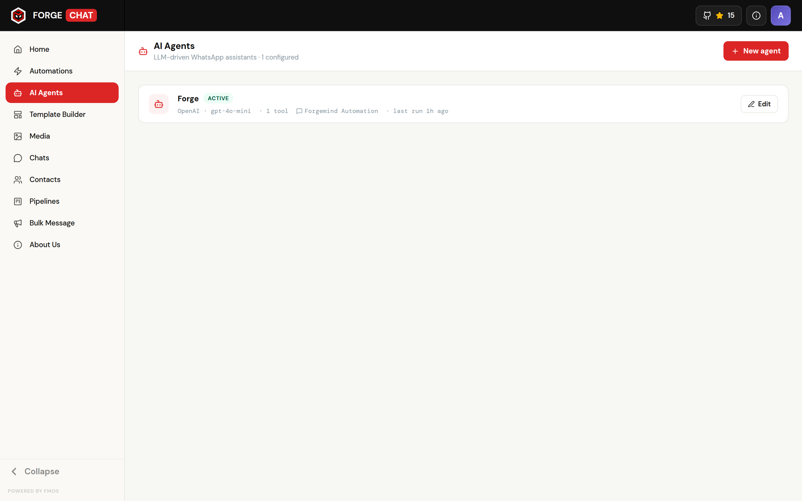
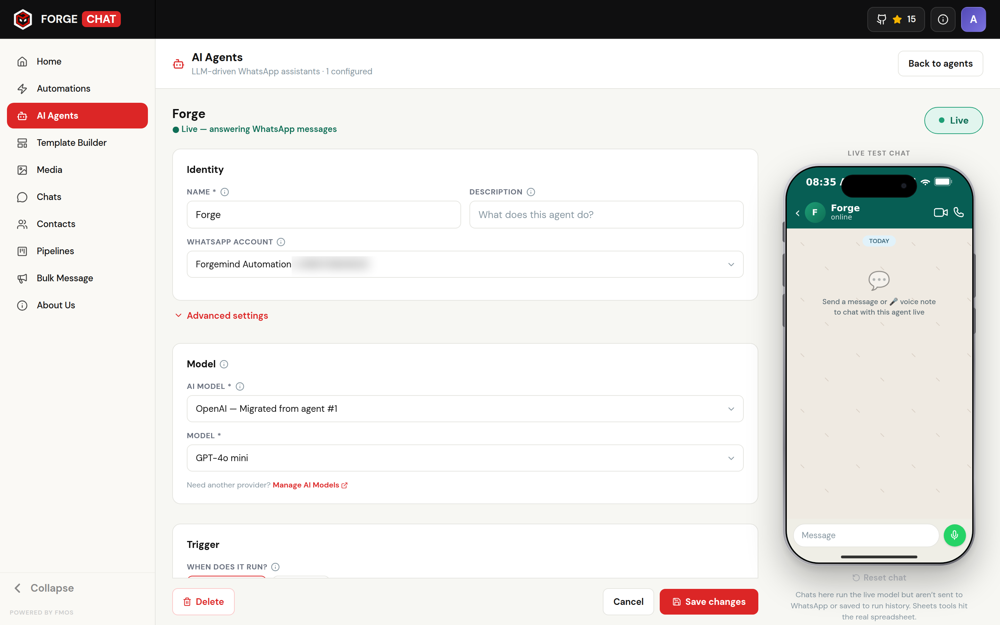

<p align="center">
  
</p>

<h1 align="center">ForgeChat</h1>
<p align="center">
  <strong>Your own WhatsApp Business inbox & CRM — running on your own server</strong>
</p>

<p align="center">
  <a href="#-what-is-forgechat">What is it?</a> •
  <a href="#-what-you-can-do">Features</a> •
  <a href="#-deploy-it-yourself">Deploy</a> •
  <a href="#-connect-your-whatsapp">Connect WhatsApp</a> •
  <a href="#-everyday-use">Use it</a> •
  <a href="#-help--troubleshooting">Help</a>
</p>

<p align="center">
  
  
  
  
  
</p>

<p align="center">
  <a href="https://youtu.be/tvYR0cGOj_4"></a>
</p>

<p align="center">
  <sub>▶ Video tour (above, no audio) — <a href="https://youtu.be/tvYR0cGOj_4">watch the full version on YouTube</a> with narration.</sub>
</p>

<p align="center">
  <sub>Need a server to run it on? <a href="https://www.hostinger.com/in?REFERRALCODE=RZ8CONTACT7T"><strong>Get a Hostinger VPS at 20% off</strong></a> (referral link).</sub>
</p>

---

## 🤔 What is ForgeChat?

**ForgeChat** is a free WhatsApp Business inbox and CRM that **you host yourself**. Instead of paying a monthly fee to a SaaS company that keeps all your customer chats on *their* servers, you run ForgeChat on your own server — so **you own your data and your customer conversations**.

It connects to the **WhatsApp Cloud API** (part of the **WhatsApp Business Platform**, hosted by Meta) — the documented, ToS-compliant way to send and receive WhatsApp business messages — and gives your whole team a clean, chat-style screen to:

- 💬 **Reply to customers** from a shared team inbox
- 🗂️ **Keep a customer database** with tags, notes, and custom fields
- 📣 **Send bulk broadcasts** to many customers at once
- 🤖 **Build auto-replies** with a drag-and-drop builder (no coding)
- 🧠 **Let an AI agent reply for you** — connect an AI model and it answers customers automatically (voice notes included)
- 📋 **Track deals** on a sales pipeline board

> **You don't need to be a programmer to set this up.** If you can install Docker and copy-paste two commands, you can run ForgeChat. It takes about **5 minutes**.

---

## 📸 What it looks like

| Team Inbox | Auto-reply Builder |
| :---: | :---: |
|  |  |
| **Message Templates** | **Customer Database** |
|  |  |
| **Bulk Broadcasts** | **Settings** |
|  |  |
| **🧠 AI Agents** | **AI Agent Builder** |
|  |  |

---

## ✨ What you can do

### 💬 Chat with customers
- A **shared team inbox** that looks just like WhatsApp
- Send and receive **text, photos, videos, voice notes, and documents**
- **Record voice notes** right inside the chat box
- React with emojis, reply to specific messages, and star important ones
- ForgeChat reminds you about WhatsApp's **24-hour reply rule** and suggests a template when needed

### 🗂️ Manage customers
- A full **contact list** with names and phone numbers
- Organize people with **color-coded tags and categories**
- Add your own **custom fields** (e.g. city, order number, plan)
- **Import contacts** from an Excel/CSV spreadsheet
- Track sales opportunities on a **deals pipeline (Kanban board)**

### 📣 Reach people at scale
- Build approved **WhatsApp message templates** with a live phone preview
- Send **bulk broadcasts** (templates, text, links, images, video, audio, documents)
- Watch **live delivery status** for every recipient
- See **template performance** with charts and click stats

### 🤖 Automate replies
- A **drag-and-drop builder** for auto-replies — no coding
- Trigger flows on **keywords**, **any new message**, **new contacts**, and delivery/read events
- Every automation run is **logged** so you can see exactly what happened

### 🧠 AI agents that reply for you
- Connect an **AI model** (OpenAI, Claude, and more) and let an agent **answer customers automatically**
- Shape its behaviour with a plain-English **system prompt**, conversation **context**, and **tools** — no coding
- It understands **voice notes** too — incoming audio is **transcribed** and answered like any text
- Let it **look things up in Google Sheets** and **send media** back to the customer
- Trigger on a **keyword** or let it handle **every chat**, with a session window so it can hold a multi-turn conversation
- **Test it in a live preview** before going live, and review **every run** step by step
- **Set it up in the app, not config files** — connect **Google (Sheets)** and your **AI model** under **Settings → Integrations**. A shop can link a live stock/price sheet so an agent instantly answers *"is this in stock?"* or *"what's the price?"* — no `.env` editing

### 🔐 Keep it secure & organized
- **Team accounts** with roles — admins control who sees what
- Assign specific chats to specific team members
- Secure login, encrypted WhatsApp tokens, and protected access throughout

---

## 🚀 Deploy it yourself

The only thing you need installed is **Docker** — everything else (secure keys, database, tables) is set up automatically on first start. Pick how you want to run it:

| Run on | Best for |
| --- | --- |
| 🍎 **macOS** | Trying it on your own Mac |
| 🪟 **Windows** | Trying it on your own PC |
| 🖥️ **Server** | Real 24/7 use with your own domain + HTTPS |

> 🍎 **Mac** and 🪟 **Windows** run locally with **Docker Desktop** — perfect for testing and demos. To send and receive **real WhatsApp messages** you need a public `https://` address, so for production use the 🖥️ **Server** path below.

### 🍎 macOS

1. Install **[Docker Desktop](https://www.docker.com/products/docker-desktop/)** (pick the **Apple Silicon** or **Intel** build to match your Mac).
2. **Open Docker Desktop and wait until it says "Engine running"** (bottom-left). `docker compose` can't start anything until the engine is up.
3. In **Terminal**, run:
   ```bash
   git clone https://github.com/Forgemind-git/ForgeChat.git
   cd ForgeChat
   docker compose up -d
   # then print the exact address to open:
   echo "ForgeChat is running at http://localhost:$(docker compose port forgecrm-frontend 80 | cut -d: -f2)"
   ```
4. Open the **http://localhost:…** address the last command printed (default **http://localhost:8080**), and create your admin account right in the browser.

No config files, no secrets, no database commands — ForgeChat creates its own secure keys and sets up its database automatically. The first launch builds the app, so give it a minute. Want a different port? `HTTP_PORT=9000 docker compose up -d`.

> **Want real WhatsApp messages on this local install?** You'll start one free Cloudflare Tunnel command so Meta can reach your webhook — see **[Connect your WhatsApp](#-connect-your-whatsapp)** below. Keep using the app at `http://localhost:8080`.

### 🪟 Windows

1. Install **[Docker Desktop](https://www.docker.com/products/docker-desktop/)** (keep **WSL 2** ticked) and **[Git for Windows](https://git-scm.com/download/win)** (click *Next* through the installer), then restart your PC.
2. **Open Docker Desktop and wait until it says "Engine running"** (bottom-left) before continuing — `docker compose` can't start anything until the engine is up.
3. In **PowerShell**, run:
   ```powershell
   git clone https://github.com/Forgemind-git/ForgeChat.git
   cd ForgeChat
   docker compose up -d
   # then print the exact address to open:
   "ForgeChat is running at http://localhost:$((docker compose port forgecrm-frontend 80).Split(':')[-1].Trim())"
   ```
4. Open the **http://localhost:…** address the last command printed (default **http://localhost:8080**), and create your admin account right in the browser.

No config files, no secrets, no database commands — ForgeChat sets everything up on first start. The first launch builds the app, so give it a minute. Want a different port? `$env:HTTP_PORT=9000; docker compose up -d`.

> **Want real WhatsApp messages on this local install?** You'll start one free Cloudflare Tunnel command so Meta can reach your webhook — see **[Connect your WhatsApp](#-connect-your-whatsapp)** below. Keep using the app at `http://localhost:8080`.

### 🖥️ Server — your own domain with automatic HTTPS

This is the **production** path. To actually **send and receive WhatsApp messages**, the app needs a public web address (`https://…`) that Meta can reach — a plain `localhost` install can't receive messages.

1. Rent a small server (**2 GB+ RAM**) with ports **80** and **443** free — e.g. a **[Hostinger VPS at 20% off](https://www.hostinger.com/in?REFERRALCODE=RZ8CONTACT7T)** (referral link).
2. Register a domain you own and point its DNS **A record** at the server's IP address.
3. Install Docker (`curl -fsSL https://get.docker.com | sh`), then clone and run the installer:
   ```bash
   git clone https://github.com/Forgemind-git/ForgeChat.git
   cd ForgeChat
   ./install.sh
   ```
   It asks for your domain, checks that DNS and the ports are ready, then starts everything. That's it.

A secure HTTPS certificate is obtained and renewed **automatically**. Open **https://your-domain**, create your admin account, then connect WhatsApp (below).

<details><summary>Prefer to run it yourself without the installer?</summary>

```bash
DOMAIN=chat.yourbusiness.com docker compose -f docker-compose.yml -f docker-compose.prod.yml up -d
```
The installer is just a friendly wrapper around this command plus DNS/port pre-checks.
</details>

> ⚠️ **Keep the `secrets` volume.** ForgeChat stores its encryption key there. If you delete it, saved WhatsApp tokens can no longer be decrypted and you'll have to reconnect WhatsApp.

### Optional settings

Everything works out of the box. If you want to override something (database password, port, or feature keys like an LLM provider for AI agents), create a `.env` file next to `docker-compose.yml` — see [`backend/.env.example`](backend/.env.example). None of it is required.

---

## 📱 Connect your WhatsApp

To send and receive real messages, link your **WhatsApp Business Account**. You need two things: a **public HTTPS address** Meta can reach, and your **Meta account details**. It's a one-time setup.

### Step 1 — Get a public address Meta can reach

Meta delivers incoming messages to a **webhook**, so it needs a public `https://` URL.

- 🖥️ **Server install:** you already have one — your domain (e.g. `https://chat.yourbusiness.com`). **Skip to Step 2.**
- 🍎🪟 **Local install (Mac/Windows):** `localhost` isn't reachable from the internet, so start the **built-in Cloudflare Tunnel** — no account, nothing to install, it runs as a container. From the `ForgeChat` folder:
  ```bash
  docker compose --profile tunnel up -d
  docker compose logs -f tunnel
  ```
  The log keeps streaming; within a few seconds it prints a line like `https://two-cats-run.trycloudflare.com` — that's your **public URL** for Step 3. Copy it, then press **Ctrl+C** to stop watching. (Use `-f` as shown: plain `docker compose logs tunnel` often runs the split-second *before* the URL is ready, which is why it can look empty the first time.)

  > ⚠️ **Log in and use the app at `http://localhost:8080`** — *not* the `…trycloudflare.com` URL. The tunnel exists only so Meta can reach your webhook; opening the app through it fails with a CORS error on login.
  > ℹ️ The tunnel URL changes whenever you restart it; if it changes, update the **Callback URL** in Meta (Step 3). Stop it later with `docker compose --profile tunnel down`. *(Prefer ngrok? It works too, but needs a free account + authtoken — the built-in tunnel is the quickest start.)*

### Step 2 — Add the account in ForgeChat

1. **Log in** to ForgeChat (at `http://localhost:8080`, or your domain) → **Settings** → **WhatsApp Accounts** → **Add**.
2. From the [Meta Business dashboard](https://business.facebook.com/) (your app → **WhatsApp → API Setup**), copy these into the form: **Phone Number ID**, **WABA ID**, **Meta App ID**, and a **Meta access token**. Also make up a **verify token** — any random text (you'll paste the *same* value into Meta in Step 3). ForgeChat encrypts the access token and **auto-detects your business phone number and name from Meta** using that token — so make sure it's valid (a *test number*'s token from the API Setup page expires after 24 hours).

### Step 3 — Point Meta's webhook at ForgeChat

In the **Meta dashboard** → **WhatsApp → Configuration → Webhook → Edit**:

- **Callback URL:** your **public URL** from Step 1, followed by `/api/webhook/whatsapp`
  - Local example: `https://two-cats-run.trycloudflare.com/api/webhook/whatsapp`
  - Server example: `https://chat.yourbusiness.com/api/webhook/whatsapp`
  - ⚠️ On a local install, **ignore the `http://localhost…` URL the ForgeChat form shows** — Meta can't reach localhost. Use your **tunnel** address here instead.
- **Verify token:** the exact verify token you entered in ForgeChat (Step 2).
- Click **Verify and save** — Meta calls your webhook to confirm it (ForgeChat and the tunnel must be running).
- **Subscribe to these webhook fields** (under *WhatsApp Business Account*):
  - `messages` — incoming messages + delivery/read statuses *(required)*
  - `message_template_status_update` — template approved / rejected / paused by Meta
  - `message_template_quality_update` — template quality rating changes (GREEN / YELLOW / RED)
  - `message_template_components_update` — edits to an approved template's content
  - `template_category_update` — Meta re-categorises a template
  - `template_correct_category_detection` — Meta's suggested correct category
  - `smb_message_echoes` — copies of messages your team sends from the WhatsApp app, so they also appear in ForgeChat (coexistence)

**Verify it works:** send a real WhatsApp message from your phone to the business number — it should appear in **Chats** within seconds, and your reply from ForgeChat should arrive back on your phone.

> ℹ️ You can explore the whole app (inbox, contacts, automations, templates) **before** connecting WhatsApp — you just won't send/receive real messages until this step is done.

---

## 🧭 Everyday use

| You want to… | Go to… |
| --- | --- |
| Reply to customers | **Chats** |
| Add or edit customers, tags, custom fields | **Contacts** |
| Create approved WhatsApp templates | **Template Builder** |
| Send a message to many people at once | **Bulk Message** |
| Set up keyword auto-replies | **Automations** |
| Set up an AI agent that replies for you | **AI Agents** |
| Track sales/deals | **Pipelines** |
| Add team members & control access | **Settings → Users** |

---

## 🔄 Keeping it running

**Update to the latest version** (run on your server, inside the `ForgeChat` folder):

```bash
git pull
docker compose up -d --build         # add the prod overlay flags if you use a domain
```

New database changes are applied automatically on start — nothing else to run.

**Back up your data** (highly recommended — set up a daily automatic backup):

```bash
mkdir -p ~/backups
crontab -e
# add this line to back up every day at 3 AM and keep 7 days:
0 3 * * * cd ~/ForgeChat && docker compose exec -T forgecrm-db pg_dump -U postgres postgres | gzip > ~/backups/forgechat-$(date +\%Y\%m\%d).sql.gz && find ~/backups -name '*.sql.gz' -mtime +7 -delete
```

> Also keep the `secrets` volume safe — it holds the key that decrypts your stored WhatsApp tokens.

---

## 🆘 Help & Troubleshooting

| Problem | What to do |
| --- | --- |
| **`This site can't be reached` / `exec format error` (Apple Silicon Mac)** | If `localhost:8080` won't load and `docker compose logs forgecrm-frontend` shows `exec /docker-entrypoint.sh: exec format error`, Docker Desktop's **containerd image store** built the web image for the wrong CPU. One-time fix: open **Docker Desktop → Settings → General**, **uncheck** "Use containerd for pulling and storing images", click **Apply & Restart**, then rebuild: `docker compose build --no-cache && docker compose up -d`. |
| **`The system cannot find the file specified` / `pipe/dockerDesktopLinuxEngine` (Windows or Mac)** | Docker Desktop isn't running. Open it and wait for **"Engine running"**, then re-run `docker compose up -d`. Confirm the engine is reachable with `docker version` — the **Server:** section must appear (not just **Client:**). If Docker Desktop won't start on Windows, the **WSL 2** backend is likely missing: run `wsl --install` in an **Administrator** PowerShell, restart, and try again. |
| **Login fails with `500` when opening the `…trycloudflare.com` URL** | You're browsing the app through the tunnel — use **`http://localhost:8080`** instead. The tunnel is only for Meta's webhook; logging in through it is blocked by CORS. |
| **WhatsApp connected but no chats appear** | ForgeChat auto-detects your business number from Meta using the access token — if that token was invalid/expired when you connected, the number stays blank and chats for it are hidden (they're still saved). Fix: **Settings → WhatsApp Accounts → edit → paste a valid access token → Save** to re-fetch it. Received messages then appear immediately. |
| **No tunnel URL in the logs** | The URL prints a few seconds *after* the tunnel starts, so watch it in **follow mode**: `docker compose logs -f tunnel`, wait for the `https://…trycloudflare.com` line, then press Ctrl+C. (Plain `docker compose logs tunnel` can run before it's printed — that's why it looks empty the first time.) |
| **The page won't load (production)** | Your domain may not point to the server yet. Double-check the DNS "A record", wait a few minutes, then refresh. |
| **"502" error or blank screen** | The app may still be starting. Wait a minute, then check the logs: `docker compose logs forgecrm-backend`. |
| **Can't log in** | Use the admin email/password you created in the setup screen. Forgot it? An admin can reset it under **Settings → Users**. |
| **Build got "Killed" / "out of memory"** | The build ran out of RAM. Use **2 GB+**, or add swap and rebuild: `fallocate -l 2G /swapfile && chmod 600 /swapfile && mkswap /swapfile && swapon /swapfile`. |
| **Messages aren't arriving** | Re-check the **webhook** in the Meta dashboard: subscribe to `messages`, make sure the **Callback URL ends with `/api/webhook/whatsapp`**, and the **Verify token matches exactly** what you entered in ForgeChat (no extra spaces). |
| **Changed an optional `.env` setting** | Re-create the containers so they pick up the new values: `docker compose up -d`. |
| **HTTPS certificate won't issue (production)** | DNS isn't pointing at the server yet. Check with `dig +short chat.yourbusiness.com` (should return your server IP), then `docker compose -f docker-compose.yml -f docker-compose.prod.yml restart caddy`. |
| **Reconnected WhatsApp after a reset and tokens are gone** | The `secrets` volume (encryption key) was likely removed. Re-enter the WhatsApp access token in **Settings → WhatsApp Accounts**. |
| **Is my data safe?** | Yes — everything lives on *your* server. WhatsApp tokens are encrypted, and access is protected by login. Just keep your backups (above). |

Still stuck? Open an issue on [GitHub](https://github.com/Forgemind-git/ForgeChat/issues) and we'll help.

---

## 🔒 Security

- Everything runs on **your** server — your data never leaves it.
- WhatsApp access tokens are **encrypted** at rest (AES-256-GCM).
- Login uses secure httpOnly cookies; passwords are hashed with bcrypt.
- Incoming webhooks are verified with Meta's signature so fake messages are rejected.
- The API is protected with rate limiting, security headers, and parameterized database queries.

Found a security issue? Please report it privately — see **[SECURITY.md](./SECURITY.md)**. Don't open a public issue.

---

## 🤝 Contributing

Contributions are welcome! See **[CONTRIBUTING.md](./CONTRIBUTING.md)** for setup and conventions, and the **[CODE_OF_CONDUCT.md](./CODE_OF_CONDUCT.md)**. Release history is in **[CHANGELOG.md](./CHANGELOG.md)**.

---

## 📄 License

ForgeChat is [**fair-code**](https://faircode.io) distributed under the **[Sustainable Use License](./LICENSE.md)**.

- ✅ Use it for your own business, personal, or non-commercial purposes.
- ✅ Share it free of charge for non-commercial purposes.
- ❌ No reselling or paid hosting as a service without permission.

Copyright © 2026 **Forgemind Techhub LLP**. **Forgemind AI** is a trademark of Forgemind Techhub LLP — see **[TRADEMARK.md](./TRADEMARK.md)**.

> **WhatsApp** is a trademark of WhatsApp LLC. **Meta** is a trademark of Meta Platforms, Inc. ForgeChat is an independent application that connects to the WhatsApp Cloud API (hosted by Meta), and is **not** affiliated with, endorsed by, sponsored by, or otherwise officially connected to Meta Platforms, Inc. or WhatsApp LLC.

---

<div align="center">

**ForgeChat** — own your inbox.

<sub>Made with ❤️ by <a href="https://github.com/Forgemind-git">Forgemind</a></sub>

</div>
